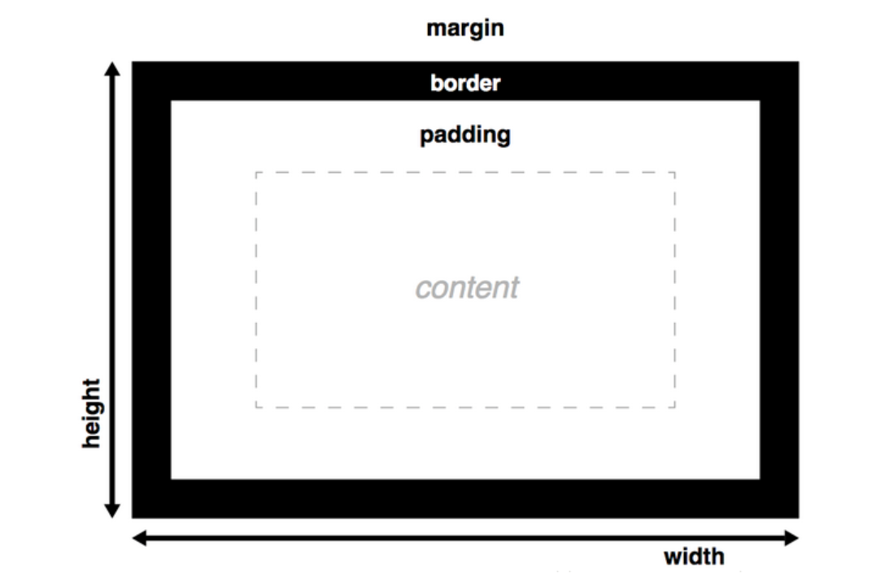
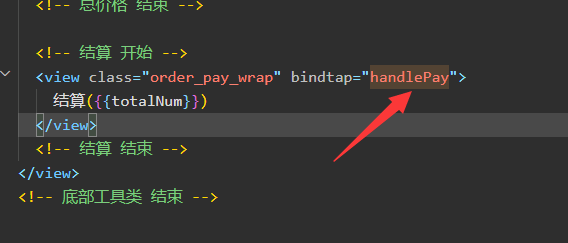
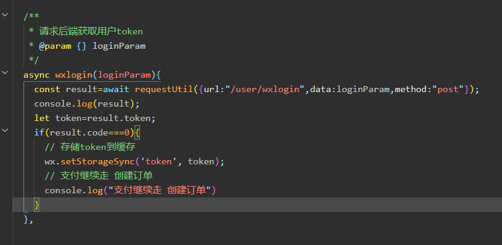
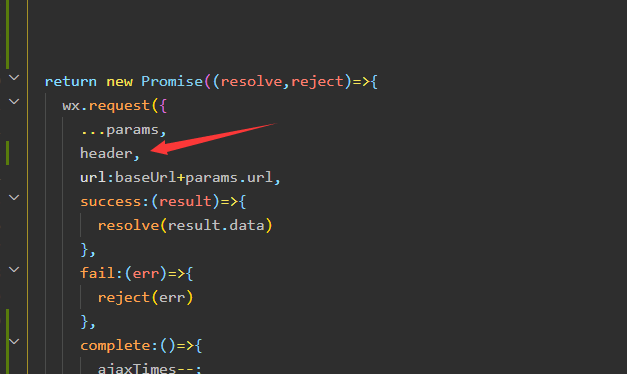
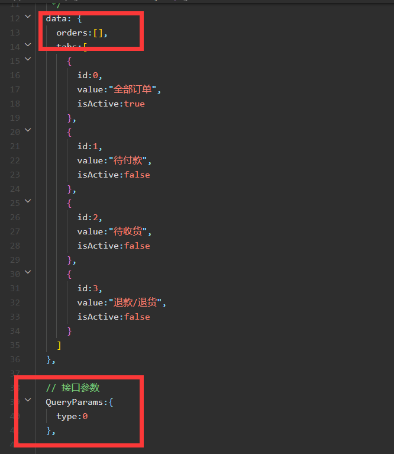
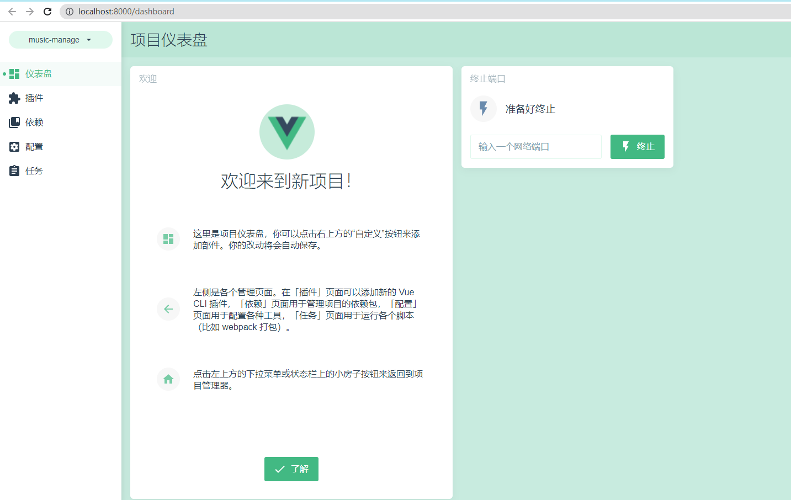
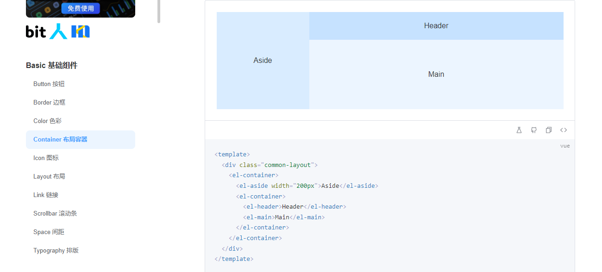
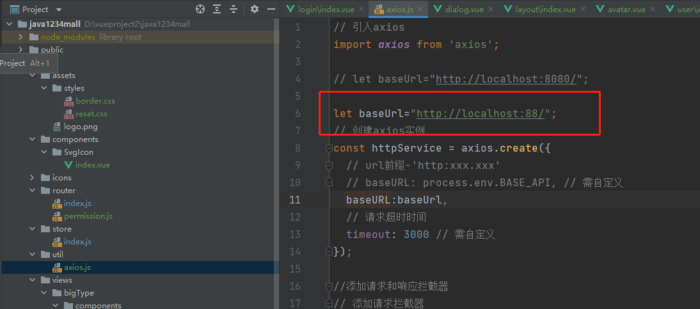

## 一、前言

### 简介

采用主流技术栈实现，Mysql数据库，SpringBoot2+Mybatis Plus后端，微信小程序原生实现，Vue3.2+Element Plus实现后台管理。基于JWT技术实现前后端分离。


微信小程序端涵盖了axios异步请求，Promise应用，swiper组件，自定义组件，应用了微信小程序提供的登录，支付，地址管理，包括下拉滑动分页，less应用，以及结合SpringBoot后端实现了企业级微信小程序支付功能，为了方便，采用ngrok实现映射本机IP，开发环境演示真实支付功能。


电商的后台管理采用了主流的Vue3.2+Element Plus组件 实现，涵盖了axios+Promise工具类封装，自定义icon，vuex应用，router路由，路由守卫，使用了大量的Element Plus组件，如表格，分页，图片上传，下拉框，二级联动，Form表单，rules验证框架，dialog以及第三方vue-quil富文本组件等。


### 后续迭代升级

后续会发布一个基于Spring Cloud Alibaba分布式微服务的解决方案，将本项目进行分布式业务拆分。

使用Gateway网关进行统一鉴权；

使用RocketMQ实现微信小程序异步支付回调的消息队列化，防止高并发下的回调接口的处理阻塞或者奔溃；

使用Redis作为热点数据缓存，提高QPS；

使用Nacos作为服务注册中心和配置中心；

使用OpenFeign进行微服务之间的http调用；

对某些并发大的业务模块实现集群；

基于Docker来管理redis，rocketMQ，mysql等；


## 二、小程序端业务功能实现

####  项目帮助文档

[小程序开发官方文档](https://developers.weixin.qq.com/miniprogram/dev/framework/)

[阿里妈妈矢量图标](https://www.iconfont.cn/)


#### 项目整体搭建


##### 新建项目-index首页实现

##### iconfont矢量图标样式引入

全局引入iconfont样式

```
@import "./styles/iconfont.wxss"
```

##### 底部菜单tabbar实现

```json
"tabBar": {
    "color": "#999",
    "selectedColor": "#FF5700",
    "backgroundColor": "#fafafa",
    "list": [{
      "pagePath": "pages/index/index",
      "text": "首页",
      "iconPath": "icons/_home.png",
      "selectedIconPath": "icons/home.png"
    },{
      "pagePath": "pages/category/index",
      "text": "分类",
      "iconPath": "icons/_category.png",
      "selectedIconPath": "icons/category.png"
    },{
      "pagePath": "pages/cart/index",
      "text": "购物车",
      "iconPath": "icons/_cart.png",
      "selectedIconPath": "icons/cart.png"
    },{
      "pagePath": "pages/my/index",
      "text": "我的",
      "iconPath": "icons/_my.png",
      "selectedIconPath": "icons/my.png"
    }]
  }
```


##### 初始化全局样式设置

```css
/* 初始化全局样式 */
page,view,text,swiper,swiper-item,image,navigator{
  padding:0;
  margin: 0;
  box-sizing: border-box;
}
```

`box-sizing: border-box;`的理解

默认的盒模型高度和宽度计算；


用了`box-sizing: border-box;`的盒模型高度和宽度计算；



> border-box  width 和 height 属性包括内容，内边距和边框，但不包括外边距。


全局变量定义 设置主题颜色，字体大小等

```css
/* 全局变量定义 设置主题颜色，字体大小等 */
page{
  /* 主题颜色 */
  --themeColor:#FF5700;
  /* 字体大小 rpx自适应大小 */
  font-size:28rpx;
}
```

使用变量var

```css
view{
  color:var(--themeColor);
}
```


导航栏背景颜色和文字颜色设置

```json
"window": {
    "backgroundTextStyle": "light",
    "navigationBarBackgroundColor": "#FF5700",
    "navigationBarTitleText": "商城",
    "navigationBarTextStyle": "white"
 }
```


#### 首页功能实现

##### 搜索框自定义组件实现


第一步：定义SearchBar


第二步：引入SearchBar

```json
"usingComponents": {
    "SearchBar":"/components/SearchBar/SearchBar"
}
```


第三步：使用SearchBar

```xml
<view>
  <!-- 搜索框开始 -->
  <SearchBar></SearchBar>
  <!-- 搜索框结束 -->
</view>
```


SearchBar.wxml

```xml
<view class="search_bar">
  <navigator url="/pages/search/index" open-type="navigate">
    <icon type="search" size="16"></icon>搜索
  </navigator>
</view>
```


SearchBar.wxss

```css
.search_bar{
  height: 90rpx;
  padding: 10rpx;
  background-color: var(--themeColor);
}

.search_bar navigator{
  height: 100%;
  display: flex;
  justify-content: center;
  align-items: center;
  background-color: #fff;
  border-radius: 15rpx;
  color: #666;
}

.search_bar navigator icon{
  padding-right: 5rpx;
}
```


##### 微信开发者工具配置支持less

Less 是一门 CSS 预处理语言，它扩充了 CSS 语言，增加了诸如变量、混合（mixin）、函数等功能，让 CSS 更易维护、方便制作主题、扩充。

微信开发者工具默认不支持less，我们需要自己安装插件：


##### SpringBoot后端项目架构搭建

新建后端项目 `argimall`

springboot版本我们选用稳定的 `2.3.2.RELEASE`

项目用的依赖 加下：

```
<dependencies>

	<dependency>
		<groupId>org.springframework.boot</groupId>
		<artifactId>spring-boot-starter-web</artifactId>
	</dependency>

	<dependency>
		<groupId>org.springframework.boot</groupId>
		<artifactId>spring-boot-devtools</artifactId>
		<scope>runtime</scope>
		<optional>true</optional>
	</dependency>

	<dependency>
		<groupId>org.projectlombok</groupId>
		<artifactId>lombok</artifactId>
		<optional>true</optional>
	</dependency>

	<dependency>
		<groupId>mysql</groupId>
		<artifactId>mysql-connector-java</artifactId>
		<scope>runtime</scope>
	</dependency>

	<!-- 连接池 -->
	<dependency>
		<groupId>com.alibaba</groupId>
		<artifactId>druid</artifactId>
		<version>1.1.10</version>
	</dependency>
	<!-- mybatis-plus -->
	<dependency>
		<groupId>com.baomidou</groupId>
		<artifactId>mybatis-plus-boot-starter</artifactId>
		<version>3.3.2</version>
	</dependency>
	<dependency>
		<groupId>org.projectlombok</groupId>
		<artifactId>lombok</artifactId>
		<optional>true</optional>
	</dependency>

	<!-- 添加Httpclient支持 -->
	<dependency>
		<groupId>org.apache.httpcomponents</groupId>
		<artifactId>httpclient</artifactId>
		<version>4.5.2</version>
	</dependency>

	<dependency>
		<groupId>com.alibaba</groupId>
		<artifactId>fastjson</artifactId>
		<version>1.2.40</version>
	</dependency>

	<!-- JWT -->
	<dependency>
		<groupId>com.auth0</groupId>
		<artifactId>java-jwt</artifactId>
		<version>3.2.0</version>
	</dependency>
	<dependency>
		<groupId>io.jsonwebtoken</groupId>
		<artifactId>jjwt</artifactId>
		<version>0.7.0</version>
	</dependency>

	<dependency>
		<groupId>jdom</groupId>
		<artifactId>jdom</artifactId>
		<version>1.1</version>
	</dependency>
	<dependency>
		<groupId>dom4j</groupId>
		<artifactId>dom4j</artifactId>
		<version>1.6.1</version>
	</dependency>
	<dependency>
		<groupId>commons-io</groupId>
		<artifactId>commons-io</artifactId>
		<version>2.5</version>
	</dependency>


</dependencies>
```


application.yml

```yaml
server:
  port: 8080
  servlet:
    context-path: /

spring:
  datasource:
    type: com.alibaba.druid.pool.DruidDataSource
    driver-class-name: com.mysql.cj.jdbc.Driver
    url: jdbc:mysql://localhost:3306/mall?serverTimezone=Asia/Shanghai
    username: root
    password: 123456
```


##### Swiper轮播图后端接口实现

mybatis-plus配置：

```yaml
mybatis-plus:
  global-config:
    db-config:
      id-type: auto #id生成规则：数据库id自增
  configuration:
    map-underscore-to-camel-case: false  # 开启驼峰功能
    auto-mapping-behavior: full # 自动映射任何复杂的结果
    log-impl: org.apache.ibatis.logging.stdout.StdOutImpl
  mapper-locations: classpath:mybatis/mapper/*.xml
```


##### 微信小程序轮播图实现

swiper组件文档：https://developers.weixin.qq.com/miniprogram/dev/component/swiper.html


后端图片虚拟路径映射配置：

```java
package com.argimall.config;

import org.springframework.context.annotation.Configuration;
import org.springframework.web.servlet.config.annotation.ResourceHandlerRegistry;
import org.springframework.web.servlet.config.annotation.WebMvcConfigurer;

/**
 * web醒目配置类
 */
@Configuration
public class WebAppConfigurer implements WebMvcConfigurer {

    @Override
    public void addResourceHandlers(ResourceHandlerRegistry registry) {
        registry.addResourceHandler("/image/swiper/**").addResourceLocations("file:D:\\picture\\swiperImgs\\");
    }
}
```


开发环境请求后端接口，可能会出现报错，工具里务必设置下 不校验合法域名；


正式环境发布小程序，要设置下服务器域名白名单：

小程序后台管理 -> 开发管理 -> 开发设置 -> 服务器域名


静态swiper实现：

```xml
<!-- 轮播图开始 -->
  <view class="index_swiper">
    <swiper>
      <swiper-item>
        <navigator>
          <image mode="widthFix" src="http://localhost:8081/image/swiper/1.jpg"></image>
        </navigator>
      </swiper-item>
      <swiper-item>
        <navigator>
          <image mode="widthFix" src="http://localhost:8081/image/swiper/2.jpg"></image>
        </navigator>
      </swiper-item>
      <swiper-item>
        <navigator>
          <image mode="widthFix" src="http://localhost:8081/image/swiper/3.jpg"></image>
        </navigator>
      </swiper-item>
    </swiper>
  </view>
  <!-- 轮播图结束 -->
```

```css
.index_swiper{
  swiper{
    width: 750rpx;
    height: 375rpx;
    swiper-item{
      image{
        width: 100%;
      }
    }
  }
}
```


swiper加三个属性：

indicator-dots 是否显示面板指示点

autoplay 是否自动切换

circular 是否采用衔接滑动


发起请求API：

https://developers.weixin.qq.com/miniprogram/dev/api/network/request/wx.request.html


动态获取后端数据：

```javascript
Page({

  /**
   * 页面的初始数据
   */
  data: {
    // 轮播图数组
    swiperList:[]
  },

  /**
   * 生命周期函数--监听页面加载
   */
  onLoad: function (options) {
    // 发送异步请求 从后端获取数据
    wx.request({
      url: 'http://localhost:8081/product/findSwiper',
      method:"GET",
      success:(result)=>{
        console.log(result);
        this.setData({
          swiperList:result.data.message
        })
      }
    })
  }
})
```


页面遍历显示轮播图：

```xml
<swiper autoplay indicator-dots circular>
  <swiper-item
	wx:for="{{swiperList}}"
	wx:for-item="swiper"
	wx:key="id"
  >
    <navigator>
	  <image mode="widthFix" src="{{'http://localhost:8081/image/swiper/'+swiper.swiperPic}}"></image>
	</navigator>
  </swiper-item>
</swiper>
```


##### Promise方式的请求工具类封装

主要解决多次异步依赖回调请求的 “回调地狱”困扰，让代码更易于维护；


requestUtil.js封装：

```javascript
/**
 * 后端请求工具类
 */
export const requestUtil=(params)=>{
  return new Promise((resolve,reject)=>{
    wx.request({
      ...params,
      success:(result)=>{
        resolve(result.data)
      },
      fail:(err)=>{
        reject(err)
      }
    })
  });
}
```


导入请求工具类：

```javascript
// 导入request请求工具类
import {requestUtil} from '../../utils/requestUtil.js';
```


调用工具类：

```javascript
requestUtil({url: 'http://localhost:8081/product/findSwiper',method:"GET"})
  .then(result=>{
	this.setData({
		swiperList:result.message
	 })
})
```


##### 请求根路径baseUrl封装

```javascript
// 定义请求根路径baseUrl
const baseUrl="http://localhost:8081";

/**
 * 返回请求根路径baseUrl
 */
export const getBaseUrl=()=>{
  return baseUrl;
}
```

请求更改方式更改：


图片请求的更改：导入getBaseUrl和初始化baseUrl


请求图片更改：


##### 请求高级封装es7 async await语法支持

我们配置下es7 async语法支持，让异步请求更加优雅，易于维护；

配置方式：

1，在小程序开发工具中勾选es6转es5语法


2，下载 facebook的regenerator库中的 [regenerator/packages/regenerator-runtime/runtime.js](https://github.com/facebook/regenerator/blob/5703a79746fffc152600fdcef46ba9230671025a/packages/regenerator-runtime/runtime.js)

3，在小程序目录下新建文件夹 `lib/runtime/runtime.js`，将代码拷贝进去。

4，在每一个需要使用async语法的页面js文件中，都引入（不能全局引入），只需要引入，不需要调用。

```
import regeneratorRuntime from '../../lib/runtime/runtime';
```

然后就可以正常的使用了async await语法处理异步请求了。


改造后的代码：

```javascript
/**
 * 获取轮播图数据
*/
async getSwiperList() {
	// requestUtil({url: '/product/findSwiper',method:"GET"})
	//   .then(result=>{
	//     const baseUrl=getBaseUrl();
	//     this.setData({
	//         swiperList:result.message,
	//         baseUrl
	//     })
	// })
	const result = await requestUtil({
	  url: '/product/findSwiper',
	  method: "GET"
	});
	const baseUrl=getBaseUrl();
	this.setData({
	  swiperList: result.message,
	  baseUrl
	})
}
```


##### 首页商品大类显示

后端商品大类接口实现

```java
/**
 * 查询所有商品大类
 * @return
 */
@GetMapping("/findAll")
public R findAll(){
	List<BigType> bigTypeList = bigTypeService.list();
	Map<String,Object> map=new HashMap<>();
	map.put("message",bigTypeList);
	return R.ok(map);
}
```


商品大类图片映射：

```
registry.addResourceHandler("/image/bigType/**").addResourceLocations("file:D:\\picture\\bigTypeImgs\\");
```


定义商品大类初始化数据：

```json
data: {
	// 轮播图数组
	swiperList: [],
	baseUrl: '',
	bigTypeList:[],
	bigTypeList_row1:[],
	bigTypeList_row2:[]
},
```


获取后端数据：

```javascript
/**
* 获取商品大类数据
*/
async getBigTypeList(){
	const result = await requestUtil({
	  url: '/bigType/findAll',
	  method: "GET"
	});

	console.log(result)
	const bigTypeList=result.message;
	const bigTypeList_row1=bigTypeList.filter((item,index)=>{
	  return index<5;
	})
	const bigTypeList_row2=bigTypeList.filter((item,index)=>{
	  return index>=5;
	})
	this.setData({
	  bigTypeList,
	  bigTypeList_row1,
	  bigTypeList_row2,
	})
}
```


样式文件：

```less
.index_bigType{
  padding-top: 20rpx;
  background-color:#F7F7F7;
  .bigTypeRow{
    display:flex;
    navigator{
      flex:1;
      image{
        width: 150rpx;
      }
    }
  }
}
```


##### 首页热门推荐商品显示

后端热门推荐商品接口实现

mybatis-plus分页拦截器：

```java
package com.argimall.config;

import com.baomidou.mybatisplus.extension.plugins.PaginationInterceptor;
import org.springframework.context.annotation.Bean;
import org.springframework.context.annotation.Configuration;

/**
 * MybatisPlus配置类
 */
@Configuration
public class MybatisPlusConfig {

    @Bean
    public PaginationInterceptor paginationInterceptor(){
        return new PaginationInterceptor();
    }
}
```


Controller方法实现：

```java
/**
 * 查询热门推荐商品
 * @return
 */
@GetMapping("/findHot")
public R findHot(){
	Page<Product> page = productService.page(new Page<>(0,8), new QueryWrapper<Product>().eq("isHot", true).orderByAsc("hotDateTime"));
	List<Product> hotProductList = page.getRecords();
	Map<String,Object> map=new HashMap<>();
	map.put("message",hotProductList);
	return R.ok(map);
}
```


商品图片虚拟路径映射实现：

```java
registry.addResourceHandler("/image/product/**").addResourceLocations("file:D:\\argimall-mall-v2\\productImgs\\");
```


小程序端热卖推荐商品显示

 ¥ 人民币符号


热卖推荐商品js：

```javascript
/**
* 获取热卖商品
*/
async getHotProductList(){
	const result = await requestUtil({
	  url: '/product/findHot',
	  method: "GET"
	});
	this.setData({
	  hotProductList: result.message
	})
},
```


热卖推荐商品wxml：

```xml
<!-- 商品热卖推荐 开始 -->
<view class="index_hotProduct">
	<view class="product_title">
	  热卖推荐
	</view>
	<view class="product_list">
	  <view class="product_detail"
		wx:for="{{hotProductList}}"
		wx:for-item="hotProduct"
		wx:key="id"
	  >
		<navigator>
		  <image mode="widthFix" src="{{baseUrl+'/image/product/'+hotProduct.proPic}}"></image>
		  <view class="product_name">{{hotProduct.name}}</view>
		  <view class="product_price"> ¥ {{hotProduct.price}}</view>
		  <button size="mini" type="warn">立即购买</button>
		</navigator>
	  </view>
	</view>
</view>
```


热卖推荐商品样式wxss：

```css
.index_hot_product{
  .product_title{
    font-size: 32rpx;
    background-color:#E0E0E0;
    font-weight: 600;
    padding: 20rpx;
    color: var(--themeColor);
  }
  .list{
    display: flex;
    flex-wrap: wrap;
    .product_detail{
      margin: 15rpx;
      width: 46%;
      text-align: center;
      navigator{
        image{
          background-color: #F5F5F5;
        }
        .product_name{
          white-space: nowrap;
          overflow: hidden;
          text-overflow: ellipsis;
        }
        .product_price{
          color: var(--themeColor);
        }
      }
    }
  }
}
```


#### 商品分类页面实现


 scroll-view组件 https://developers.weixin.qq.com/miniprogram/dev/component/scroll-view.html

argimall


##### 商品分类后端接口实现

`@TableField(select = false)`表示mp-plus查询的时候，这个字段映射数据库查询；

新建小类实体：

```java
/**
 * 商品小类
 */
@TableName("t_smallType")
@Data
public class SmallType implements Serializable {

    private Integer id; // 编号

    private String name; // 名称

    private String remark; // 备注

    private Integer bigTypeId; // 大类id

    @TableField(select = false)
    private BigType bigType;  // 所属商品大类

    @TableField(select = false)
    private List<Product> productList; // 商品集合
    
}
```


大类实体加一个smallTypeList集合

```java
/**
 * 商品大类
 */
@TableName("t_bigType")
@Data
public class BigType {

    private Integer id; // 编号

    private String name; // 名称

    private String remark; // 备注

    private String image="default.jpg"; // 封面图片

    @TableField(select = false)
    private List<SmallType> smallTypeList; // 小类集合

}
```


获取所有菜单接口：

```java
/**
 * 获取所有菜单信息
 * @return
 */
@GetMapping("/findCategories")
public R findCategories(){
	List<BigType> bigTypeList = bigTypeService.list();
	for(BigType bigType:bigTypeList){
		List<SmallType> smallTypeList = smallTypeService.list(new QueryWrapper<SmallType>().eq("bigTypeId", bigType.getId()));
		bigType.setSmallTypeList(smallTypeList);
		for(SmallType smallType:smallTypeList){
			List<Product> productList = productService.list(new QueryWrapper<Product>().eq("typeId", smallType.getId()));
			smallType.setProductList(productList);
		}
	}
	Map<String,Object> map=new HashMap<>();
	map.put("message",bigTypeList);
	return R.ok(map);
}
```


##### 请求后端数据

定义初始化数据：

```javascript
   /**
   * 页面的初始数据
   */
  data: {
    leftMenuList:[], // 左侧菜单数据
    rightContent:[]  // 右侧商品数据
  },

  // 接口的返回数据
  Cates:[],
```


获取获取数据：

```javascript
  /**
   * 获取商品分类数据
   */
  async getCates(){
    const result = await requestUtil({
      url: '/bigType/findCategories',
      method: "GET"
    });
    this.Cates=result.message;
    let leftMenuList=this.Cates.map(v=>v.name)
    let rightContent=this.Cates[0].smallTypeList;
    this.setData({
      leftMenuList,
      rightContent
    })
  },
```


##### 静态页面实现

```html
<view class="cates">
  <!-- 搜索框开始 -->
  <SearchBar></SearchBar>
  <!-- 搜索框结束 -->

  <view class="cates_container">
    <!-- 左侧菜单 开始 -->
    <scroll-view class="left_menu" scroll-y>
    
    </scroll-view>
    <!-- 左侧菜单 结束 -->

    <!-- 右侧商品数据 开始 -->
    <scroll-view class="right_container" scroll-y>
   
    </scroll-view>
    <!-- 右侧商品数据 结束 -->
  </view>
</view>
```


less样式：

```css
page{
  height: 100%;
}

.cates{
  height: 100%;
  .cates_container{
    height: ~'calc( 100vh - 90rpx )';
    display: flex;
    .left_menu{
      flex:2;
      background-color: aqua;
    }
    .right_container{
      flex:5;
      background-color: blue;
    }
  }
}
```


view{菜单$}*30 生成测试数据

页面模型效果：


##### 页面数据动态显示

```html
  <view class="cates_container">
    <!-- 左侧菜单 开始 -->
    <scroll-view class="left_menu" scroll-y>
      <view  class="menu_item"
        wx:for="{{leftMenuList}}"
        wx:key="*this"
      >{{item}}</view>
     
    </scroll-view>
    <!-- 左侧菜单 结束 -->

    <!-- 右侧商品数据 开始 -->
    <scroll-view class="right_container" scroll-y>
      <view class="productType"
        wx:for="{{rightContent}}"
        wx:for-item="productType"
        wx:key="id"
      >
      <view class="productType_title">
        {{productType.name}}
        <view class="product_list">
          <navigator
            wx:for="{{productType.productList}}"
            wx:key="id"
            wx:for-item="product"
            >
            <image mode="widthFix" src="{{baseUrl+'/image/product/'+product.proPic}}"></image>
          <view class="product_name">{{product.name}}</view>
          <view class="product_price"> ¥ {{product.price}}</view>
          </navigator>
        </view>
      </view>
      </view>
    </scroll-view>
    <!-- 右侧商品数据 结束 -->
  </view>
```


页面样式：

```css
page {
  height: 100%;
}

.cates {
  height: 100%;

  .cates_container {
    height: ~'calc( 100vh - 90rpx )';
    display: flex;

    .left_menu {
      flex: 2;

      .menu_item {
        margin-top: 5rpx;
        height: 80rpx;
        display: flex;
        justify-content: center;
        align-items: center;
        font-size: 30rpx;
      }

      .active {
        font-weight: bolder;
        color: var(--themeColor);
        border-left: 8rpx solid currentColor;
      }
    }

    .right_container {
      flex: 5;

      .productType {
        padding: 30rpx 20rpx 30rpx 20rpx;
        .productType_title {
          font-weight: bolder;
        }

        .product_list {
          navigator {
            margin: 10rpx;
            display: flex;
            background-color: #F8F8F8;
            image {
              flex: 1;
            }

            .right {
              flex: 3;
              display: flex;
              flex-direction: column;
              justify-content: space-around;
              .product_name {
                padding-top: 10rpx;
                white-space: nowrap;
                overflow: hidden;
                text-overflow: ellipsis;
              }

              .product_price {
                padding-bottom: 10rpx;
              }
            }
          }
        }
      }
    }
  }
}
```


左侧菜单默认选中第一个：

```xml
    <!-- 左侧菜单 开始 -->
    <scroll-view class="left_menu" scroll-y>
      <view  class="menu_item {{index==0 ? 'active':''}}"
        wx:for="{{leftMenuList}}"
        wx:key="*this"
        data-index="{{index}}"
      >{{item}}</view>
     
    </scroll-view>
    <!-- 左侧菜单 结束 -->
```


##### 左侧菜单点击切换实现

定义当前选中的左侧菜单的索引


依据`currentIndex`来动态显示被选中菜单的样式：


同时搞一个`bindtap`点击事件`handleMenuItemChange`，带一个index索引参数

```javascript
  // 左侧菜单的点击事件
  handleMenuItemChange(e){
    console.log(e)
    const {index}=e.currentTarget.dataset;
    console.log("index="+index)
    let rightContent=this.Cates[index].smallTypeList;
    this.setData({
      currentIndex:index,
      rightContent
    })
  },
```

获取事件`index`索引，赋值给`currrentIndex`，以及根据`index`获取对应的`rightContent`。并且`setData`设置


##### 右侧内容列表置顶设置

利用`scroll-view`提供的`scroll-top`属性，设置变量`scrollTop`


初始化设置值为0


每次点击左侧菜单，重置`scrollTop`为0即可


##### 首页商品大类跳转商品分类页面实现

我们通过wx.switchTab方法，跳转商品分页页面，同时我们需要带参数，但是switchTab方法无法携带参数，所以我们通过全局参数设置的方式，来间接传递参数。


全局app.js

```javascript
// app.js
App({
  onLaunch() {
   
  },
  globalData: {
    index:-1
  }
})
```

globalData设置index属性为-1

这里我们需要判断显示商品分类页面是我们直接点击下方Tabbar菜单打开的，还是从首页商品大类分页点击进来的。


```xml
<view class="bigTypeRow">
    <navigator
               bindtap="handleTypeJump"
               data-index="{{index}}"
               wx:for="{{bigTypeList_row1}}"
               wx:for-item="bigType"
               wx:key="id">
        <image mode="widthFix" src="{{baseUrl+'/image/bigType/'+bigType.image}}"></image>
    </navigator>
</view>

<view class="bigTypeRow">
    <navigator
               bindtap="handleTypeJump"
               data-index="{{index+5}}"
               wx:for="{{bigTypeList_row2}}"
               wx:for-item="bigType"
               wx:key="id">
        <image mode="widthFix" src="{{baseUrl+'/image/bigType/'+bigType.image}}"></image>
    </navigator>
</view>
```

bindtap事件handleTypeJump，以及带上data-index所以index；


事件方法，获取index索引，设置到全局globalData里面去，然后跳转商品分类页面

```javascript
  //  大类点击事件
  handleTypeJump(e){
    const {index}=e.currentTarget.dataset;
   

    const app=getApp();
    app.globalData.index=index;

    wx.switchTab({
      url: '/pages/category/index',
    })
  }
```

在商品分类页面，onShow方法上，我们可以从全局globalData获取index参数，然后重新获取数据，指定index；

```javascript
  /**
   * 生命周期函数--监听页面显示
   */
  onShow: function () {
    console.log("onShow");
    const app=getApp();
    var index=app.globalData.index;
    console.log("index="+index)
    if(index!=-1){
      // let rightContent=this.Cates[index].smallTypeList;
      // this.setData({
      //   currentIndex:index,
      //   rightContent,
      //   scrollTop:0
      // })
      this.getCates2(index);
      app.globalData.index=-1; // 重置index
    }
  },
```


```javascript
  /**
   * 获取商品分类数据 从首页跳转过来的
   */
  async getCates2(index){
    const baseUrl=getBaseUrl();
    const result = await requestUtil({
      url: '/bigType/findCategories',
      method: "GET"
    });
    this.Cates=result.message;
 
    let leftMenuList=this.Cates.map(v=>v.name)
    let rightContent=this.Cates[index].smallTypeList;
    this.setData({
      leftMenuList,
      rightContent,
      currentIndex:index,
      scrollTop:0,
      baseUrl
    })
  },
```


#### 商品详情页面实现

##### 商品详情后端接口实现

定义产品轮播图片

```java
@TableName("t_product_swiper_image")
@Data
public class ProductSwiperImage {

    private Integer id; // 编号

    private String image; // 图片名称

    private Integer sort; // 排列序号 从小到大排序

    private Integer productId; // 所属产品

}
```

Product实体 定义产品轮播图片集合属性

```java
    @TableField(select = false)
    private List<ProductSwiperImage> productSwiperImageList;
```

定义商品详情接口：

```java
/**
 * 根据id查询商品信息
 * @param id
 * @return
 */
@GetMapping("/detail")
public R detail(Integer id){
    Product product = productService.getById(id);
    List<ProductSwiperImage> productSwiperImageList = productSwiperImageService.list(new QueryWrapper<ProductSwiperImage>().eq("productId", product.getId()).orderByAsc("sort"));
    product.setProductSwiperImageList(productSwiperImageList);
    Map<String,Object> map=new HashMap<>();
    map.put("message",product);
    return R.ok(map);
}
```


##### 商品详情轮播图动态显示实现

配置商品轮播图片虚拟路径映射

```java
registry.addResourceHandler("/image/productSwiperImgs/**").addResourceLocations("file:D:\\argimall\\productSwiperImgs\\");
```


定义商品详情初始化对象以及调用后端接口获取商品详情数据

```javascript
  /**
   * 页面的初始数据
   */
  data: {
    productObj:{},
    baseUrl:''
  },

  /**
   * 生命周期函数--监听页面加载
   */
  onLoad: function (options) {
    const baseUrl=getBaseUrl();
    this.setData({
      baseUrl
    })
    this.getProductDetail(options.id);
  },

  // 获取产品信息
  async getProductDetail(id){
    const result=await requestUtil({url: "/product/detail",data:{id}});
    this.productInfo=result.message;
    
    this.setData({
      productObj:result.message,
    })
  },
```


遍历动态显示轮播图片：

```xml
<view class="product_swiper">
  <swiper autoplay indicator-dots circular>
      <swiper-item
        wx:for="{{productObj.productSwiperImageList}}"
        wx:key="id"
      >
      <navigator>
          <image mode="widthFix" src="{{baseUrl+'/image/productSwiperImgs/'+item.image}}"></image>
        </navigator>
      </swiper-item>
    </swiper>
</view>
```


样式：

```css
.product_swiper{
  swiper{
    height: 100vw;
    swiper-item{
      navigator{
        image{
        }
      }
    }
  }
}
```


##### 商品详情属性内容显示


index.wxml

```xml
<view class="product_price">¥{{productObj.price}}</view>

<view class="product_name">{{productObj.name}}</view>

<view class="product_description">
{{productObj.description}}
</view>

<view class="desc_tabs">
  <view class="tabs_title">
    <view class="title_item {{activeIndex==0?'active':''}}" bindtap="handleItemTap" data-index="0">商品介绍</view>
    <view class="title_item {{activeIndex==1?'active':''}}" bindtap="handleItemTap" data-index="1">规格参数</view>
  </view>
  <view class="tabs_content">
    <block wx:if="{{activeIndex==0}}">
      <rich-text nodes="{{productObj.productIntroImgs}}"></rich-text>
    </block>
    <block wx:elif="{{activeIndex==1}}">
      <rich-text nodes="{{productObj.productParaImgs}}"></rich-text>
    </block>
  </view>
</view>
```


index.less

```css
.product_price{
  padding: 15rpx;
  font-size: 42rpx;
  font-weight: 600;
  color: var(--themeColor);
}

.product_name{
  padding: 15rpx;
  font-size: 40rpx;
  font-weight: 600;
  border-top: 1rpx solid #dedede;
}

.product_description{
  padding: 0 10rpx 25rpx 10rpx;
  border-bottom: 1rpx solid #dedede;
}

.desc_tabs{
  .tabs_title{
    display: flex;
    .title_item{
      flex:1;
      display: flex;
      justify-content: center;
      align-items: center;
      padding: 15rpx;
    }
    .active{
      color: var(--themeColor);
    }
  }
  .tabs_content{
    .rich-text{
      
    }
  }
}
```

定义activeIndex，用来判断点击的哪个tab

```js
  /**
   * 页面的初始数据
   */
  data: {
    productObj:{},
    baseUrl:'',
    activeIndex:0
  },
```


tab点击事件

```js
  /**
   * tab点击事件
   * @param {} e 
   */
  handleItemTap(e){
    const {index}=e.currentTarget.dataset;
    console.log(index)
    this.setData({
      activeIndex:index
    })
  },
```


##### 商品介绍和规则参数图片映射和IP设置

这里的都是图片路径，我们一般开发都是域名地址图片路径，这里我们开发环境，先暂时搞成localhost，或者你真机调试的话，搞成局域网IP；

虚拟路径映射配置：

```java
        registry.addResourceHandler("/image/productIntroImgs/**").addResourceLocations("file:D:\\argimall-mall\\productIntroImgs\\");
        registry.addResourceHandler("/image/productParaImgs/**").addResourceLocations("file:D:\\argimall-mall\\productParaImgs\\");
```

mysql 替换某个字段中的某个字符

```sql
update 表名 set 字段名=REPLACE (字段名,'原来的值','要修改的值')

update  t_product as a set a.`productIntroImgs`=REPLACE (a.`productIntroImgs`,'192.168.0.116','localhost:8081') ;

update  t_product as a set a.`productParaImgs`=REPLACE (a.`productParaImgs`,'192.168.0.116','localhost:8081') ;
```


##### 商品信息底部工具类实现


index.wxml

```xml
<view class="btm_tool">
  <navigator open-type="switchTab" url="/pages/index/index" class="tool_item">
    <view class="iconfont icon-home"></view>
    <view>首页</view>
  </navigator>

  <view class="tool_item">
    <view class="iconfont icon-kefufenxiermaikefu"></view>
    <view>客服</view>
    <button open-type="contact"></button>
  </view>

  <navigator open-type="switchTab" url="/pages/cart/index" class="tool_item">
    <view class="iconfont icon-home icon-gouwuche"></view>
    <view>购物车</view>
  </navigator>

  <view class="tool_item btn_cart">

    <view>加入购物车</view>
  </view>

  <view class="tool_item btn_buy">
    <view>立即购买</view>
  </view>

</view>
```

index.wxss

```css

.btm_tool{
  padding: 10rpx;
  border-top: 1px solid #ccc;
  position: fixed;
  left: 0;
  bottom: 0;
  background-color: #fff;
  width:100%;
  display: flex;
  height: 90rpx;

  .tool_item{
    flex:1;
    display: flex;
    flex-direction: column;
    justify-content: center;
    align-items: center;
    font-size: 24rpx;
    position: relative;
    button{
      position: absolute;
      top:0;
      left:0;
      width: 100%;
      height: 100%;
      opacity: 0;
    }
  }

  .btn_cart{
    flex:2;
    display: flex;
    justify-content: center;
    align-items: center;
    background-image: linear-gradient(90deg,#fdcf00,#fd9b00);
    color: #fff;
    font-size: 30rpx;
    font-weight: 600;
    border-bottom-left-radius: 50rpx;
    border-top-left-radius: 50rpx;
  }

  .btn_buy{
    flex:2;
    display: flex;
    justify-content: center;
    align-items: center;
    background-image: linear-gradient(90deg,#ff7310,#fe3f00);
    color: #fff;
    font-size: 30rpx;
    font-weight: 600;
    border-bottom-right-radius: 50rpx;
    border-top-right-radius: 50rpx;
  }
 
}
```


##### 模拟网络延迟加载，添加正在加载中图标显示

模拟网络延迟加载

修改requestUtil.js

```javascript
// 定义请求根路径baseUrl
const baseUrl="http://localhost:8081";

// 同时发送异步代码的次数
let ajaxTimes=0;

/**
 * 返回请求根路径baseUrl
 */
export const getBaseUrl=()=>{
  return baseUrl;
}

/**
 * 后端请求工具类
 */
export const requestUtil=(params)=>{

  

  var start = new Date().getTime();
  console.log("ajaxTimes="+ajaxTimes)

  ajaxTimes++;

 
  // 显示加载中 效果
  wx.showLoading({
    title: '加载中'
  });
  

  // 模拟网络延迟加载
  while(true)  if(new Date().getTime()-start > 1*1000) break;

  return new Promise((resolve,reject)=>{
    wx.request({
      ...params,
      url:baseUrl+params.url,
      success:(result)=>{
        resolve(result.data)
      },
      fail:(err)=>{
        reject(err)
      },
      complete:()=>{
        ajaxTimes--;
        if(ajaxTimes==0){
          //  关闭正在等待的图标
          wx.hideLoading();
        }
      }
    })
  });
}
```


#### 购物车页面实现

##### 商品加入购物车逻辑实现

小程序购物车实现原理，我们把用户选择要购买的商品存储到缓存中，数组格式，利用`wx.setStorageSync`和`wx.getStorageSync`

定义productInfo，获取信息的时候设置下，方便加入购物车获取商品信息


定义tab事件：


```javascript
  // 点击 加入购物车
  handleCartAdd() {
    this.setCartAdd();
    // 弹窗提示
    wx.showToast({
      title: '加入成功',
      icon:'success',
      mask:true
    })
  },

  // 加入购物车
  setCartAdd(){
    // 获取缓存中的购物车 数组格式
    let cart=wx.getStorageSync('cart')||[];
    // 判断商品对象中是否存在于购物车数组中
    let index=cart.findIndex(v=>v.id===this.productInfo.id);
    if(index===-1){  // 不存在
      this.productInfo.num=1;
      cart.push(this.productInfo);
    }else{  // 已经存在
      cart[index].num++;
    }
    wx.setStorageSync('cart', cart); // 把购物车添加到缓存中
  },
```

测试：


##### 购物车页面收货地址实现

我们利用小程序收货地址开放接口实现 wx.chooseAddress

https://developers.weixin.qq.com/miniprogram/dev/api/open-api/address/wx.chooseAddress.html


index.wxml

```xml
<!-- 收货地址 开始 -->
<view class="revice_address_row">

  <view class="address_btn" wx:if="{{!address}}">
    <button type="warn" plain  bindtap="handleChooseAddress">获取收货地址</button>
  </view>

  <view wx:else class="user_info_row">
    <view class="user_info">
      <view>收货人：{{address.userName}},{{address.telNumber}}</view>
      <view>{{address.provinceName+address.cityName+address.countyName+address.detailInfo}}</view>
    </view>

    <view class="change_address">
      <button bindtap="handleChooseAddress" size="mini" type="default" plain>更换地址</button>
    </view>
  </view>

</view>
<!-- 收货地址 结束 -->
```


index.less

```less
.revice_address_row{
  .address_btn{
    padding: 20rpx;
    button{
      width: 60%;
    }
  }

  .user_info_row{
    padding: 20rpx;
    display: flex;
    .user_info{
      flex:5;
    }
    .change_address{
      flex:3;
      text-align: right;
      button{
        border: 1px solid gray;
        font-weight: normal;
      }
    }
  }
}
```


定义address

```js
  data: {
    address:{}
  },
```


点击事件,把获取到的地址信息存缓存

```js
  // 点击 获取收货地址
  handleChooseAddress(){
    wx.chooseAddress({
      success: (result) => {
        console.log(result);
        wx.setStorageSync('address', result)
      },
    })
  },
```


onshow，从缓存中获取数据，存入data

```js
  /**
   * 生命周期函数--监听页面显示
   */
  onShow: function () {
    console.log("show")
    const address=wx.getStorageSync('address');
    this.setData({
      address
    })
  },
```


##### 购物车商品列表显示实现


定义cart


从缓存中获取cart，设置cart

```js
  /**
   * 生命周期函数--监听页面显示
   */
  onShow: function () {
    console.log("show")
    const address=wx.getStorageSync('address');
    const cart=wx.getStorageSync('cart')||[];
    this.setData({
      address,
      cart
    })
  },
```

index.wxml

```xml
<!-- 购物车清单 开始 -->
<view class="cart_content">
  <view class="cart_main">
    <view class="cart_item"
      wx:for="{{cart}}"
      wx:key="id"
    >
      <!-- 复选框 开始 -->
      <view class="cart_chk_warp">
        <checkbox-group>
          <checkbox></checkbox>
        </checkbox-group>
      </view>
      <!-- 复选框 结束 -->

      <!-- 商品图片 开始 -->
      <navigator class="cart_img_warp" url="/pages/product_detail/index?id={{item.id}}">
        <image mode="widthFix" src="{{baseUrl+'/image/product/'+item.proPic}}"></image>
      </navigator>
      <!-- 商品图片 结束 -->

      <!-- 商品信息 开始 -->
      <view class="cart_info_warp">
        <navigator url="/pages/product_detail/index?id={{item.id}}">
          <view class="goods_name">{{item.name}}</view>
        </navigator> 
        <view class="goods_price_warp">
          <view class="goods_price">¥ {{item.price}}</view>
          <view class="cart_num_tool">
            <view class="num_edit">-</view>
            <view class="goods_num">{{item.num}}</view>
            <view class="num_edit">+</view>
          </view>
        </view>
      </view>
      <!-- 商品信息 结束 -->
    </view>
  </view>
</view>
<!-- 购物车清单 结束 -->
```

index.wxss

```less
.cart_content{
  background-color: #F5F5F5;
  .cart_main{
    padding: 2rpx 10rpx 10rpx 10rpx;
    .cart_item{
      display: flex;
      background-color: white;
      border-radius: 10px;
      margin: 20rpx;
      padding-right: 20rpx;
      .cart_chk_warp{
        flex:1;
        display: flex;
        justify-content: center;
        align-items: center;
        margin: 20rpx;
      }
      .cart_img_warp{
        flex:2;
        display: flex;
        justify-content: center;
        align-items: center;
        margin: 20rpx;
        border-radius: 10px;
        background-color: #F5F5F5;
        image{
          width: 80%;
        }
      }
      .cart_info_warp{
        flex:4;
        display: flex;
        flex-direction: column;
        justify-content: space-around;
        navigator{
          .goods_name{
            font-weight: bolder;
            display: -webkit-box;
            overflow: hidden;
            -webkit-box-orient: vertical;
            -webkit-line-clamp: 2;
          }
        }
        .goods_price_warp{
          display: flex;
          justify-content: space-between;
          .goods_price{
            color:var(--themeColor);
            font-size:34rpx;
          }
          .cart_num_tool{
            display: flex;
            .num_edit{
              display: flex;
              justify-content: center;
              align-items: center;
              width:55rpx;
              height:55rpx;
            }
            .goods_num{
              width:85rpx;
              height:55rpx;
              display: flex;
              justify-content: center;
              align-items: center;
              background-color: #F5F5F5;
            }
          }
        }
      }
    }
  }
}
```

##### 购物车底部工具栏实现


index.wxml

```xml
<!-- 底部工具类 开始 -->
<view class="footer_tool">
  <!-- 全选 开始 -->
  <view class="all_chk_wrap">
    <checkbox-group>
      <checkbox><text decode="true">&nbsp;&nbsp;全选</text></checkbox>
    </checkbox-group>
  </view>
  <!-- 全选 结束 -->

  <!-- 总价格 开始 -->
  <view class="total_price_wrap">
    <view class="total_price">
      合计：<text class="total_price_text">¥ 666</text>
    </view>
  </view>
  <!-- 总价格 结束 -->

  <!-- 结算 开始 -->
  <view class="order_pay_wrap">
    结算(6)
  </view>
  <!-- 结算 结束 -->
</view>
<!-- 底部工具类 结束 -->
```

index.less

```less
.footer_tool{
  display: flex;
  width: 100%;
  height: 90rpx;
  background-color: #fff;
  border-top: 1px solid #ccc;
  position: fixed;
  bottom: 0;
  left: 0;
  .all_chk_wrap{
    flex:2;
    display: flex;
    justify-content: center;
    align-items: center;
    padding-left: 25rpx;
  }
  .total_price_wrap{
    flex:5;
    display: flex;
    justify-content: center;
    align-items: center;
    .total_price{
      .total_price_text{
        color:var(--themeColor);
        font-size: 34rpx;
        font-weight: bold;
      }
    }
  }
  .order_pay_wrap{
    flex:3;
    display: flex;
    justify-content: center;
    align-items: center;
    background-image: linear-gradient(90deg,#FF740B,#FE6227);
    margin: 10rpx;
    color:#fff;
    font-weight: 600;
    font-size: 32rpx;
    border-radius: 20px;
  }
}
```

工具栏默认会挡住商品列表，我们需要page设置padding-bottom

```less
page{
  padding-bottom: 70rpx;
}
```


##### 购物车底部工具栏全选、总价、总数量实现


购物车商品加一个checked属性


定义allChecked属性


onShow里面，遍历判断设置

```javascript
  onShow: function () {
    console.log("show")
    const address=wx.getStorageSync('address');
    const cart=wx.getStorageSync('cart')||[];
    let allChecked=true;
    cart.forEach(v=>{
      if(v.checked){

      }else{
        allChecked=false;
      }
    })
    allChecked=cart.length!=0?allChecked:false;
    this.setData({
      address,
      cart,
      allChecked
    })
  },
```

购物车每个商品加下复选框值


全选也加下：


总价和总数量实现，定义totalPrice和totalNum

```js
  /**
   * 页面的初始数据
   */
  data: {
    address:{},
    cart:[],
    baseUrl:'',
    allChecked:false,
    totalPrice:0,
    totalNum:0
  },
```

onShow里面逻辑实现：

```js
  onShow: function () {
    console.log("show")
    const address=wx.getStorageSync('address');
    const cart=wx.getStorageSync('cart')||[];
    let allChecked=true;
    let totalPrice=0;
    let totalNum=0;
    cart.forEach(v=>{
      if(v.checked){
        totalPrice+=v.num*v.price;
        totalNum+=v.num;
      }else{
        allChecked=false;
      }
    })
    allChecked=cart.length!=0?allChecked:false;
    this.setData({
      address,
      cart,
      allChecked,
      totalNum,
      totalPrice
    })
  },
```

动态显示：


##### 购物车商品复选框选中业务处理

当我们点击购物车商品复选框时候，我们需要对data里的cart和缓存中的cart进行修改，以及对总价，总数据量进行修改，以及对全选也要处理。


商品复选框绑定change事件,以及带上商品id参数

```xml
        <checkbox-group data-id="{{item.id}}" bindchange="handleItemChange">
          <checkbox checked="{{item.checked}}"></checkbox>
        </checkbox-group>
```

事件代码，获取商品所在cart里的索引，然后设置对应商品的checked的属性取反；

以及重新计算属性

```js
  // 商品选中事件处理
  handleItemChange(e){
    const {id}=e.currentTarget.dataset;
    // 获取购物车数组
    let {cart}=this.data;
    let index=cart.findIndex(v=>v.id===id);
    console.log(index)
    cart[index].checked=!cart[index].checked;
    // 重新计算
    this.setCart(cart);
  },
```


setCart封装：

```js
// 设置购物车状态 同时 重新计算 底部工具栏 数据 全选 总价格  购物买书 以及重新设置缓存
  setCart(cart){
    let allChecked=true;
    let totalPrice=0;
    let totalNum=0;
    cart.forEach(v=>{
      if(v.checked){
        totalPrice+=v.num*v.price;
        totalNum+=v.num;
      }else{
        allChecked=false;
      }
    })
    allChecked=cart.length!=0?allChecked:false;
    this.setData({
      cart,
      allChecked,
      totalNum,
      totalPrice
    })
    // cart设置到缓存中
    wx.setStorageSync('cart', cart);
  }
```


onShow事件修改下：

```js
  /**
   * 生命周期函数--监听页面显示
   */
  onShow: function () {
    console.log("show")
    const address=wx.getStorageSync('address');
    const cart=wx.getStorageSync('cart')||[];
 
    this.setData({
      address
    })

    this.setCart(cart);
  },
```


##### 购物车全选复选框选中业务处理

复选框绑定`handleItemAllCheck`事件


```js
  // 商品全选功能
  handleItemAllCheck(){
    // 获取data中的数据
    let {cart,allChecked}=this.data;
    // 修改值
    allChecked=!allChecked;
    // 循环修改cart数组中的商品修改状态
    cart.forEach(v=>v.checked=allChecked);
    // 修改后的值 填充回data以及缓存中
    this.setCart(cart);
  },
```


##### 购物车商品数量编辑实现

绑定handleItemNumEdit事件，带上id和operation参数

```xml
          <view class="cart_num_tool">
            <view class="num_edit" bindtap="handleItemNumEdit" data-id="{{item.id}}" data-operation="{{-1}}">–</view>
            <view class="goods_num">{{item.num}}</view>
            <view class="num_edit" bindtap="handleItemNumEdit" data-id="{{item.id}}" data-operation="{{1}}">+</view>
          </view>
```

编辑逻辑，获取operation,id，得到cart，判断索引，设置num数据量

```js
  // 商品数量的编辑功能
  handleItemNumEdit(e){
    const {operation,id}=e.currentTarget.dataset;
    console.log(operation,id);
    let {cart}=this.data;
    let index=cart.findIndex(v=>v.id===id);
    cart[index].num+=operation;
    this.setCart(cart);
  },
```


##### 购物车商品数量为0判断是否删除

当编辑商品的数量为1，再减的话，我们搞个模态提示，让用户决定是否要删除这个商品？


```js
    if(cart[index].num===1 && operation===-1){
      wx.showModal({
        title:'系统提示',
        content:'您是否要删除？',
        cancelColor: 'cancelColor',
        success:(res)=>{
          if(res.confirm){
            cart.splice(index,1);
            this.setCart(cart);
          }
        }
      })
    }else{
      cart[index].num+=operation;
      this.setCart(cart);
    }
```


##### 购物车空用友好动态图替换

假如购物车空的时候，为了友好的用户体验，我们加一个gif图片


##### 商品详情立即购买逻辑实现

商品详情页面，点击“立即购买”按钮的逻辑，是把当前商品添加到购物车，以及跳转到购物车页面


index.wxml搞一个点击事件


立即购买事件逻辑，添加当前商品到购物车cart，以及跳转到购物车页面，tab方式跳转。

```js
  // 点击 立即购买
  handleBuy(){
    this.setCartAdd();
    wx.switchTab({
      url: '/pages/cart/index',
    })
  },
```


#### 支付页面实现

##### 点击“结算”跳转支付页面逻辑实现

购物车页面，点击“结算”按钮，我们需要判断用否选择地址，以及购物车是否有商品。

2个条件都判断成功后，可以跳转进去支付确认页面；

搞一个handlePay，



事件处理逻辑，判断+跳转：

```js
  // 点击结算
  handlePay(){
    const {address,totalNum}=this.data;
    if(!address){
      wx.showToast({
        title: '您还没有选择收货地址',
        icon: 'none'
      })
      return;
    }
    if(totalNum===0){
      wx.showToast({
        title: '您还没有选购商品',
        icon: 'none'
      })
      return;
    }
    wx.navigateTo({
      url: '/pages/pay/index',
    })
  },
```


##### 支付确认订单页面实现

类似购物车页面，但是这里商品显示的是购物车选中的商品，所以cart要加下checked过滤；


index.wxml：

```xml
<!-- 收货地址 开始 -->
<view class="revice_address_row">

    <view class="user_info">
      <view class="user_info_item">{{address.provinceName+address.cityName+address.countyName}}</view>
      <view class="user_info_item user_info_detail">{{address.detailInfo}}</view>
      <text class="user_info_item" decode="{{true}}">{{address.userName}}&nbsp;&nbsp;{{address.telNumber}}</text>
    </view>

</view>
<!-- 收货地址 结束 -->

<!-- 购物车清单 开始 -->
<view class="cart_content">
<view class="cart_main">
 
    <view class="cart_item"
      wx:for="{{cart}}"
      wx:key="id"
    >
    
      <!-- 商品图片 开始 -->
      <navigator class="cart_img_warp" url="/pages/product_detail/index?id={{item.id}}">
        <image mode="widthFix" src="{{baseUrl+'/image/product/'+item.proPic}}"></image>
      </navigator>
      <!-- 商品图片 结束 -->

      <!-- 商品信息 开始 -->
      <view class="cart_info_warp">
        <navigator url="/pages/product_detail/index?id={{item.id}}">
          <view class="goods_name">{{item.name}}</view>
        </navigator> 
        <view class="goods_price_warp">
          <view class="goods_price">¥ {{item.price}}</view>
          <view class="cart_num_tool">
            
            <view class="goods_num">×{{item.num}}</view>
          
          </view>
        </view>
      </view>
      <!-- 商品信息 结束 -->
    </view>
 
</view>
</view>
<!-- 购物车清单 结束 -->

<!-- 底部工具类 开始 -->
<view class="footer_tool">


<!-- 总价格 开始 -->
<view class="total_price_wrap">
  <view class="total_price">
    共{{totalNum}}件，合计<text class="total_price_text" decode="{{true}}">&nbsp;¥ {{totalPrice}}</text>
  </view>
</view>
<!-- 总价格 结束 -->

<!-- 结算 开始 -->
<view class="order_pay_wrap" bindtap="handlePay">
  去付款
</view>
<!-- 结算 结束 -->
</view>
<!-- 底部工具类 结束 -->
```

index.less

```less
page{
  padding-bottom: 70rpx;
}

.revice_address_row{
  border-bottom: 1rpx dotted gray;
  padding: 20rpx;
 .user_info{
   .user_info_item{
    margin-top: 10rpx;
   }
   .user_info_detail{
    font-size: 20px;
    font-weight: bolder;
    margin-bottom: 10rpx;
   }
 }
}

.cart_content{
  background-color: #F5F5F5;
  .cart_main{
    padding: 2rpx 10rpx 10rpx 10rpx;
    .cart_item{
      display: flex;
      background-color: white;
      border-radius: 10px;
      margin: 20rpx;
      padding-right: 20rpx;
    
      .cart_img_warp{
        flex:2;
        display: flex;
        justify-content: center;
        align-items: center;
        margin: 20rpx;
        border-radius: 10px;
        background-color: #F5F5F5;
        image{
          width: 80%;
        }
      }
      .cart_info_warp{
        flex:4;
        display: flex;
        flex-direction: column;
        justify-content: space-around;
        navigator{
          .goods_name{
            font-weight: bolder;
            display: -webkit-box;
            overflow: hidden;
            -webkit-box-orient: vertical;
            -webkit-line-clamp: 2;
          }
        }
        .goods_price_warp{
          display: flex;
          justify-content: space-between;
          .goods_price{
            color:var(--themeColor);
            font-size:34rpx;
          }
          .cart_num_tool{
            display: flex;
        
            .goods_num{
              display: flex;
              justify-content: center;
              align-items: center;
          
            }
          }
        }
      }
    }
  }
}


.footer_tool{
  display: flex;
  width: 100%;
  height: 90rpx;
  background-color: #fff;
  border-top: 1px solid #ccc;
  position: fixed;
  bottom: 0;
  left: 0;
  padding-left: 30rpx;
  .total_price_wrap{
    flex:5;
    display: flex;
   
    align-items: center;
    .total_price{
      .total_price_text{
        color:var(--themeColor);
        font-size: 34rpx;
        font-weight: bold;
      }
    }
  }
  .order_pay_wrap{
    flex:3;
    display: flex;
    justify-content: center;
    align-items: center;
    background-image: linear-gradient(90deg,#FF740B,#FE6227);
    margin: 10rpx;
    color:#fff;
    font-weight: 600;
    font-size: 32rpx;
    border-radius: 20px;
  }
}
```


index.js

```js
// 导入request请求工具类
import {
  getBaseUrl,
  requestUtil
} from '../../utils/requestUtil.js';
import regeneratorRuntime from '../../lib/runtime/runtime';
Page({

  /**
   * 页面的初始数据
   */
  data: {
    baseUrl: '',
    cart:[],
    address:{},
    totalPrice:0,
    totalNum:0
  },


  /**
   * 生命周期函数--监听页面加载
   */
  onLoad: function (options) {
    const baseUrl=getBaseUrl();
    this.setData({
      baseUrl
    })
  },


  /**
   * 生命周期函数--监听页面显示
   */
  onShow: function () {
    console.log("show")
    const address=wx.getStorageSync('address');
    let cart=wx.getStorageSync('cart')||[];
    // 选中的商品显示
    cart=cart.filter(v=>v.checked);
    let totalPrice=0;
    let totalNum=0;
    cart.forEach(v=>{
        totalPrice+=v.num*v.price;
        totalNum+=v.num;
    })
   
    this.setData({
      cart,
      address,
      totalNum,
      totalPrice
    })
  }

})
```


#### 支付功能实现

##### 微信小程序支付申请

开发微信小程序，我们第一步，就是需要申请微信小程序支付（需要企业资质）

我们进入小程序后台管理，左侧 功能 -> 微信支付


这里有两种方式：

第一种：直接小程序里申请，根据提示，填写资料，支付300元，一般快的话，当前就下来了，慢的话一周。

第二种：假如已经有公众号服务号，开通了微信支付，有商户号，则可以绑定下商户，这样就关联了商户主体，不用另外再付费申请了。

最终我们通过后台，需要获取以下几个参数：

appid  开发Id  
mch_id  商户号
key  商户的key【API密匙】
url api  请求地址
notify_url  服务器异步通知页面路径


##### 微信小程序支付业务流程时序图

参考[官方文档](https://pay.weixin.qq.com/wiki/doc/api/wxa/wxa_api.php?chapter=7_4&index=3)

小程序支付的交互图如下：


商户系统和微信支付系统主要交互：

1、小程序内调用登录接口，获取到用户的openid,api参见公共api【[小程序登录API](https://developers.weixin.qq.com/miniprogram/dev/api/open-api/login/wx.login.html)】

2、商户server调用支付统一下单，api参见公共api【[统一下单API](https://pay.weixin.qq.com/wiki/doc/api/wxa/wxa_api.php?chapter=9_1&index=1)】

3、商户server调用再次签名，api参见公共api【[再次签名](https://pay.weixin.qq.com/wiki/doc/api/wxa/wxa_api.php?chapter=7_7&index=3)】

4、商户server接收支付通知，api参见公共api【[支付结果通知API](https://pay.weixin.qq.com/wiki/doc/api/wxa/wxa_api.php?chapter=9_7)】

5、商户server查询支付结果，如未收到支付通知的情况，商户后台系统可调用【[查询订单API](https://pay.weixin.qq.com/wiki/doc/api/wxa/wxa_api.php?chapter=9_2)】 （查单实现可参考：[支付回调和查单实现指引](https://pay.weixin.qq.com/wiki/doc/api/wxa/wxa_api.php?chapter=23_9&index=1)）


小程序端发起微信支付请求：[wx.requestPayment](https://developers.weixin.qq.com/miniprogram/dev/api/payment/wx.requestPayment.html)


##### 微信小程序登录以及获取微信用户信息

[获取openid 通过调用code2Session接口](https://developers.weixin.qq.com/minigame/dev/api-backend/open-api/login/auth.code2Session.html)


[调用wx.login获取code](https://developers.weixin.qq.com/miniprogram/dev/api/open-api/login/wx.login.html)

```js
wx.login({
      timeout: 5000,
      success:(res)=>{
        console.log("code="+res.code)
      }
    })
```


Promise封装：

```js
/**
 * wx login封装
 */
export const getWxLogin=()=>{
  return new Promise((resolve,reject)=>{
    wx.login({
      timeout: 5000,
      success:(res)=>{
        resolve(res)
      },
      fail:(err)=>{
        reject(err)
      }
    })
  });
}
```

调用：

```js
    let res=await getWxLogin();
    console.log("code="+res.code)
```


[调用wx.getUserProfile获取微信用户信息](https://developers.weixin.qq.com/miniprogram/dev/api/open-api/user-info/wx.getUserProfile.html)

```js
    wx.getUserProfile({
      desc: '获取用户信息',
      success:(res)=>{
        console.log(res.userInfo.nickName,res.userInfo.avatarUrl)
      }
    })
```

Promise封装：

```js
/**
 * wx getUserProfile封装
 */
export const getUserProfile=()=>{
  return new Promise((resolve,reject)=>{
    wx.getUserProfile({
      desc: '获取用户信息',
      success:(res)=>{
        resolve(res)
      },
      fail:(err)=>{
        reject(err)
      }
    })
  });
}
```

调用：

```js
    let res2=await getUserProfile();
    console.log(res2.userInfo.nickName,res2.userInfo.avatarUrl)
```


注意，wx.login和wx.getUserProfile同时调用，会报错：


getUserProfile:fail can only be invoked by user TAP gesture.

需要用户手动确认才能通过验证


解决方案：通过Promise.all可以解决这个问题；并行处理多个promise, 然后将结果聚合到一个数组里边；

```js
Promise.all([getWxLogin(),getUserProfile()]).then((res)=>{
      console.log(res[0].code)
      console.log(res[1].userInfo.nickName,res[1].userInfo.avatarUrl)
    })
```


##### 通过code2Session接口获取openId

application.yml定义微信接口参数

```yaml
weixin:
  jscode2sessionUrl: https://api.weixin.qq.com/sns/jscode2session
  appid: 改成你自己的
  secret: 改成你自己的
```


定义属性配置映射类：

```java
package com.argimall.properties;

import lombok.Data;
import org.springframework.boot.context.properties.ConfigurationProperties;
import org.springframework.stereotype.Component;

/**
 * 微信小程序配置文件
 */
@Component
@ConfigurationProperties(prefix = "weixin")
@Data
public class WeixinProperties {

    private String jscode2sessionUrl; // 登录凭证校验请求地址

    private String appid; // 小程序 appId

    private String secret; // 小程序 appSecret

}
```


前端：

```js
  /**
   * 请求后端获取用户token
   * @param {} loginParam 
   */
  async wxlogin(loginParam){
    const result=await requestUtil({url:"/user/wxlogin",data:loginParam,method:"post"});
    console.log(result);

  },
```


后端

```java
package com.argimall.controller;

import com.argimall.entity.R;
import com.argimall.entity.WxUserInfo;
import com.argimall.properties.WeixinProperties;
import org.springframework.beans.factory.annotation.Autowired;
import org.springframework.web.bind.annotation.RequestBody;
import org.springframework.web.bind.annotation.RequestMapping;
import org.springframework.web.bind.annotation.RestController;

/**
 * 微信用户Controller
 */
@RestController
@RequestMapping("/user")
public class UserController {

    @Autowired
    private WeixinProperties weixinProperties;

    /**
     * 微信用户登录
     * @param wxUserInfo
     * @return
     */
    @RequestMapping("/wxlogin")
    public R wxLogin(@RequestBody WxUserInfo wxUserInfo){
        System.out.println("code="+wxUserInfo.getCode());
        // 通过jscode2session 获取openId
        String jscode2sessionUrl=weixinProperties.getJscode2sessionUrl()+"?appid="+weixinProperties.getAppid()+"&secret="+weixinProperties.getSecret()+"&js_code="+wxUserInfo.getCode()+"&grant_type=authorization_code";
        System.out.println(jscode2sessionUrl);
        return R.ok();
    }

}

```


插入或者更新微信用户信息，以及生成jwt token

```java
    /**
     * 微信用户登录
     * @param wxUserInfo
     * @return
     */
    @RequestMapping("/wxlogin")
    public R wxLogin(@RequestBody WxUserInfo wxUserInfo){
        // System.out.println("code="+wxUserInfo.getCode());
        // 通过jscode2session 获取openId
        String jscode2sessionUrl=weixinProperties.getJscode2sessionUrl()+"?appid="+weixinProperties.getAppid()+"&secret="+weixinProperties.getSecret()+"&js_code="+wxUserInfo.getCode()+"&grant_type=authorization_code";
        // System.out.println(jscode2sessionUrl);
        String result = httpClientUtil.sendHttpGet(jscode2sessionUrl);
        System.out.println(result);
        JSONObject jsonObject=JSON.parseObject(result);
        String openid = jsonObject.get("openid").toString();
        System.out.println(openid);
        // 1 插入用户到数据库 判断用户是否存在 不存在的话 插入 存在的话 更新
        WxUserInfo resultWxUserInfo = wxUserInfoService.getOne(new QueryWrapper<WxUserInfo>().eq("openid", openid));
        if(resultWxUserInfo==null){ // 不存在 插入用户
            System.out.println("不存在 插入用户");
            wxUserInfo.setOpenid(openid);
            wxUserInfo.setRegisterDate(new Date());
            wxUserInfo.setLastLoginDate(new Date());
            wxUserInfoService.save(wxUserInfo);
        }else{  // 存在 更新用户信息
            System.out.println("存在 更新用户信息");
            resultWxUserInfo.setNickName(wxUserInfo.getNickName());
            resultWxUserInfo.setAvatarUrl(wxUserInfo.getAvatarUrl());
            resultWxUserInfo.setLastLoginDate(new Date());
            wxUserInfoService.updateById(resultWxUserInfo);
        }

        // 利用jwt生成token返回到前端
        String token = JwtUtils.createJWT(openid, wxUserInfo.getNickName(), SystemConstant.JWT_TTL);
        Map<String,Object> resultMap=new HashMap<String,Object>();
        resultMap.put("token",token);
        return R.ok(resultMap);
    }
```


前端获取token 存储到缓存



点击支付，增加token判断逻辑，如果有token，直接走继续支付，创建订单


##### 后端创建订单

requestUtil.js封装 对于/my/请求，header里面加token




前端：

```js

  /**
   * 创建订单
   */
  async createOrder(){

    const totalPrice=this.data.totalPrice; // 请求体 总价
    const address=this.data.address.provinceName+this.data.address.cityName+this.data.address.countyName+this.data.address.detailInfo; // 请求体  收货地址
    const consignee=this.data.address.userName; // 请求体 收货人
    const telNumber=this.data.address.telNumber; // 请求体 联系电话
    let goods=[];
    this.data.cart.forEach(v=>goods.push({
      goodsId:v.id,
      goodsNumber:v.num,
      goodsPrice:v.price,
      goodsName:v.name,
      goodsPic:v.proPic
    }))
    const orderParam={
      totalPrice,
      address,
      consignee,
      telNumber,
      goods
    }
    const res=await requestUtil({url:"/my/order/create",method:"POST",data:orderParam})
    console.log(res.orderNo);
  },
```


后端：(加下事务)

```java
    /**
     * 创建订单，返回订单号
     * @param order
     * @param token
     * @return
     */
    @RequestMapping("/create")
    @Transactional
    public R create(@RequestBody Order order, @RequestHeader(value="token") String token){
        System.out.println("token:"+token);
        // 通过token获取openid
        Claims claims = JwtUtils.validateJWT(token).getClaims();
        if(claims!=null){
            System.out.println("openid="+claims.getId());
            order.setUserId(claims.getId());
        }
        order.setOrderNo("JAVA"+DateUtil.getCurrentDateStr());
        order.setCreateDate(new Date());

        OrderDetail[] goods = order.getGoods();

        // 添加订单到数据库
        orderService.save(order);
        // 添加订单详情到数据库
        for(int i=0;i<goods.length;i++){
            OrderDetail orderDetail=goods[i];
            orderDetail.setMId(order.getId());
            orderDetailService.save(orderDetail);
        }
        Map<String,Object> resultMap=new HashMap<>();
        resultMap.put("orderNo",order.getOrderNo());
        return R.ok(resultMap);
    }
}
```


##### 前后端token鉴权拦截实现

自定义拦截器：

```java
package com.argimall.interceptor;

import com.argimall.util.JwtUtils;
import com.argimall.util.StringUtil;
import io.jsonwebtoken.Claims;
import org.springframework.web.method.HandlerMethod;
import org.springframework.web.servlet.HandlerInterceptor;

import javax.servlet.http.HttpServletRequest;
import javax.servlet.http.HttpServletResponse;

/**
 * 自定义鉴权拦截器
 */
public class SysInterceptor implements HandlerInterceptor {

    @Override
    public boolean preHandle(HttpServletRequest request, HttpServletResponse response, Object handler) throws Exception {
        String path=request.getRequestURI();
        System.out.println(path);
        if(handler instanceof HandlerMethod){
            // 判断token是否为空
            String token=request.getHeader("token");
            System.out.println("token="+token);
            if(StringUtil.isEmpty(token)){
                System.out.println("token为空！");
                throw new RuntimeException("签名验证不存在！");
            }else{
                // 如果token不为空 我们要对token鉴权
                Claims claims = JwtUtils.validateJWT(token).getClaims();
                if(claims==null){
                    throw new RuntimeException("鉴权失败！");
                }else{
                    System.out.println("鉴权成功！");
                    return true;
                }
            }
        }else{
            return true;
        }
    }
}

```


配置拦截器：

```java
    @Bean
    public SysInterceptor sysInterceptor(){
        return new SysInterceptor();
    }

    @Override
    public void addInterceptors(InterceptorRegistry registry) {
        String[] patterns=new String[]{"/adminLogin","/product/**","/bigType/**","/user/wxlogin","/weixinpay/**"};
        registry.addInterceptor(sysInterceptor())
                .addPathPatterns("/**")
                .excludePathPatterns(patterns);
    }
```


##### 全局异常统一处理

```java
/**
 * 全局异常处理
 */
@ControllerAdvice
@ResponseBody
public class GlobleExceptionHandler {

    @ExceptionHandler(value = Exception.class)
    public R exceptionHandler(HttpServletRequest request,Exception e){
        System.out.println("全局异常");
        return R.error("服务端异常，请联系管理员"+"<br/>"+e.getMessage());
    }
}
```


##### 调用支付统一下单接口

参数配置：

```yaml
#微信支付配置
# appid 
# mch_id 商户号
# key 商户的key【API密匙】
# url api请求地址
# notify_url 服务器异步通知页面路径
weixinpayconfig:
   appid: 换成你的
   mch_id: 换成你的
   key: jrBXpy1VPNY0FCFI42EBShLom7KMaRBa
   url: https://api.mch.weixin.qq.com/pay/unifiedorder
   notify_url: https://2c23-222-184-165-54.ngrok.io/weixinpay/notifyUrl
```


前端：

```js
// 调用统一下单，预支付
    const preparePayRes=await requestUtil({url:"/my/order/preparePay",method:"POST",data:orderNo});
```


后端：

```java
    /**
     * 预付款
     * @param orderNo
     * @return
     */
    @RequestMapping("/preparePay")
    public R preparePay(@RequestBody String orderNo) throws Exception{
        System.out.println("orderNo="+orderNo);
        Order order = orderService.getOne(new QueryWrapper<Order>().eq("orderNo", orderNo));
       /* System.out.println("total_fee="+order.getTotalPrice().movePointRight(2));
        System.out.println("========");
        System.out.println("appid="+weixinpayProperties.getAppid());
        System.out.println("mch_id="+weixinpayProperties.getMch_id());
        System.out.println("openid="+order.getUserId());
        System.out.println("nonce_str="+StringUtil.getRandomString(32));
        System.out.println("body="+"argimallmall商品购买测试");
        System.out.println("out_trade_no="+orderNo);
        System.out.println("spbill_create_ip="+"127.0.0.1");
        System.out.println("notify_url="+weixinpayProperties.getNotify_url());
        System.out.println("trade_type="+"JSAPI");
        System.out.println("sign=");*/

        Map<String,Object> map=new HashMap<String,Object>();
        map.put("appid",weixinpayProperties.getAppid());
        map.put("mch_id",weixinpayProperties.getMch_id());
        map.put("openid",order.getUserId());
        map.put("nonce_str",StringUtil.getRandomString(32));
        map.put("body","argimallmall商品购买测试");
        map.put("total_fee",order.getTotalPrice().movePointRight(2));
        map.put("out_trade_no",orderNo);
        map.put("spbill_create_ip","127.0.0.1");
        map.put("notify_url",weixinpayProperties.getNotify_url());
        map.put("trade_type","JSAPI");
        map.put("sign",getSign(map));

        // 参数转成xml
        String xml=XmlUtil.genXml(map);
        System.out.println("xml="+xml);

        HttpResponse httpResponse = HttpClientUtil.sendXMLDataByPost(weixinpayProperties.getUrl().toString(), xml);
        String httpEntityContent = HttpClientUtil.getHttpEntityContent(httpResponse);
        System.out.println("httpEntityContent="+httpEntityContent);

        Map resultMap = XmlUtil.doXMLParse(httpEntityContent);
        System.out.println("resultMap="+resultMap);

    

        return R.ok();
    }
```


32位随机串生成

```java
	/**
	 * 生成由[A-Z,0-9]生成的随机字符串
	 * @param length  欲生成的字符串长度
	 * @return
	 */
	public static String getRandomString(int length){
		Random random = new Random();

		StringBuffer sb = new StringBuffer();

		for(int i = 0; i < length; ++i){
			int number = random.nextInt(2);
			long result = 0;

			switch(number){
				case 0:
					result = Math.round(Math.random() * 25 + 65);
					sb.append(String.valueOf((char)result));
					break;
				case 1:

					sb.append(String.valueOf(new Random().nextInt(10)));
					break;
			}
		}
		return sb.toString();
	}
```


sign签名算法实现：

```java
  /**
     * 微信支付签名算法sign
     */
    private String getSign(Map<String,Object> map) {
        StringBuffer sb = new StringBuffer();
        String[] keyArr = (String[]) map.keySet().toArray(new String[map.keySet().size()]);//获取map中的key转为array
        Arrays.sort(keyArr);//对array排序
        for (int i = 0, size = keyArr.length; i < size; ++i) {
            if ("sign".equals(keyArr[i])) {
                continue;
            }
            sb.append(keyArr[i] + "=" + map.get(keyArr[i]) + "&");
        }
        sb.append("key=" + weixinpayProperties.getKey());
        String sign = string2MD5(sb.toString());
        return sign;
    }

    /***
     * MD5加码 生成32位md5码
     */
    private String string2MD5(String str){
        if (str == null || str.length() == 0) {
            return null;
        }
        char hexDigits[] = { '0', '1', '2', '3', '4', '5', '6', '7', '8', '9',
                'a', 'b', 'c', 'd', 'e', 'f' };

        try {
            MessageDigest mdTemp = MessageDigest.getInstance("MD5");
            mdTemp.update(str.getBytes("UTF-8"));

            byte[] md = mdTemp.digest();
            int j = md.length;
            char buf[] = new char[j * 2];
            int k = 0;
            for (int i = 0; i < j; i++) {
                byte byte0 = md[i];
                buf[k++] = hexDigits[byte0 >>> 4 & 0xf];
                buf[k++] = hexDigits[byte0 & 0xf];
            }
            return new String(buf).toUpperCase();
        } catch (Exception e) {
            return null;
        }
    }
```


##### 小程序发起wx.requestPayment微信支付

后端返回：

```java
Map resultMap = XmlUtil.doXMLParse(httpEntityContent);
        System.out.println("resultMap="+resultMap);

        if(resultMap.get("result_code").equals("SUCCESS")){
            Map<String,Object> payMap=new HashMap<>();
            payMap.put("appId",resultMap.get("appid"));
            payMap.put("timeStamp",System.currentTimeMillis()/1000+"");
            payMap.put("nonceStr",StringUtil.getRandomString(32));
            payMap.put("package","prepay_id="+resultMap.get("prepay_id"));
            payMap.put("signType","MD5");
            payMap.put("paySign",getSign(payMap));
            payMap.put("orderNo",orderNo);

            return R.ok(payMap);
        }else{
            return R.error(500,"系统报错，请联系管理员");
        }
```


promise形式的 小程序的微信支付

```js
/**
 * promise形式的 小程序的微信支付
 */
export const requestPay=(pay)=>{
  return new Promise((resolve,reject)=>{
    wx.requestPayment({
      ...pay,
      success:(res)=>{
        resolve(res)
      },
      fail:(err)=>{
        reject(err)
      }
    })
  });
}
```


调用发起支付：

```js
    // 调用统一下单，预支付
    const preparePayRes=await requestUtil({url:"/my/order/preparePay",method:"POST",data:orderNo});
    console.log("preparePayRes:"+preparePayRes);

    let payRes=await requestPay(preparePayRes);
```


##### 微信支付异步回调notify_url接口实现

通过ngrok映射本机 https://ngrok.com/


后端：

```java
package com.argimall.controller;

import com.baomidou.mybatisplus.core.conditions.query.QueryWrapper;
import com.argimall.entity.Order;
import com.argimall.properties.WeixinpayProperties;
import com.argimall.service.IOrderDetailService;
import com.argimall.service.IOrderService;
import com.argimall.util.MD5Util;
import com.argimall.util.XmlUtil;
import org.slf4j.Logger;
import org.slf4j.LoggerFactory;
import org.springframework.beans.factory.annotation.Autowired;
import org.springframework.stereotype.Controller;
import org.springframework.web.bind.annotation.RequestMapping;

import javax.servlet.http.HttpServletRequest;
import java.io.BufferedReader;
import java.io.InputStream;
import java.io.InputStreamReader;
import java.util.*;

/**
 * 微信支付Controller
 */
@Controller
@RequestMapping("/weixinpay")
public class WeixinpayController {

    @Autowired
    private IOrderService orderService;

    @Autowired
    private WeixinpayProperties weixinpayProperties;

    private final static Logger logger= LoggerFactory.getLogger(WeixinpayController.class);

    /**
     * 微信支付服务器异步通知
     * @param request
     * @throws Exception
     */
    @RequestMapping("/notifyUrl")
    public synchronized void notifyUrl(HttpServletRequest request)throws Exception{
        logger.info("notifyUrl");
        // 第一步 获取数据
        InputStream inputStream;
        StringBuffer sb=new StringBuffer();
        inputStream=request.getInputStream();
        String s;
        BufferedReader in=new BufferedReader(new InputStreamReader(inputStream,"UTF-8"));
        while (((s=in.readLine())!=null)){
            sb.append(s);
        }
        in.close();
        inputStream.close();
        logger.info("sb:"+sb.toString());

        // 解析xml成map
        Map<String,String> m=new HashMap<>();
        m=XmlUtil.doXMLParse(sb.toString());

        // 过滤空 设置TreeMap
        SortedMap<Object,Object> packageParams=new TreeMap<>();
        Iterator<String> it = m.keySet().iterator();
        while(it.hasNext()){
            String parameter = it.next();
            String parameterValue = m.get(parameter);

            String v="";
            if(parameterValue!=null){
                v=parameterValue.trim();
            }

            packageParams.put(parameter,v);
        }

        logger.info("packageParams:"+packageParams);

        // 微信支付的API秘钥
        String key=weixinpayProperties.getKey();
        String out_trade_no= (String) packageParams.get("out_trade_no");

        if(isTenpaySign("UTF-8",packageParams,key)){
            logger.info("验证签名通过");
            if("SUCCESS".equals(packageParams.get("result_code"))){
                Order order = orderService.getOne(new QueryWrapper<Order>().eq("orderNo", out_trade_no));
                if(order!=null && order.getStatus()==1){
                    order.setPayDate(new Date());
                    order.setStatus(2); // 设置已支付状态
                    orderService.saveOrUpdate(order);
                    logger.info(out_trade_no+"：微信服务器异步修改订单状态成功！");
                }
            }
        }else{
            logger.info(out_trade_no+"：微信服务器异步验证失败！");
        }


    }


    /**
     * 是否签名正确,规则是:按参数名称a-z排序,遇到空值的参数不参加签名。
     * @return boolean
     */
    public static boolean isTenpaySign(String characterEncoding, SortedMap<Object, Object> packageParams, String API_KEY) {
        StringBuffer sb = new StringBuffer();
        Set es = packageParams.entrySet();
        Iterator it = es.iterator();
        while(it.hasNext()) {
            Map.Entry entry = (Map.Entry)it.next();
            String k = (String)entry.getKey();
            String v = (String)entry.getValue();
            if(!"sign".equals(k) && null != v && !"".equals(v)) {
                sb.append(k + "=" + v + "&");
            }
        }
        sb.append("key=" + API_KEY);

        //算出摘要
        String mysign = MD5Util.MD5Encode(sb.toString(), characterEncoding).toLowerCase();
        String tenpaySign = ((String)packageParams.get("sign")).toLowerCase();

        return tenpaySign.equals(mysign);
    }


}

```


验证签名：

```java
	/**
	 * 是否签名正确,规则是:按参数名称a-z排序,遇到空值的参数不参加签名。
	 * @return boolean
	 */
	public static boolean isTenpaySign(String characterEncoding, SortedMap<Object, Object> packageParams, String API_KEY) {
		StringBuffer sb = new StringBuffer();
		Set es = packageParams.entrySet();
		Iterator it = es.iterator();
		while(it.hasNext()) {
			Map.Entry entry = (Map.Entry)it.next();
			String k = (String)entry.getKey();
			String v = (String)entry.getValue();
			if(!"sign".equals(k) && null != v && !"".equals(v)) {
				sb.append(k + "=" + v + "&");
			}
		}
		sb.append("key=" + API_KEY);

		//算出摘要
		String mysign = MD5Util.MD5Encode(sb.toString(), characterEncoding).toLowerCase();
		String tenpaySign = ((String)packageParams.get("sign")).toLowerCase();

		return tenpaySign.equals(mysign);
	}

```


##### 缓存中删除已经支付商品，跳转订单页面

```js
      // 删除缓存中的 已经支付的商品
      let newCart=wx.getStorageSync('cart');
      newCart = newCart.filter(v=>!v.checked);
  
      wx.setStorageSync('cart', newCart);
  
      wx.showToast({
        title: '支付成功',
        icon:'none'
      })
  
      wx.navigateTo({
        url: '/pages/order/index?type=0'
      })
```

try,catch包裹，假如有异常，友好提示


#### 订单列表页面实现

##### 静态订单查询Tabs实现


index.wxml

```html
<view class="tabs">
  <view class="tabs_title">
    <view class="title_item active">
      全部订单
    </view>
    <view class="title_item">
      待付款
    </view>
    <view class="title_item">
      待收货
    </view>
    <view class="title_item">
      退款/退货
    </view>
  </view>
  <view class="tabs_content">
    内容
  </view>
</view>
```


index.less

```less
.tabs{
  .tabs_title{
    display: flex;
    .title_item{
      display: flex;
      justify-content: center;
      align-items: center;
      padding: 15rpx 0;
      flex: 1;
    }
    .active{
      color: var(--themeColor);
      border-bottom: 5rpx solid currentColor;
    }
  }
  .tabs_content{

  }
}
```


tabs定义

```javascript
    tabs:[
      {
        id:0,
        value:"全部订单",
        isActive:true
      },
      {
        id:1,
        value:"待付款",
        isActive:false
      },
      {
        id:2,
        value:"待收货",
        isActive:false
      },
      {
        id:3,
        value:"退款/退货",
        isActive:false
      }
    ]
```

绑定tab事件，以及带index参数


tab事件逻辑，切换标题，异步后台获取数据，更改内容（暂未实现）

```js
  /**
   * tab点击事件处理
   * @param {*} e 
   */
  handleItemTap(e){
    const {index}=e.currentTarget.dataset;
    console.log("index="+index)
    // 切换标题
    let {tabs}=this.data;
    tabs.forEach((v,i)=>i==index?v.isActive=true:v.isActive=false);
    this.setData({
      tabs
    })
  },
```


##### 动态数据渲染订单查询实现


后端查询：

```java
    /**
     * 订单查询 type值 0 全部订单  1待付款  2 待收货  3 退款/退货
     * @param type
     * @return
     */
    @RequestMapping("/list")
    public R list(Integer type){
        System.out.println("type="+type);
        List<Order> orderList=null;
        Map<String,Object> resultMap=new HashMap<String,Object>();

        if(type==0){  // 全部订单查询
            orderList=orderService.list(new QueryWrapper<Order>().orderByDesc("id"));
        }else{
            orderList = orderService.list(new QueryWrapper<Order>().eq("status", type).orderByDesc("id"));
        }
        resultMap.put("orderList",orderList);
        return R.ok(resultMap);
    }
```

前端定义orders数组，以及QueryParams




请求后端：

```js
  /**
   * 获取订单
   */
  async getOrders(){
    const res=await requestUtil({url:'/my/order/list',data:this.QueryParams});
    console.log(res)
    this.setData({
      orders:res.orderList
    })
  },
```


wxml:

```html
    <view class="order_main">
      <view class="order_item"
          wx:for="{{orders}}"
          wx:key="id">
        <view class="order_no_row">
          <view class="order_no_text">订单编号</view>
          <view class="order_no_value">{{item.orderNo}}</view>
        </view>
        <view class="order_price_row">
          <view class="order_price_text">订单价格</view>
          <view class="order_price_value">¥{{item.totalPrice}}</view>
        </view>
        <view class="order_time_row">
          <view class="order_time_text">订单日期</view>
          <view class="order_time_value">{{item.createDate}}</view>
        </view>
      </view>
    </view>
```


样式：

```css
    .order_main{
      .order_item{
        padding: 20rpx;
        border-bottom: 1rpx solid #ccc;
        color: #666;
        .order_no_row{
          display: flex;
          justify-content: space-between;
          padding: 10rpx 0;
          .order_no_text{

          }
          .order_no_value{

          }
        }
        .order_price_row{
          display: flex;
          justify-content: space-between;
          padding: 10rpx 0;
          .order_price_text{

          }
          .order_price_value{
            color: var(--themeColor);
            font-size: 32rpx;
          }
        }
        .order_time_row{
          display: flex;
          justify-content: space-between;
          padding: 10rpx 0;
          .order_time_text{

          }
          .order_time_value{

          }
        }
      }
    }
```


##### 订单数据下拉分页实现

后端实现：

```java
    /**
     * 订单查询 type值 0 全部订单  1待付款  2 待收货  3 退款/退货
     * @param type
     * @return
     */
    @RequestMapping("/list")
    public R list(Integer type,Integer page,Integer pageSize){
        System.out.println("type="+type);
        List<Order> orderList=null;
        Map<String,Object> resultMap=new HashMap<String,Object>();

        Page<Order> pageOrder=new Page<>(page,pageSize);

        if(type==0){  // 全部订单查询
            // orderList=orderService.list(new QueryWrapper<Order>().orderByDesc("id"));
            Page<Order> orderResult = orderService.page(pageOrder, new QueryWrapper<Order>().orderByDesc("id"));
            System.out.println("总记录数："+orderResult.getTotal());
            System.out.println("总页数："+orderResult.getPages());
            System.out.println("当前页数据："+orderResult.getRecords());
            orderList=orderResult.getRecords();
            resultMap.put("total",orderResult.getTotal());
            resultMap.put("totalPage",orderResult.getPages());
        }else{
           // orderList = orderService.list(new QueryWrapper<Order>().eq("status", type).orderByDesc("id"));
            Page<Order> orderResult = orderService.page(pageOrder, new QueryWrapper<Order>().eq("status", type).orderByDesc("id"));
            System.out.println("总记录数："+orderResult.getTotal());
            System.out.println("总页数："+orderResult.getPages());
            System.out.println("当前页数据："+orderResult.getRecords());
            orderList=orderResult.getRecords();
            resultMap.put("total",orderResult.getTotal());
            resultMap.put("totalPage",orderResult.getPages());
        }
        resultMap.put("orderList",orderList);
        return R.ok(resultMap);
    }

```


前端定义分页参数：

```js
  // 接口参数
  QueryParams:{
    type:0,
    page:1,// 第几页
    pageSize:10 // 每页记录数
  },

  // 总页数
  totalPage:1,
```


触底获取下一页数据：

```js
  /**
   * 页面上拉触底事件的处理函数
   */
  onReachBottom: function () {
    console.log("触底")
    if(this.QueryParams.page>=this.totalPage){
      // 没有下一页数据
      console.log("没有下一页数据");
      wx.showToast({
        title: '没有下一页数据了'
      })
    }else{
      console.log("有下一页数据");
      this.QueryParams.page++;
      this.getOrders();
    }
  },
```


拼接下一页数据：

```js
  /**
   * 获取订单
   */
  async getOrders(){
    const res=await requestUtil({url:'/my/order/list',data:this.QueryParams});
    console.log(res)
    this.totalPage=res.totalPage;
    this.setData({
      orders:[...this.data.orders,...res.orderList]
    })
  },
```


重置请求参数：

```js
  // 根据标题索引来激活选中的数据
  changeTitleByIndex(index){
    // 切换标题
    let {tabs}=this.data;
    tabs.forEach((v,i)=>i==index?v.isActive=true:v.isActive=false);
    this.setData({
      tabs
    })
  },

  /**
   * tab点击事件处理
   * @param {*} e 
   */
  handleItemTap(e){
    const {index}=e.currentTarget.dataset;
    this.changeTitleByIndex(index);
   // console.log("index="+index)
   
    // 获取订单列表
    this.QueryParams.type=index;
    this.QueryParams.page=1;
    this.setData({
      orders:[]
    })
    this.getOrders();

   
  },
```


下拉刷新实现：

开启下拉刷新：

```json
{
  "usingComponents": {},
  "navigationBarTitleText": "订单查询",
  "enablePullDownRefresh":true,
  "backgroundTextStyle":"dark"
}
```


下拉刷新事件

```js
    /**
   * 页面相关事件处理函数--监听用户下拉动作
   */
  onPullDownRefresh: function () {
    console.log("下拉刷新")
    this.QueryParams.page=1;
    this.setData({
      orders:[]
    })
    this.getOrders();
    // 手动关闭等待效果
    wx.stopPullDownRefresh({
     
    })
  }
```


进入页面加载信息：

```js
  /**
   * 生命周期函数--监听页面显示
   */
  onShow: function () {
    console.log("onShow")
    let pages=getCurrentPages();
    console.log(pages)
    let currentPage=pages[pages.length-1];
    const {type}=currentPage.options;
    this.changeTitleByIndex(type);
    this.QueryParams.type=type;
    this.QueryParams.page=1;
    this.getOrders();
  },
```


##### 公共Tabs组件封装

新建Tabs组件


Tabs.wxml

```xml
<view class="tabs">
  <view class="tabs_title">
    <view
      bindtap="handleItemTap"
      wx:for="{{tabs}}"
      wx:key="id"
      data-index="{{index}}"
      class="title_item {{item.isActive?'active':''}}">
      {{item.value}}
    </view>
  
  </view>
  <view class="tabs_content">
    <slot></slot>
  </view>
</view>
```

Tabs.wxss

```css
.tabs .tabs_title {
  display: flex;
}
.tabs .tabs_title .title_item {
  display: flex;
  justify-content: center;
  align-items: center;
  padding: 15rpx 0;
  flex: 1;
}
.tabs .tabs_title .active {
  color: var(--themeColor);
  border-bottom: 5rpx solid currentColor;
}
```

Tabs.js

```js
// components/Tabs/Tabs.js
Component({
  /**
   * 组件的属性列表
   */
  properties: {
    tabs:Array,
    value:[]
  },

  /**
   * 组件的初始数据
   */
  data: {

  },

  /**
   * 组件的方法列表
   */
  methods: {
    handleItemTap(e){
      // 获取索引
      const {index}=e.currentTarget.dataset;
      // 触发 父组件中的自定义事件
      this.triggerEvent("tabsItemChange",{index});
    }
  }
})

```


order里面：

引入组件：


传入handleTabsItemChange事件


改个事件名：获取Tabs组件传来的index


#### 搜索页面实现

##### 商品搜索页面静态实现

index.wxml

```html
<view class="search_row">
  <input type="text" model:value="{{inputValue}}" placeholder="请输入商品关键字" bindinput="handleInput" />
  <button hidden="{{!isFocus}}">取消</button>
</view>
<view class="search_content">

</view>
```


index.less

```
page{
  background-color: #F9F9F9;
  padding-top: 20rpx;
}

.search_row{
  height: 50rpx;
  display: flex;
  input{
    background-color: #FFFFFF;
    flex:1;
    height: 100%;
    padding-left: 30rpx;
  }
  button{
    display:flex;
    justify-content: center;
    align-items: center;
    width:110rpx !important;
    font-size: 26rpx;
    padding: 0;
    margin: 0 10rpx;
    height: 100%;
  }
}

.search_content{

}
```

index.js

```js
  /**
   * 页面的初始数据
   */
  data: {
    isFocus:false, // 取消 按钮 是否显示
    inputValue:"" // 输入框的值
  },
  
    // 输入框值改变事件
  handleInput(e){
    const {value}=e.detail;
    console.log(value)
    if(!value.trim()){
      this.setData({
        isFocus:false
      })
      return;
    }
    this.setData({
      isFocus:true
    })
  },
```


##### 商品搜索后端动态获取数据

后端动态获取数据：

```java
/**
     * 商品搜索
     * @param q
     * @return
     */
    @GetMapping("/search")
    public R search(String q){
        List<Product> productList = productService.list(new QueryWrapper<Product>().like("name", q));
        Map<String,Object> map=new HashMap<>();
        map.put("productList",productList);
        return R.ok(map);
    }
```

定义productList


前端调用		

```js
  /**
   * 请求后端 商品搜索
   */
  async search(q){
    const result = await requestUtil({
      url: '/product/search',
      data:{q}
    });
    this.setData({
      productList: result.productList
    })
  },
```


页面渲染：

```html
<view class="search_row">
  <input type="text" model:value="{{inputValue}}" placeholder="请输入商品关键字" bindinput="handleInput" />
  <button hidden="{{!isFocus}}" bindtap="handleCancel" >取消</button>
</view>
<view class="search_content">
  <navigator
    url="/pages/product_detail/index?id={{item.id}}"
    class="search_item"
    wx:for="{{productList}}"
    wx:key="id"
  >
  {{item.name}}
  </navigator>
</view>
```

样式：

```css
.search_content{
  margin-top: 15rpx;
  padding: 0px;
  .search_item{
    background-color: #FFFFFF;
    font-size: 26rpx;
    padding: 15rpx;
    align-items: center;
    border-bottom: 1rpx solid #EAEAEA;

    overflow:hidden;
    white-space: nowrap;
    text-overflow: ellipsis;
  }
}
```

取消按钮：


```js
  // 点击 取消按钮
  handleCancel(){
    this.setData({
      productList:[], // 商品数组
      isFocus:false, // 取消 按钮 是否显示
      inputValue:"" // 输入框的值
    })
  },
```

##### 搜索性能优化

搞个定时器


#### 个人中心页面实现

（补充前面的取消按钮逻辑）

##### 个人中心用户信息动态显示实现


index.wxml

```html
<view class="user_info">
  <!-- 用户背景信息开始 -->
  <view class="user_info_bg">
    <view class="user_info_wrap">
      <image class="user_icon" src="{{userInfo.avatarUrl}}"></image>
      <view class="user_name">{{userInfo.nickName}}</view>
    </view>
  </view>
  <!-- 用户背景信息结束 -->

  <!-- 用户操作菜单开始 -->
  <view class="user_menu">
  </view>
  <!-- 用户操作菜单结束 -->


</view>
```


index.less

```less
page{
  background-color: #F6F6F4;
}

.user_info{
  .user_info_bg{
    position: relative;
    height: 40vh;
    background-color: var(--themeColor);
    .user_info_wrap{
      position: relative;
      top: 30%;
      text-align: center;
      .user_icon{
        width: 150rpx;
        height: 150rpx;
        border-radius: 50%;
      }
      .user_name{
        color: #fff;
      }
    }
  }
}
```


index.js

```js
  /**
   * 生命周期函数--监听页面加载
   */
  onLoad: function (options) {
    // 判断缓存中是否有token
    const token=wx.getStorageSync('token');
    if(!token){
      wx.showModal({
        title:'友情提示',
        content:'微信授权登录后，才可进入个人中心',
        success:(res)=>{
          Promise.all([getWxLogin(),getUserProfile()]).then((res)=>{
            console.log(res[0].code)
            console.log(res[1].userInfo.nickName,res[1].userInfo.avatarUrl)
            let loginParam={
              code:res[0].code,
              nickName:res[1].userInfo.nickName,
              avatarUrl:res[1].userInfo.avatarUrl
            }
            console.log(loginParam)
            // 把用户信息放到缓存中
            wx.setStorageSync('userInfo', res[1].userInfo);
            this.wxlogin(loginParam);
            this.setData({
              userInfo:res[1].userInfo
            })
          })
        }
      })
    }else{
      console.log("token存在"+token);
      const userInfo=wx.getStorageSync('userInfo');
      this.setData({
        userInfo
      })
    }
  },

      /**
   * 请求后端获取用户token
   * @param {} loginParam 
   */
  async wxlogin(loginParam){
    // 发送请求 获取用户的token
    const result=await requestUtil({url:"/user/wxlogin",data:loginParam,method:"post"});
    let token=result.token;
    if(result.code==0){
      // 存储token到缓存
      wx.setStorageSync('token', token);
    
    }
  },
```


##### 个人中心用户操作菜单实现


静态页面

```html
  <!-- 用户操作菜单开始 -->
  <view class="user_menu">
    <!-- 订单管理开始 -->
    <view class="order_wrap">
      <view class="order_title">我的订单</view>
      <view class="order_content">
        <navigator url="/pages/order/index?type=1">
          <view class="iconfont icon-daifukuan"></view>
          <view class="order_name">待付款</view>
        </navigator>
        <navigator url="/pages/order/index?type=2">
          <view class="iconfont icon-daishouhuo"></view>
          <view class="order_name">待收货</view>
        </navigator>
        <navigator url="/pages/order/index?type=3">
          <view class="iconfont icon-tuikuan"></view>
          <view class="order_name">退款/退货</view>
        </navigator>
        <navigator url="/pages/order/index?type=0">
          <view class="iconfont icon-dingdan"></view>
          <view class="order_name">全部订单</view>
        </navigator>
      </view>
    </view>
    <!-- 订单管理结束 -->

    <!-- 收货地址管理开始 -->
    <view class="address_wrap" bindtap="handleEditAddress">
      收货地址管理
    </view>
    <!-- 收货地址结束 -->

    <!-- 应用相关信息开始 -->
    <view class="add_info_wrap">
      <view class="app_info_item app_info_contact">
        <text>联系客服</text>
        <text>400-699-12345</text>
      </view>
      <view class="app_info_item">
        <button open-type="feedback" class="feedback">意见反馈</button>
      </view>
      <view class="app_info_item">
        关于我们
      </view>
    </view>
    <!-- 应用相关信息结束 -->

  </view>
  <!-- 用户操作菜单结束 -->
```


样式：

```less
  .user_menu{
    margin-top: 15rpx;
    background-color: #F6F6F4;
    .order_wrap{
      margin: 15rpx;
      background-color: #fff;
      .order_title{
        padding: 15rpx;
        padding-left: 35rpx;
        border-bottom: 5rpx solid #F6F6F4;
      }
      .order_content{
        padding: 20rpx;
        display: flex;
        text-align: center;
        navigator{
          padding: 15rpx 0;
          flex:1;
          text-align: center;
          .iconfont{
            font-size: 24px;
          }
          .order_name{

          }
        }
      }
    }
  }

  .address_wrap{
    margin: 15rpx;
    margin-top: 20rpx;
    background-color: #fff;
    padding: 20rpx 0;
    padding-left: 35rpx;
  }

  .add_info_wrap{
    margin: 15rpx;
    margin-top: 20rpx;
    background-color: #fff;
    .app_info_item{
      padding: 20rpx;
      padding-left: 35rpx;
      border-bottom: 5rpx solid #F6F6F4;
    }
    .app_info_contact{
      display: flex;
      justify-content: space-between;
    }

    .feedback{
      margin: 0;
      padding: 0;
      background-color: transparent;
      width: 100%;
      height: 100%;
      display: flex;
      justify-content: start;
      align-items: center;
      font-size: 28rpx;
      font-weight: normal;
      flex-grow: 1;
    }
    .feedback::after {
      border: none;
    }
  }
```


index.js

```js
  // 点击 编辑收货地址
  handleEditAddress(){
    wx.chooseAddress({
      success: (result) => {},
    })
  },
```


## 三、Vue3.2+Element Plus后台管理实现

#### vue项目搭建

我们用vue ui来搭建vue项目；

vue ui是一个可视化图形界面，方便你去创建、更新和管理vue项目，包括下载router，vuex，axios，elementui等插件，配置好一些属性以及依赖关系，方便我们使用，我个人第一次接触它就感觉非常非常非常智能和强大。

##### **1，安装node**


##### **2，安装Vue CLI**

vue-cli 是一个官方发布 vue.js 项目脚手架，使用 vue-cli 可以快速创建 vue 项目。

因为vue ui是在Vue CLI基础上封装的

`npm install -g @vue/cli`


##### **3，vue ui搭建vue项目**

命令行窗口执行：

`vue ui`





##### **4，安装axios element-plus**


element-plus官网：

https://element-plus.gitee.io/


##### 5，项目测试

导入elementplus以及样式

```js
import ElementPlus from 'element-plus'
import 'element-plus/dist/index.css'

createApp(App).use(store).use(router).use(ElementPlus).mount('#app')
```


#### 管理员登录功能实现

##### 项目样式初始化


加上border.css和reset.css，初始化边框以及给DOM重置样式；


放assets目录下；


main.js里面引入即可：

```js
import '././assets/styles/border.css'
import '././assets/styles/reset.css'
```


##### 静态登录页面实现


```html
<template >
  <div class="login-container">
    <el-form ref="formRef" :model="form" class="login-form" >
      <div class="title-container">
        <h3 class="title">argimallMall-管理员登录</h3>
      </div>
      <el-form-item prop="userName">
        <el-icon :size="20" class="svg-container">
          <edit/>
        </el-icon>
        <el-input v-model="form.userName" placeholder="请输入用户名..."></el-input>
      </el-form-item>
      <el-form-item prop="password">
        <el-icon :size="20" class="svg-container">
          <edit/>
        </el-icon>
        <el-input v-model="form.password" placeholder="请输入密码..." type="password"></el-input>
      </el-form-item>
      <el-button type="primary" class="login-button">登录</el-button>
    </el-form>
  </div>
</template>

<script setup>
import { ref } from 'vue'
import { Edit } from '@element-plus/icons-vue'


const form=ref({
  userName: '',
  password:''
})

</script>

<style lang="scss" scoped>
$bg: #2d3a4b;
$dark_gray: #889aa4;
$light_gray: #eee;
$cursor: #fff;

.login-container {
  min-height: 100%;
  width: 100%;
  background-color: $bg;
  overflow: hidden;

  .login-form {
    position: relative;
    width: 520px;
    max-width: 100%;
    padding: 160px 35px 0;
    margin: 0 auto;
    overflow: hidden;

    ::v-deep .el-form-item {
      border: 1px solid rgba(255, 255, 255, 0.1);
      background: rgba(0, 0, 0, 0.1);
      border-radius: 5px;
      color: #454545;
    }

    ::v-deep .el-form-item__content{
      color: #454545;
      background: rgba(0, 0, 0, 0.1);
    }

    ::v-deep .el-input__wrapper {
      display: block;
      color: #454545;
      background: rgb(36,47,60);
      box-shadow:none;
    }

    ::v-deep .el-input {
      display: inline-block;
      background: rgb(36,47,60);
      height: 47px;
      width: 85%;

      input {
        background: transparent;
        border: 0px;
        -webkit-appearance: none;
        border-radius: 0px;
        padding: 12px 5px 12px 15px;
        color: $light_gray;
        height: 47px;
        caret-color: $cursor;
      }
    }
    .login-button {
      width: 100%;
      box-sizing: border-box;
    }
  }

  .tips {
    font-size: 16px;
    line-height: 28px;
    color: #fff;
    margin-bottom: 10px;

    span {
      &:first-of-type {
        margin-right: 16px;
      }
    }
  }

  .svg-container {
    padding: 6px 5px 6px 15px;
    color: $dark_gray;
    vertical-align: middle;
    display: inline-block;

  }

  .title-container {
    position: relative;

    .title {
      font-size: 26px;
      color: $light_gray;
      margin: 0px auto 40px auto;
      text-align: center;
      font-weight: bold;
    }

    ::v-deep .lang-select {
      position: absolute;
      top: 4px;
      right: 0;
      background-color: white;
      font-size: 22px;
      padding: 4px;
      border-radius: 4px;
      cursor: pointer;
    }
  }

  .show-pwd {
    // position: absolute;
    // right: 10px;
    // top: 7px;
    font-size: 16px;
    color: $dark_gray;
    cursor: pointer;
    user-select: none;
  }
}
</style>
```

::v-deep 样式穿透  深度作用选择器

直接在 <style lang="scss" scoped> .... </style> 中编写的话只会影响当前组件内的样式，但如果去掉scoped话又会影响全局样式。 我们::v-deep可以作用其他组件，修改其他组件样式


##### 自定义icon实现

element-plus内置有一些常用的icon供我们使用，但是我们假如需要用自己的icon时候，我们可以搞一个icon自定义组件；


先把icons文件放到src下；


再新建一个SvgIcon组件；

index.vue

```js
<template>
  <svg class="svg-icon" aria-hidden="true">
    <use :xlink:href="iconName"></use>
  </svg>
</template>

<script setup>
import { defineProps, computed } from 'vue'
const props = defineProps({
  icon: {
    type: String,
    required: true
  }
})

const iconName = computed(() => {
  return `#icon-${props.icon}`
})
</script>

<style lang="scss" scoped>
.svg-icon {
  width: 1em;
  height: 1em;
  vertical-align: -0.15em;
  fill: currentColor;
  overflow: hidden;
}
</style>
```


icons下新建index.js

```js
import SvgIcon from '@/components/SvgIcon'

const svgRequired = require.context('./svg', false, /\.svg$/)
svgRequired.keys().forEach((item) => svgRequired(item))

// 注册全局组件
export default (app) => {
  app.component('svg-icon', SvgIcon)
}
```


main.js里面导入SvgIcon

```js
import SvgIcon from '@/icons'

createApp(App).use(store).use(router).use(ElementPlus).use(SvgIcon).mount('#app')
```


安装 svg-sprite-loader


vue.config.js添加：

```js

const webpack = require('webpack');

const path = require('path')
function resolve(dir) {
  return path.join(__dirname, dir)
}

module.exports = {
  lintOnSave: false,

  chainWebpack(config) {
    // 设置 svg-sprite-loader
    // config 为 webpack 配置对象
    // config.module 表示创建一个具名规则，以后用来修改规则
    config.module
      // 规则
      .rule('svg')
      // 忽略
      .exclude.add(resolve('src/icons'))
      // 结束
      .end()
    // config.module 表示创建一个具名规则，以后用来修改规则
    config.module
      // 规则
      .rule('icons')
      // 正则，解析 .svg 格式文件
      .test(/\.svg$/)
      // 解析的文件
      .include.add(resolve('src/icons'))
      // 结束
      .end()
      // 新增了一个解析的loader
      .use('svg-sprite-loader')
      // 具体的loader
      .loader('svg-sprite-loader')
      // loader 的配置
      .options({
        symbolId: 'icon-[name]'
      })
      // 结束
      .end()
    config
      .plugin('ignore')
      .use(
        new webpack.ContextReplacementPlugin(/moment[/\\]locale$/, /zh-cn$/)
      )
    config.module
      .rule('icons')
      .test(/\.svg$/)
      .include.add(resolve('src/icons'))
      .end()
      .use('svg-sprite-loader')
      .loader('svg-sprite-loader')
      .options({
        symbolId: 'icon-[name]'
      })
      .end()
  }
}
```


使用：

```xml
<svg-icon icon="password" class="svg-container"></svg-icon>
<svg-icon icon="user" class="svg-container"></svg-icon>
```


##### 表单验证实现

Form 组件允许你验证用户的输入是否符合规范，来帮助你找到和纠正错误。

`Form` 组件提供了表单验证的功能，只需为 `rules` 属性传入约定的验证规则，并将 `form-Item` 的 `prop` 属性设置为需要验证的特殊键值即可。


```js
const rules=ref({
  userName: [
    {
      required: true,
      message: '请输入用户名',
      trigger: 'blur'
    }
  ],
  password: [
    {
      required: true,
      message: '请输入密码',
      trigger: 'blur'
    }
  ]
})

const formRef=ref(null);

const handleLogin=()=>{
  formRef.value.validate(async (valid)=>{
    if(valid){
      console.log("验证成功")
    }
  })
}
```


##### 后端登录逻辑实现

Admin实体：

```java
@TableName("t_admin")
@Data
public class Admin {

    @TableId(type = IdType.AUTO)
    private Integer id; // 编号

    private String userName; // 用户名

    private String password; // 密码

    @TableField(select = false)
    private String newPassword; // 新密码
}
```

再新建t_admin数据库表，以及mapper，service；


AdminController.java

```
/**
 * 管理员Controller
 */
@RestController
public class AdminController {

    @Autowired
    private IAdminService adminService;

    /**
     * 管理员登录
     * @param admin
     * @return
     */
    @PostMapping("/adminLogin")
    public R adminLogin(@RequestBody Admin admin){
        if(admin==null){
          return R.error();
        }
        if(StringUtil.isEmpty(admin.getUserName())){
            return R.error("用户名不能位空！");
        }
        if(StringUtil.isEmpty(admin.getPassword())){
            return R.error("密码不能位空！");
        }
        Admin resultAdmin = adminService.getOne(new QueryWrapper<Admin>().eq("userName", admin.getUserName()));
        if(resultAdmin==null){
            return R.error("用户名不存在");
        }
        if(!resultAdmin.getPassword().trim().equals(admin.getPassword())){
            return R.error("用户名或者密码错误！");
        }
        String token = JwtUtils.createJWT("-1", "admin", SystemConstant.JWT_TTL);
        Map<String,Object> resultMap=new HashMap<>();
        resultMap.put("token",token);
        return R.ok(resultMap);

    }

}
```


前端引入axios，以及ElMessage组件

```
import axios from 'axios'
import {ElMessage} from 'element-plus'
```


axios请求：

```js
const handleLogin=()=>{
  formRef.value.validate(async (valid)=>{
    if(valid){
      axios.post("http://localhost:8081/adminLogin",form.value)
        .then(response=>{
          console.log((response.data))
        }).catch(error=>{
          ElMessage.error('系统运行出错，请联系管理员')
      })
    }
  })
}
```


跨域问题解决：

```java
    @Override
    public void addCorsMappings(CorsRegistry registry) {
        registry.addMapping("/**")
                .allowedOrigins("*")
                .allowCredentials(true)
                .allowedMethods("GET", "HEAD", "POST", "PUT", "DELETE","OPTIONS")
                .maxAge(3600);
    }
```


##### axios后端请求工具类封装

axios工具类封装：

```js
// 引入axios
import axios from 'axios';

// 创建axios实例
const httpService = axios.create({
  // url前缀-'http:xxx.xxx'
  // baseURL: process.env.BASE_API, // 需自定义
  baseURL:'http://localhost:80/',
  // 请求超时时间
  timeout: 3000 // 需自定义
});

//添加请求和响应拦截器
// 添加请求拦截器
httpService.interceptors.request.use(function (config) {
  // 在发送请求之前做些什么
  config.headers.token=window.sessionStorage.getItem('token');
  return config;
}, function (error) {
  // 对请求错误做些什么
  return Promise.reject(error);
});

// 添加响应拦截器
httpService.interceptors.response.use(function (response) {
  // 对响应数据做点什么
  return response;
}, function (error) {
  // 对响应错误做点什么
  return Promise.reject(error);
});

/*网络请求部分*/

/*
 *  get请求
 *  url:请求地址
 *  params:参数
 * */
export function get(url, params = {}) {
  return new Promise((resolve, reject) => {
    httpService({
      url: url,
      method: 'get',
      params: params
    }).then(response => {
      resolve(response);
    }).catch(error => {
      reject(error);
    });
  });
}

/*
 *  post请求
 *  url:请求地址
 *  params:参数
 * */
export function post(url, params = {}) {
  return new Promise((resolve, reject) => {
    httpService({
      url: url,
      method: 'post',
      data: params
    }).then(response => {
      console.log(response)
      resolve(response);
    }).catch(error => {
      console.log(error)
      reject(error);
    });
  });
}

/*
 *  文件上传
 *  url:请求地址
 *  params:参数
 * */
export function fileUpload(url, params = {}) {
  return new Promise((resolve, reject) => {
    httpService({
      url: url,
      method: 'post',
      data: params,
      headers: { 'Content-Type': 'multipart/form-data' }
    }).then(response => {
      resolve(response);
    }).catch(error => {
      reject(error);
    });
  });
}

export default {
  get,
  post,
  fileUpload
}
```


配置@作为根目录

vue.config.js里面配置：

```js
  configureWebpack:{
      resolve:{
          alias:{
              '@':resolve('src')
          }
      }
  },
```


导入axios工具类；

```
import axiosUtil from '@/util/axios'
```

改下：

```js
try{
        let result=await axiosUtil.post("adminLogin",form.value);
        let data=result.data;
        if(data.code==0){
          ElMessage.success("登录成功");
          window.sessionStorage.setItem("token",data.token);
        }else{
          ElMessage.error(data.msg);
        }
      }catch(err){
        console.log("error:"+err);
        ElMessage.error("系统运行出错，请联系管理员");
      }
```


#### 后台管理主页面实现

##### 路由守卫实现前端鉴权跳转

路由守卫就是路由跳转过程中的一些钩子函数 ，在路由跳转的时候，做一些判断或其它的操作。 类似于组件生命周期钩子函数 

我们用beforeEach(to, from, next) 全局前置守卫，路由跳转前触发

to： 即将要进入的目标路由对象
from： 即将要离开的路由对象
next(Function)：是否可以进入某个具体路由，或者是某个具体路由的路径

router目录下面新建permission.js

```js
import router from '@/router/index'

const whiteList=['/login']
router.beforeEach((to,from,next)=>{
   let token=window.sessionStorage.getItem("token");
   console.log("token="+token);
   console.log("to.path="+to.path)
   if(token){
       if(to.path=="/login"){  // 如果是登录请求
           next("/") // 跳转后台管理页面
       }else{
           next(); // 放行
       }
   }else{
       if(whiteList.includes(to.path)){
           next() // 放行
       }else{
           next("/login") // 跳转登录页面
       }
   }
})
```


main.js里面导入：

```js
import '@/router/permission.js'
```


##### 后台管理Container布局实现

新建layout目录


登录成功后，跳转layout布局容器页面


login页面：

导入router

```
import router from "@/router";
```


登录成功，跳转后台管理页面


选用布局容器：




```html
<template>
  <div class="common-layout">
    <el-container>
      <el-aside width="200px">Aside</el-aside>
      <el-container>
        <el-header>Header</el-header>
        <el-main>Main</el-main>
      </el-container>
    </el-container>
  </div>
</template>
```


##### 左侧菜单实现

layout下面新建menu


layout index.vue导入menu

```js
import Menu from '@/views/layout/menu'
```


菜单实现：

```html
<template>
  <el-menu
      active-text-color="#ffd04b"
      background-color="#2d3a4b"
      class="el-menu-vertical-demo"
      default-active="home"
      text-color="#fff"
      router
  >
    <el-menu-item index="home">
      <el-icon><home-filled /></el-icon>
      <span>首页</span>
    </el-menu-item>

    <el-menu-item index="user">
      <el-icon><user /></el-icon>
      <span>用户管理</span>
    </el-menu-item>

    <el-sub-menu index="3">
      <template #title >
        <el-icon><management /></el-icon>
        <span>商品类别管理</span>
      </template>
      <el-menu-item index="bigType">
        <el-icon><management /></el-icon>
        <span>商品大类管理</span>
      </el-menu-item>
      <el-menu-item index="smallType">
        <el-icon><management /></el-icon>
        <span>商品小类管理</span>
      </el-menu-item>
    </el-sub-menu>

    <el-menu-item index="product">
      <el-icon><tickets /></el-icon>
      <span>商品管理</span>
    </el-menu-item>

    <el-menu-item index="order">
      <el-icon><tickets /></el-icon>
      <span>订单管理</span>
    </el-menu-item>

    <el-sub-menu index="11">
      <template #title >
        <el-icon><management /></el-icon>
        <span>系统管理</span>
      </template>
      <el-menu-item index="modifyPassword">
        <el-icon><edit /></el-icon>
        <span>修改密码</span>
      </el-menu-item>
      <el-menu-item >
        <el-icon @click="logout"><switch-button /></el-icon>
        <span @click="logout">安全退出</span>
      </el-menu-item>
    </el-sub-menu>
  </el-menu>
</template>

<script setup>
import {HomeFilled,User,Tickets,Goods,DocumentAdd,Management,Setting,Edit,SwitchButton} from '@element-plus/icons-vue'

</script>

<style lang="scss" scoped>

</style>
```


layout修改：

```xml
<template>
  <div class="app-wrapper">
    <el-container>
      <el-aside width="200px" class="sidebar-container"><Menu/></el-aside>
      <el-container>
        <el-header>Header</el-header>
        <el-main>Main</el-main>
      </el-container>
    </el-container>
  </div>
</template>

<script setup>
import Menu from '@/views/layout/menu'
</script>

<style lang="scss" scoped>

.app-wrapper {
  position: relative;
  width: 100%;
  height: 100%;
}

.sidebar-container {
  background-color: #2d3a4b;
  height: 100%;
}

::v-deep .el-container{
  height: 100%;
}

</style>
```


##### Breadcrumb 面包屑实现

为了实现二级路由，我们搞成搞个子路由，对于二级菜单

```js
const routes = [
  {
    path: '/',
    name: '首页',
    component: () => import('../views/layout'),
    redirect:'/home',
    children:[
      {
        path: '/home',
        name: '首页',
        component: () => import('../views/home/index')
      },
      {
        path: '/bigType',
        name: '商品大类',
        component: () => import('../views/bigType/index')
      }
    ]
  },
  {
    path: '/login',
    name: 'login',
    component: () => import('../views/login')
  }
]
```


breadcrumb.vue

```js
<template>
  <el-breadcrumb separator="/">
    <el-breadcrumb-item v-for="(item,index) in breadcrumbList" :key="index">
      <span class="no-redirect" v-if="index==breadcrumbList.length-1">{{item.name}}</span>
      <span class="redirect" v-else @click="handleRedirect(item.path)">{{item.name}}</span>
    </el-breadcrumb-item>
  </el-breadcrumb>
</template>

<script setup>
import {ref, watch} from 'vue'
import { useRoute,useRouter } from 'vue-router'
const route=useRoute();
const router=useRouter();
console.log(route.matched)

const breadcrumbList=ref([]);


const handleRedirect=(path)=>{
  router.push(path)
}

const initBreadcrumbList=()=>{
  breadcrumbList.value=route.matched;
}

watch(route,()=>{
  initBreadcrumbList();
},{deep:true,immediate:true})

</script>

<style lang="scss" scoped>
.no-redirect{
  cursor:text;
}
.redirect{
  color:#666;
  font-weight:600;
  cursor:pointer;
  &:hover{
    color:#304156
  }
}
</style>
```


layout index.vue修改：

```html
<template>
  <div class="app-wrapper">
    <el-container>
      <el-aside width="200px" class="sidebar-container"><Menu/></el-aside>
      <el-container>
        <el-header>
          <div class="navbar">
            <Breadcrumb/>
          </div>
        </el-header>
        <el-main>
          <router-view/>
        </el-main>
      </el-container>
    </el-container>
  </div>
</template>

<script setup>
import Menu from '@/views/layout/menu'
import Breadcrumb from '@/views/layout/header/breadcrumb'
</script>

<style lang="scss" scoped>

.app-wrapper {
  position: relative;
  width: 100%;
  height: 100%;
}


.navbar {
  width: 100%;
  height: 60px;
  overflow: hidden;
  background-color: #fff;
  box-shadow: 0 1px 4px rgba(0, 21, 41, 0.08);
  padding: 0 16px;
  display: flex;
  align-items: center;
  box-sizing: border-box;
  position: relative;
}

:deep(.el-header){
  padding: 0px;
}

.sidebar-container {
  background-color: #2d3a4b;
  height: 100%;
}

:deep(.el-container){
  height: 100%;
}

</style>
```


##### Avatar头像实现

avatar：

```html
<template>
  <el-dropdown>
    <span class="el-dropdown-link">
      <el-avatar shape="square" :size="40" :src="squareUrl" />
    </span>
    <template #dropdown>
      <el-dropdown-menu>
        <el-dropdown-item>安全退出</el-dropdown-item>
      </el-dropdown-menu>
    </template>
  </el-dropdown>

</template>

<script setup>
import { ref } from 'vue'

const squareUrl=ref("http://www.argimall.com/gg/avatar.jpg")

</script>

<style lang="scss" scoped>

</style>
```


导入avatar

```
import Avatar from '@/views/layout/header/avatar'
```


样式：

```css
.navbar-right {
    flex: 1;
    display: flex;
    align-items: center;
    justify-content: flex-end;
  }
```


##### Footer实现

footer index.vue

```html
<template>
  <div class="footer">
    Copyright © 2012-2023 argimall 版权所有&nbsp;&nbsp;<a href="http://www.argimall.com" target="_blank">www.argimall.com</a>
  </div>
</template>

<script>

</script>

<style lang="scss" scoped>
.footer{
  padding: 20px;
  display: flex;
  align-items: center;
}
</style>
```


##### 默认Home主页实现

home index.vue

```html
<template>
  <div class="home">
    欢迎使用，argimall微信小程序商城后台管理
  </div>

</template>

<script>
export default {
  name: "index"
};
</script>

<style lang="scss" scoped>
.home{
  padding: 40px;
  font-size: 30px;
  font-weight: bold;
}
</style>
```


##### 安全退出实现

VueX 是一个专门为 Vue.js 应用设计的状态管理构架，统一管理和维护各个vue组件的可变化状态(你可以理解成 vue 组件里的某些 data )。

Vuex有五个核心概念：

> state, getters, mutations, actions, modules。

> 1. state：vuex的基本数据，用来存储变量

> 2. getters：从基本数据(state)派生的数据，相当于state的计算属性

> 3. mutation：提交更新数据的方法，必须是同步的(如果需要异步使用action)。每个 mutation 都有一个字符串的 事件类型 (type) 和 一个 回调函数 (handler)。

回调函数就是我们实际进行状态更改的地方，并且它会接受 state 作为第一个参数，提交载荷作为第二个参数。

> 4. action：和mutation的功能大致相同，不同之处在于 ==》1. Action 提交的是 mutation，而不是直接变更状态。 2. Action 可以包含任意异步操作。

> 5. modules：模块化vuex，可以让每一个模块拥有自己的state、mutation、action、getters,使得结构非常清晰，方便管理。


store index.js

```js
import { createStore } from 'vuex'
import  router from '@/router'

export default createStore({
  state: {
  },
  getters: {
  },
  mutations: {
  },
  actions: {
    // 安全退出
    logout(){
      window.sessionStorage.clear();
      window.localStorage.clear();
      router.replace('/login')
    }
  },
  modules: {
  }
})
```


注册click事件


```js
import { useStore } from 'vuex'
const store=useStore();

const logout=()=>{
  store.dispatch('logout')
}
```


#### 用户管理功能实现

前端：

```html
<template>
  <el-card>
    <el-row :gutter="20" class="header">
      <el-col :span="7">
        <el-input placeholder="请输入用户昵称..." clearable v-model="queryForm.query"></el-input>
      </el-col>
      <el-button type="button" :icon="Search" @click="initUserList">搜索</el-button>
    </el-row>
    <el-table :data="tableData" stripe style="width: 100%">
      <el-table-column prop="id" label="#ID" width="80" />
      <el-table-column prop="nickName" label="用户昵称" width="200" />
      <el-table-column prop="avatarUrl" label="头像" width="200">
        <template v-slot="scope">
          
        </template>
      </el-table-column>
      <el-table-column prop="openid" label="openID" />
      <el-table-column prop="registerDate" label="注册日期" width="200"/>
      <el-table-column prop="lastLoginDate" label="最后登录日期" width="200"/>
    </el-table>
    <el-pagination
        v-model:currentPage="queryForm.pageNum"
        v-model:page-size="queryForm.pageSize"
        :page-sizes="[10, 20, 30, 40,50]"
        layout="total, sizes, prev, pager, next, jumper"
        :total="total"
        @size-change="handleSizeChange"
        @current-change="handleCurrentChange"
    />
  </el-card>
</template>

<script setup>
  import {Search} from '@element-plus/icons-vue'
  import { ref } from 'vue'
  import axios from "@/util/axios";

  const queryForm=ref({
    query:'',
    pageNum:1,
    pageSize:10
  })

  const total=ref(0)


  const tableData =ref([])

  const initUserList=async()=>{
    const res=await axios.post("admin/user/list",queryForm.value);
    tableData.value=res.data.userList;
    total.value=res.data.total;
  }

  initUserList();

  const handleSizeChange = (pageSize) => {
    queryForm.value.pageNum=1;
    queryForm.value.pageSize=pageSize;
    initUserList();
  }
  const handleCurrentChange = (pageNum) => {
    queryForm.value.pageNum=pageNum;
    initUserList();
  }


</script>

<style lang="scss" scoped>

.header{
  padding-bottom: 16px;
  box-sizing: border-box;
}

.el-pagination{
  padding-top: 15px;
  box-sizing: border-box;
}


</style>
```


后端：

```java
@RestController
@RequestMapping("/admin/user")
public class AdminUserController {

    @Autowired
    private IWxUserInfoService wxUserInfoService;

    /**
     * 根据条件分页查询用户信息
     * @param pageBean
     * @return
     */
    @RequestMapping("/list")
    public R list(@RequestBody PageBean pageBean){
        System.out.println(pageBean);
        String query=pageBean.getQuery().trim();
        Page<WxUserInfo> page=new Page<>(pageBean.getPageNum(),pageBean.getPageSize());
        Page<WxUserInfo> pageResult = wxUserInfoService.page(page, new QueryWrapper<WxUserInfo>().like(StringUtil.isNotEmpty(query),"nickName", query));
        Map<String,Object> map=new HashMap<>();
        map.put("userList",pageResult.getRecords());
        map.put("total",pageResult.getTotal());
        return R.ok(map);
    }

}
```


管理员请求鉴权


#### 商品大类管理实现

后端新建AdminBigTypeController：

```java
@RestController
@RequestMapping("/admin/bigType")
public class AdminBigTypeController {

    @Autowired
    private IBigTypeService bigTypeService;

    /**
     * 根据条件分页查询用户信息
     * @param pageBean
     * @return
     */
    @RequestMapping("/list")
    public R list(@RequestBody PageBean pageBean){
        System.out.println(pageBean);
        String query=pageBean.getQuery().trim();
        Page<BigType> page=new Page<>(pageBean.getPageNum(),pageBean.getPageSize());
        Page<BigType> pageResult = bigTypeService.page(page, new QueryWrapper<BigType>().like(StringUtil.isNotEmpty(query),"name", query));
        Map<String,Object> map=new HashMap<>();
        map.put("bigTypeList",pageResult.getRecords());
        map.put("total",pageResult.getTotal());
        return R.ok(map);
    }
   

}

```


前端：

```html
<template>
  <el-card>
    <el-row :gutter="20" class="header">
      <el-col :span="7">
        <el-input placeholder="请输入商品大类名称..." clearable v-model="queryForm.query"></el-input>
      </el-col>
      <el-button type="primary" :icon="Search" @click="initBigTypeList">搜索</el-button>
      <el-button type="primary" :icon="DocumentAdd" @click="initBigTypeList">添加商品大类</el-button>
    </el-row>
    <el-table :data="tableData" stripe style="width: 100%">
      <el-table-column prop="id" label="#ID" width="80" />
      <el-table-column prop="name" label="商品大类名称" width="200" />
      <el-table-column prop="image" label="商品大类图片" width="200">
        <template v-slot="scope">
          
        </template>
      </el-table-column>
      <el-table-column prop="remark" label="商品大类描述"/>
      <el-table-column prop="action" label="操作" width="300" >
        <template v-slot="scope">
          <el-button type="success" @click="handleDialogValue(scope.row.id)">更换图片</el-button>
          <el-button type="primary" :icon="Edit" @click="handleDelete(scope.row.id)"></el-button>
          <el-button type="danger" :icon="Delete" @click="handleDelete(scope.row.id)"></el-button>
        </template>
      </el-table-column>
    </el-table>
    <el-pagination
        v-model:currentPage="queryForm.pageNum"
        v-model:page-size="queryForm.pageSize"
        :page-sizes="[10, 20, 30, 40,50]"
        layout="total, sizes, prev, pager, next, jumper"
        :total="total"
        @size-change="handleSizeChange"
        @current-change="handleCurrentChange"
    />
  </el-card>
</template>

<script setup>
import {Search ,Delete,Edit,DocumentAdd} from '@element-plus/icons-vue'
import { ref } from 'vue'
import axios, {getServerUrl}  from "@/util/axios";

const queryForm=ref({
  query:'',
  pageNum:1,
  pageSize:10
})

const total=ref(0)


const tableData =ref([])

const initBigTypeList=async()=>{
  const res=await axios.post("admin/bigType/list",queryForm.value);
  tableData.value=res.data.bigTypeList;
  total.value=res.data.total;
}

initBigTypeList();

const handleSizeChange = (pageSize) => {
  queryForm.value.pageNum=1;
  queryForm.value.pageSize=pageSize;
  initBigTypeList();
}
const handleCurrentChange = (pageNum) => {
  queryForm.value.pageNum=pageNum;
  initBigTypeList();
}


</script>

<style lang="scss" scoped>

.header{
  padding-bottom: 16px;
  box-sizing: border-box;
}

.el-pagination{
  padding-top: 15px;
  box-sizing: border-box;
}


</style>
```


添加修改实现：

后端：

```java
    /**
     * 添加或者修改
     * @param bigType
     * @return
     */
    @RequestMapping("/save")
    public R save(@RequestBody BigType bigType){
        if(bigType.getId()==null || bigType.getId()==-1){
            bigTypeService.save(bigType);
        }else{
            bigTypeService.saveOrUpdate(bigType);
        }
        return R.ok();
    }

    /**
     * 根据id查询
     * @param id
     * @return
     */
    @GetMapping("/{id}")
    public R findById(@PathVariable(value="id") Integer id){
        BigType bigType = bigTypeService.getById(id);
        Map<String,Object> map=new HashMap<>();
        map.put("bigType",bigType);
        return R.ok(map);
    }
```


前端dialog：

```html
<template>
  <el-dialog
    model-value="dialogVisible"
    :title="dialogTitle"
    width="30%"
    @close="handleClose"
  >
    <el-form
        ref="formRef"
        :model="form"
        :rules="rules"
        label-width="100px"
    >
      <el-form-item label="大类名称：" prop="name">
        <el-input v-model="form.name" />
      </el-form-item>
      <el-form-item label="大类描述：" prop="remark">
        <el-input v-model="form.remark" type="textarea" :rows="4"/>
      </el-form-item>
    </el-form>
    <template #footer>
        <span class="dialog-footer">

              <el-button @click="handleClose">取消</el-button>
              <el-button type="primary" @click="handleConfirm">确认</el-button>

        </span>
    </template>
  </el-dialog>
</template>

<script setup>


import {defineEmits, defineProps, ref, watch} from "vue";
import axios from "@/util/axios";
import { ElMessage } from "element-plus";

  const props=defineProps({
    id:{
      type:Number,
      default:-1,
      required:true
    },
    dialogTitle:{
      type:String,
      default:'',
      required:true
    }
  })


const form=ref({
  id:-1,
  name:"",
  remark:""
})

const rules=ref({

  name: [
    {
      required: true,
      message: '请输入商品大类名称！'
    }
  ],
  remark: [
    {
      required: true,
      message: '请输入商品大类描述！'
    }
  ]

})

const formRef=ref(null);

const initFormData=async(id)=>{
  const res=await axios.get("admin/bigType/"+id)
  form.value=res.data.bigType;
}

watch(
    ()=>props.id,
    ()=>{
      console.log("id="+props.id);
      let id=props.id;
      if(id!=-1){
        initFormData(id)
      }
    }
)

// 定义父组件事件
const emits=defineEmits(['update:modelValue','initBigTypeList'])

const handleClose=()=>{
  console.log("xxx")
  // 调用执行
  emits('update:modelValue',false)
}


const handleConfirm=()=>{
  formRef.value.validate(async(valid)=>{
    if(valid){

        let result=await axios.post("admin/bigType/save",form.value)
        let data=result.data;
        if(data.code==0){
          ElMessage.success("执行成功！");
          formRef.value.resetFields();
          emits("initBigTypeList");
          handleClose();
        }else{
          ElMessage.error(data.msg);
        }

    }else{
      console.log("fail")
      return false
    }
  })
}


</script>

<style scoped>

</style>
```


```
<Dialog v-model="dialogVisible" :id="id" :dialogTitle="dialogTitle" @initBigTypeList="initBigTypeList"></Dialog>
```


```
const id=ref(-1)

const dialogTitle=ref('');

const dialogVisible=ref(false)
```

```
const handleDialogValue=(bigTypeId)=>{
  console.log("bigTypeId="+bigTypeId)
  if(bigTypeId){
    id.value=bigTypeId;
    dialogTitle.value="商品大类修改"
  }else{
    id.value=-1;
    dialogTitle.value="商品大类添加"
  }
  dialogVisible.value=true
}
```


大类删除：

后端

```java
    /**
     * 删除
     * @param id
     * @return
     */
    @GetMapping("/delete/{id}")
    public R delete(@PathVariable(value = "id") Integer id){
        // 加个判断 大类下面如果有小类，返回报错提示
        if(smallTypeService.count(new QueryWrapper<SmallType>().eq("bigTypeId",id))>0){
            return R.error(500,"大类下面有小类信息，不能删除");
        }else{
            bigTypeService.removeById(id);
            return R.ok();
        }
    }
```


```js


const handleDelete=(id)=>{
  ElMessageBox.confirm(
      '您确定要删除这条记录吗？',
      '系统提示',
      {
        confirmButtonText: '确定',
        cancelButtonText: '取消',
        type: 'warning',
      }
  )
      .then(async() => {
        let res=await axios.get('admin/bigType/delete/'+id)
        if(res.data.code==0){
          ElMessage({
            type: 'success',
            message: '删除成功',
          })
          initBigTypeList();
        }else{
          ElMessage({
            type: 'error',
            message: res.data.msg,
          })
        }

      })
      .catch(() => {

      })
}

```


头像修改：

后端：

指定大类图片上传地址：

```
bigTypeImagesFilePath: D://argimall-mall-v2/bigTypeImgs/
```


```
@Value("${bigTypeImagesFilePath}")
private String bigTypeImagesFilePath;
```


```java
/**
 * 上传商品大类图片
 * @param file
 * @return
 * @throws Exception
 */
@RequestMapping("/uploadImage")
public Map<String,Object> uploadImage(MultipartFile file)throws Exception{
    Map<String,Object> resultMap=new HashMap<>();
    if(!file.isEmpty()){
        // 获取文件名
        String originalFilename = file.getOriginalFilename();
        // 获取文件名的后缀名
        String suffixName = originalFilename.substring(originalFilename.lastIndexOf("."));
        String newFileName=DateUtil.getCurrentDateStr()+suffixName;
        FileUtils.copyInputStreamToFile(file.getInputStream(),new File(bigTypeImagesFilePath+newFileName));

        resultMap.put("code",0);
        resultMap.put("msg","上传成功");
        Map<String,Object> dataMap=new HashMap<>();
        dataMap.put("title",newFileName);
        dataMap.put("src","/image/bigType/"+newFileName);
        resultMap.put("data",dataMap);
    }
    return resultMap;
}
```


前端：

新建imageDialog

```html
<template>
  <el-dialog
    model-value="imageDialogVisible"
    title="商品大类图片更换"
    width="30%"
    @close="handleClose"
    center
  >
    <el-form
        ref="formRef"
        :model="form"
        label-width="100px"
        style="text-align: center"
    >

      <el-upload
          :headers="headers"
          class="avatar-uploader"
          :action="getServerUrl()+'/admin/bigType/uploadImage'"
          :show-file-list="false"
          :on-success="handleAvatarSuccess"
          :before-upload="beforeAvatarUpload"
      >
        
        <el-icon v-else class="avatar-uploader-icon"><Plus /></el-icon>
      </el-upload>

    </el-form>
    <template #footer>
        <span class="dialog-footer">


              <el-button type="primary" @click="handleConfirm">确认更换</el-button>

        </span>
    </template>
  </el-dialog>
</template>

<script setup>


import {defineEmits, defineProps, ref, watch} from "vue";
import axios,{getServerUrl} from "@/util/axios";
import { ElMessage } from "element-plus";
import { Plus } from '@element-plus/icons-vue'

  const props=defineProps({
    imageDialogValue:{
      type:Object,
      default:()=>{},
      required:true
    }
  })


const form=ref({
  id:-1,
  image:''
})

const headers=ref({
  token:window.sessionStorage.getItem('token')
})

const formRef=ref(null);

const imageUrl=ref("")

watch(
    ()=>props.imageDialogValue,
    ()=>{
      form.value=props.imageDialogValue;
      imageUrl.value=getServerUrl()+'/image/bigType/'+form.value.image
    },
    {deep:true,immediate:true}
)

const beforeAvatarUpload = (file) => {
  const isJPG = file.type === 'image/jpeg'
  const isLt2M = file.size / 1024 / 1024 < 2

  if (!isJPG) {
    ElMessage.error('图片必须是jpg格式')
  }
  if (!isLt2M) {
    ElMessage.error('图片大小不能超过2M!')
  }
  return isJPG && isLt2M
}

const handleAvatarSuccess=(res)=>{
  imageUrl.value=getServerUrl()+res.data.src;
  form.value.image=res.data.title;
}


// 定义父组件事件
const emits=defineEmits(['update:modelValue','initBigTypeList'])

const handleClose=()=>{
  console.log("xxx")
  // 调用执行
  emits('update:modelValue',false)
}

const handleConfirm=async()=>{
    let result=await axios.post("admin/bigType/save",form.value)
    let data=result.data;
    if(data.code==0){
      ElMessage.success("执行成功！");
      formRef.value.resetFields();
      emits("initBigTypeList");
      handleClose();
    }else{
      ElMessage.error(data.msg);
    }
}


</script>

<style >


.avatar-uploader .el-upload {
  border: 1px dashed #d9d9d9;
  border-radius: 6px;
  cursor: pointer;
  position: relative;
  overflow: hidden;
}
.avatar-uploader .el-upload:hover {
  border-color: #409eff;
}
.el-icon.avatar-uploader-icon {
  font-size: 28px;
  color: #8c939d;
  width: 178px;
  height: 178px;
  text-align: center;
}
.avatar {
  width: 178px;
  height: 178px;
  display: block;
}


</style>
```


```
import ImageDialog from './components/imageDialog'
```

```
<ImageDialog v-model="imageDialogVisible" :imageDialogValue="imageDialogValue" @initBigTypeList="initBigTypeList"/>
```

```
const handleChangeImage=(row)=>{
  imageDialogVisible.value=true
  imageDialogValue.value=JSON.parse(JSON.stringify(row))
}
```

```
const imageDialogVisible=ref(false)

const imageDialogValue=ref({})
```


#### 商品小类管理实现

##### 分页查询实现

新建AdminSmallTypeController

```java
@RestController
@RequestMapping("/admin/smallType")
public class AdminSmallTypeController {

    @Autowired
    private ISmallTypeService smallTypeService;

    /**
     * 根据条件分页查询
     * @param pageBean
     * @return
     */
    @RequestMapping("/list")
    public R list(@RequestBody PageBean pageBean){
        System.out.println(pageBean);
        Map<String,Object> map=new HashMap<>();
        map.put("name",pageBean.getQuery().trim());
        map.put("start",pageBean.getStart());
        map.put("pageSize",pageBean.getPageSize());
        List<Order> list=smallTypeService.list(map);
        Long total=smallTypeService.getTotal(map);

        Map<String,Object> resultMap=new HashMap<>();
        resultMap.put("smallTypeList",list);
        resultMap.put("total",total);
        return R.ok(resultMap);
    }

    /**
     * 删除
     * @param id
     * @return
     */
    @GetMapping("/delete/{id}")
    public R delete(@PathVariable(value="id") Integer id){
        smallTypeService.removeById(id);
        return R.ok();
    }


}
```


前端：

```html
<template>
  <el-card>
    <el-row :gutter="20" class="header">
      <el-col :span="7">
        <el-input placeholder="请输入商品小类名称..." clearable v-model="queryForm.query"></el-input>
      </el-col>
      <el-button type="button" :icon="Search" @click="initSmallTypeList">搜索</el-button>
    </el-row>
    <el-table :data="tableData" stripe style="width: 100%">
      <el-table-column prop="id" label="#ID" width="80" />
      <el-table-column prop="name" label="商品小类名称" width="200" />
      <el-table-column prop="bigType" label="所属大类" width="200" :formatter="bigTypeNameFormatter"/>
      <el-table-column prop="remark" label="商品小类描述"/>
      <el-table-column prop="action" label="操作" width="300" >
        <template v-slot="scope">
          <el-button type="primary" :icon="Edit" @click="handleDialogValue(scope.row.id)"></el-button>
          <el-button type="danger" :icon="Delete" @click="handleDelete(scope.row.id)"></el-button>
        </template>
      </el-table-column>
    </el-table>
    <el-pagination
        v-model:currentPage="queryForm.pageNum"
        v-model:page-size="queryForm.pageSize"
        :page-sizes="[10, 20, 30, 40,50]"
        layout="total, sizes, prev, pager, next, jumper"
        :total="total"
        @size-change="handleSizeChange"
        @current-change="handleCurrentChange"
    />
  </el-card>

  <Dialog v-model="dialogVisible" :id="id"></Dialog>

</template>

<script setup>
import {Search,Delete,Edit} from '@element-plus/icons-vue'
import { ref } from 'vue'
import axios from "@/util/axios";
import { ElMessageBox,ElMessage } from 'element-plus'
import Dialog from './components/dialog'

const queryForm=ref({
  query:'',
  pageNum:1,
  pageSize:10
})

const total=ref(0)

const tableData =ref([])

const id=ref(-1)

const dialogVisible=ref(false)

const handleDialogValue=(smallTypeId)=>{
  dialogVisible.value=true
  id.value=smallTypeId;
}

const initSmallTypeList=async()=>{
  const res=await axios.post("admin/smallType/list",queryForm.value);
  tableData.value=res.data.smallTypeList;
  total.value=res.data.total;
}

initSmallTypeList();

const handleSizeChange = (pageSize) => {
  queryForm.value.pageNum=1;
  queryForm.value.pageSize=pageSize;
  initSmallTypeList();
}
const handleCurrentChange = (pageNum) => {
  queryForm.value.pageNum=pageNum;
  initSmallTypeList();
}

const bigTypeNameFormatter=(row)=>{
  return row.bigType.name
}


const handleDelete=(id)=>{
  ElMessageBox.confirm(
      '您确定要删除这条记录吗？',
      '系统提示',
      {
        confirmButtonText: '确定',
        cancelButtonText: '取消',
        type: 'warning',
      }
  )
      .then(async() => {
        let res=await axios.get('admin/smallType/delete/'+id)
        if(res.data.code==0){
          ElMessage({
            type: 'success',
            message: '删除成功',
          })
          initSmallTypeList();
        }else{
          ElMessage({
            type: 'error',
            message: res.data.msg,
          })
        }

      })
      .catch(() => {

      })
}

</script>

<style lang="scss" scoped>

.header{
  padding-bottom: 16px;
  box-sizing: border-box;
}

.el-pagination{
  padding-top: 15px;
  box-sizing: border-box;
}


</style>
```


##### 删除实现

后端：

```java
/**
     * 删除
     * @param id
     * @return
     */
    @GetMapping("/delete/{id}")
    public R delete(@PathVariable(value="id") Integer id){
        smallTypeService.removeById(id);
        return R.ok();
    }
```


##### 添加修改实现

后端：

bigType不参与数据库更新操作

```java
@TableField(select = false,updateStrategy = FieldStrategy.NEVER,insertStrategy = FieldStrategy.NEVER)
private BigType bigType;  // 所属商品大类
```

```java
/**
 * 添加或者修改
 * @param smallType
 * @return
 */
@RequestMapping("/save")
public R save(@RequestBody SmallType smallType){
    smallType.setBigTypeId(smallType.getBigType().getId());

    if(smallType.getId()==null || smallType.getId()==-1){
        smallTypeService.save(smallType);
    }else{
        smallTypeService.saveOrUpdate(smallType);
    }
    return R.ok();
}

/**
 * 根据id查询
 * @param id
 * @return
 */
@GetMapping("/{id}")
public R findById(@PathVariable(value="id") Integer id){
    SmallType smallType = smallTypeService.getById(id);
    smallType.setBigType(bigTypeService.getById(smallType.getBigTypeId()));
    Map<String,Object> map=new HashMap<>();
    map.put("smallType",smallType);
    return R.ok(map);
}
```


```java
/**
 * 查询所有数据 下拉框用到
 * @return
 */
@RequestMapping("/listAll")
public R listAll(){
    Map<String,Object> map=new HashMap<>();
    map.put("bigTypeList",bigTypeService.list());
    return R.ok(map);
}
```


前端：

```html
<template>
  <el-dialog
      model-value="dialogVisible"
      :title="dialogTitle"
      width="30%"
      @close="handleClose"
  >

    <el-form
        ref="formRef"
        :model="form"
        :rules="rules"
        label-width="100px"
    >
      <el-form-item label="小类名称" prop="name">
        <el-input v-model="form.name" />
      </el-form-item>

      <el-form-item label="所属大类">
        <el-select v-model="form.bigType.id" placeholder="请选择...">
          <el-option
              v-for="item in bigTypeSelectOptions"
              :key="item.id"
              :label="item.name"
              :value="item.id"
            >
          </el-option>
        </el-select>
      </el-form-item>

      <el-form-item label="小类描述" prop="remark">
        <el-input v-model="form.remark" type="textarea" :rows="4"/>
      </el-form-item>


    </el-form>
    <template #footer>
      <span class="dialog-footer">

        <el-button  @click="handleClose">取消</el-button>
     <el-button type="primary" @click="handleConfirm">确认</el-button>
      </span>
    </template>
  </el-dialog>
</template>

<script setup>

import {defineEmits, defineProps, ref, watch} from "vue";
import axios from "@/util/axios";
import { ElMessage } from 'element-plus'

const tableData=ref([])

const bigTypeSelectOptions=ref([])

const initBigTypeSelectList=async()=>{
  const res=await axios.post("admin/bigType/listAll");
  bigTypeSelectOptions.value=res.data.bigTypeList;
}

initBigTypeSelectList();

const props=defineProps(
    {
      id:{
        type:Number,
        default:-1,
        required:true
      },
      dialogTitle:{
        type:String,
        default:'',
        required:true
      },
      dialogVisible:{
        type:Boolean,
        default:false,
        required:true
      }
    }
)


const form=ref({
  id:-1,
  name:"",
  remark:"",
  bigType:{
    id:""
  }
})

const rules=ref({
  name:[
    { required: true, message: '请输入商品小类名称'}
  ],
  remark:[
    { required: true, message: '请输入商品小类描述'}
  ]
})

const formRef=ref(null)

const initFormData=async(id)=>{
  const res=await axios.get("admin/smallType/"+id);
  form.value=res.data.smallType;
}


watch(
    ()=>props.dialogVisible,
    ()=>{

      let id=props.id;
      console.log("id="+id)
      if(id!=-1){
        initFormData(id)
      }else{
        form.value={
          id:-1,
          name:"",
          remark:"",
          bigType:{
            id:""
          }
        }
      }
    }
)


const emits=defineEmits(['update:modelValue','initSmallTypeList'])

const handleClose=()=>{
  emits('update:modelValue',false)
}

const handleConfirm=()=>{
  formRef.value.validate(async(valid)=>{
    if(valid){

      if(form.value.bigType.id==""){
        ElMessage.error("请选择商品大类");
        return;
      }
      let result=await axios.post("admin/smallType/save",form.value);
      let data=result.data;
      if(data.code==0){
        ElMessage.success("执行成功！")
        formRef.value.resetFields();
        emits("initSmallTypeList")
        handleClose();
      }else{
        ElMessage.error(data.msg);
      }


    }else{
      console.log("fail")
    }
  })
}

</script>

<style scoped>

</style>
```


```html
<Dialog v-model="dialogVisible" :dialogVisible="dialogVisible" :dialogTitle="dialogTitle" :id="id" @initSmallTypeList="initSmallTypeList"></Dialog>
```


```js
const handleDialogValue=(smallTypeId)=>{
  if(smallTypeId){
    id.value=smallTypeId;
    dialogTitle.value="商品小类修改"
  }else{
    id.value=-1;
    dialogTitle.value="商品小类添加"
  }
  dialogVisible.value=true
}
```


#### 商品管理实现

##### 分页查询实现

Product实体加一个属性

```java
@TableField(select = false)
private SmallType type; // 商品类别
```


```java
@RestController
@RequestMapping("/admin/product")
public class AdminProductController {

    @Autowired
    private IProductService productService;

    /**
     * 根据条件分页查询
     * @param pageBean
     * @return
     */
    @RequestMapping("/list")
    public R list(@RequestBody PageBean pageBean){
        System.out.println(pageBean);
        Map<String,Object> map=new HashMap<>();
        map.put("name",pageBean.getQuery().trim());
        map.put("start",pageBean.getStart());
        map.put("pageSize",pageBean.getPageSize());
        List<Product> list=productService.list(map);
        Long total=productService.getTotal(map);

        Map<String,Object> resultMap=new HashMap<>();
        resultMap.put("productList",list);
        resultMap.put("total",total);
        return R.ok(resultMap);
    }
    
}
```


前端：

```html
<template>
  <el-card>
    <el-row :gutter="20" class="header">
      <el-col :span="7">
        <el-input placeholder="请输入商品名称..." clearable v-model="queryForm.query"></el-input>
      </el-col>
      <el-button type="primary" :icon="Search" @click="initProductList">搜索</el-button>
      <el-button type="primary" :icon="DocumentAdd" @click="handleDialogValue()">添加商品</el-button>
    </el-row>
    <el-table :data="tableData" stripe style="width: 100%">
      <el-table-column prop="name" label="商品名称" width="300" fixed/>
      <el-table-column prop="image" label="商品图片" width="150">
        <template v-slot="scope">
          
        </template>
      </el-table-column>
      <el-table-column prop="price" label="商品名称" width="100" />
      <el-table-column prop="stock" label="商品库存" width="100" />
      <el-table-column prop="type" label="商品类别" width="200" :formatter="typeNameFormatter"/>
      <el-table-column prop="hot" label="热卖?" width="100" align="center">
        <template v-slot="{row}">
          <el-switch v-model="row.hot"></el-switch>
        </template>
      </el-table-column>
      <el-table-column prop="swiper" label="首页幻灯？" width="100" align="center">
        <template v-slot="{row}">
          <el-switch v-model="row.swiper"></el-switch>
        </template>
      </el-table-column>
      <el-table-column prop="swiperPic" label="幻灯图片" width="150" align="center">
        <template v-slot="scope">
          
        </template>
      </el-table-column>
      <el-table-column prop="swiperSort" label="幻灯排序" width="100" align="center"/>
      <el-table-column prop="description" label="商品描述" width="400"/>
      <el-table-column prop="action" label="操作" width="500" fixed="right">
        <template v-slot="scope">
          <el-button type="success"  @click="handleDialogValue(scope.row.id)">更换图片</el-button>
          <el-button type="primary"  @click="handleDialogValue(scope.row.id)">幻灯设置</el-button>
          <el-button type="primary" :icon="Edit" @click="handleDialogValue(scope.row.id)"></el-button>
          <el-button type="danger" :icon="Delete" @click="handleDelete(scope.row.id)"></el-button>
          <el-button type="primary"  @click="handleDialogValue(scope.row.id)">轮播图设置</el-button>
        </template>
      </el-table-column>
    </el-table>
    <el-pagination
        v-model:currentPage="queryForm.pageNum"
        v-model:page-size="queryForm.pageSize"
        :page-sizes="[10, 20, 30, 40,50]"
        layout="total, sizes, prev, pager, next, jumper"
        :total="total"
        @size-change="handleSizeChange"
        @current-change="handleCurrentChange"
    />
  </el-card>

  <Dialog v-model="dialogVisible" :dialogVisible="dialogVisible" :dialogTitle="dialogTitle" :id="id" @initProductList="initProductList"></Dialog>

</template>

<script setup>
import {Search,Delete,Edit,DocumentAdd} from '@element-plus/icons-vue'
import { ref } from 'vue'
import axios,{getServerUrl}  from "@/util/axios";
import { ElMessageBox,ElMessage } from 'element-plus'
import Dialog from './components/dialog'

const queryForm=ref({
  query:'',
  pageNum:1,
  pageSize:10
})

const total=ref(0)

const tableData =ref([])

const id=ref(-1)

const dialogTitle=ref('');

const dialogVisible=ref(false)

const handleDialogValue=(productId)=>{
  if(productId){
    id.value=productId;
    dialogTitle.value="商品修改"
  }else{
    id.value=-1;
    dialogTitle.value="商品添加"
  }
  dialogVisible.value=true
}

const initProductList=async()=>{
  const res=await axios.post("admin/product/list",queryForm.value);
  tableData.value=res.data.productList;
  total.value=res.data.total;
}

initProductList();

const handleSizeChange = (pageSize) => {
  queryForm.value.pageNum=1;
  queryForm.value.pageSize=pageSize;
  initProductList();
}
const handleCurrentChange = (pageNum) => {
  queryForm.value.pageNum=pageNum;
  initProductList();
}

const typeNameFormatter=(row)=>{
  return row.type.name
}


const handleDelete=(id)=>{
  ElMessageBox.confirm(
      '您确定要删除这条记录吗？',
      '系统提示',
      {
        confirmButtonText: '确定',
        cancelButtonText: '取消',
        type: 'warning',
      }
  )
      .then(async() => {
        let res=await axios.get('admin/product/delete/'+id)
        if(res.data.code==0){
          ElMessage({
            type: 'success',
            message: '删除成功',
          })
          initProductList();
        }else{
          ElMessage({
            type: 'error',
            message: res.data.msg,
          })
        }

      })
      .catch(() => {

      })
}

</script>

<style lang="scss" scoped>

.header{
  padding-bottom: 16px;
  box-sizing: border-box;
}

.el-pagination{
  padding-top: 15px;
  box-sizing: border-box;
}


</style>
```


##### switch设置实现

后端

```
/**
 * 更新热门状态
 * @param id
 * @param hot
 * @return
 */
@GetMapping("/updateHot/{id}/state/{hot}")
public R updateHot(@PathVariable(value = "id") Integer id,@PathVariable(value = "hot") boolean hot){
    Product product = productService.getById(id);
    product.setHot(hot);
    if(hot){
        product.setHotDateTime(new Date());
    }else{
        product.setHotDateTime(null);
    }
    productService.saveOrUpdate(product);
    return R.ok();
}

/**
 * 更新swiper状态
 * @param id
 * @param swiper
 * @return
 */
@GetMapping("/updateSwiper/{id}/state/{swiper}")
public R updateSwiper(@PathVariable(value = "id") Integer id,@PathVariable(value = "swiper") boolean swiper){
    Product product = productService.getById(id);
    product.setSwiper(swiper);
    productService.saveOrUpdate(product);
    return R.ok();
}
```


null值更新问题 

```
@TableField(updateStrategy = FieldStrategy.IGNORED)
```


前端：


```js
const hotChangeHandle=async (row) =>{
  let res=await axios.get("admin/product/updateHot/"+row.id+"/state/"+row.hot);
  if(res.data.code==0){
    ElMessage({
      type:'success',
      message:'执行成功！'
    });
  }else{
    ElMessage({
      type:'error',
      message:res.data.msg
    });
    initProductList();
  }
}

const swiperChangeHandle=async (row) =>{
  let res=await axios.get("admin/product/updateSwiper/"+row.id+"/state/"+row.swiper);
  if(res.data.code==0){
    ElMessage({
      type:'success',
      message:'执行成功！'
    });
  }else{
    ElMessage({
      type:'error',
      message:res.data.msg
    });
    initProductList();
  }
}
```


##### 更换图片实现

定义图片上传路径

```json
productImagesFilePath: D://argimall-mall-v2/productImgs/
```


```java
/**
 * 上传商品图片
 * @param file
 * @return
 * @throws Exception
 */
@RequestMapping("/uploadImage")
public Map<String,Object> uploadImage(MultipartFile file)throws Exception{
    Map<String,Object> resultMap=new HashMap<>();
    if(!file.isEmpty()){
        // 获取文件名
        String originalFilename = file.getOriginalFilename();
        // 获取文件名的后缀名
        String suffixName = originalFilename.substring(originalFilename.lastIndexOf("."));
        String newFileName=DateUtil.getCurrentDateStr()+suffixName;
        FileUtils.copyInputStreamToFile(file.getInputStream(),new File(productImagesFilePath+newFileName));

        resultMap.put("code",0);
        resultMap.put("msg","上传成功");
        Map<String,Object> dataMap=new HashMap<>();
        dataMap.put("title",newFileName);
        dataMap.put("src","/image/product/"+newFileName);
        resultMap.put("data",dataMap);
    }
    return resultMap;
}

/**
 * 添加或者修改
 * @param product
 * @return
 */
@RequestMapping("/save")
public R save(@RequestBody Product product){
    if(product.getId()==null || product.getId()==-1){
        productService.add(product);
    }else{
        productService.update(product);
    }
    return R.ok();
}
```


```xml
<insert id="add" parameterType="com.argimall.entity.Product">
    insert into t_product values(null,#{name},#{price},#{stock},#{proPic},#{hot},#{swiper},#{swiperPic},#{swiperSort},#{type.id},null,#{productIntroImgs},#{productParaImgs},#{description});
</insert>

<update id="update" parameterType="com.argimall.entity.Product">
    update t_product
    <set>
        <if test="name!=null and name!=''">
            name=#{name},
        </if>
        <if test="price!=null">
            price=#{price},
        </if>
        <if test="stock!=null">
            stock=#{stock},
        </if>
        <if test="type!=null and type.id!=null">
            typeId=#{type.id},
        </if>
        <if test="proPic!=null and proPic!=''">
                proPic=#{proPic},
        </if>
        <if test="description!=null and description!=''">
            description=#{description},
        </if>
        <if test="productIntroImgs!=null and productIntroImgs!=''">
            productIntroImgs=#{productIntroImgs},
        </if>
        <if test="productParaImgs!=null and productParaImgs!=''">
            productParaImgs=#{productParaImgs},
        </if>
    </set>
    where id=#{id}
</update>
```


##### 幻灯设置实现

配置swiper幻灯图片上传位置

```
swiperImagesFilePath: D://argimall-mall-v2/swiperImgs/
```


```java
/**
 * 上传swiper幻灯图片
 * @param file
 * @return
 * @throws Exception
 */
@RequestMapping("/uploadSwiperImage")
public Map<String,Object> uploadSwiperImage(MultipartFile file)throws Exception{
    Map<String,Object> resultMap=new HashMap<>();
    if(!file.isEmpty()){
        // 获取文件名
        String originalFilename = file.getOriginalFilename();
        // 获取文件名的后缀名
        String suffixName = originalFilename.substring(originalFilename.lastIndexOf("."));
        String newFileName=DateUtil.getCurrentDateStr()+suffixName;
        FileUtils.copyInputStreamToFile(file.getInputStream(),new File(swiperImagesFilePath+newFileName));

        resultMap.put("code",0);
        resultMap.put("msg","上传成功");
        Map<String,Object> dataMap=new HashMap<>();
        dataMap.put("title",newFileName);
        dataMap.put("src","/image/swiper/"+newFileName);
        resultMap.put("data",dataMap);
    }
    return resultMap;
}
```


前端：

```html
<template>
  <el-dialog
      model-value="swiperImageDialogVisible"
      title="幻灯设置"
      width="30%"
      @close="handleClose"
      center
  >
    <el-form
        ref="formRef"
        :model="form"
        label-width="100px"
        style="text-align: center"
        :rules="rules"
    >

      <el-form-item label="排列序号" prop="swiperSort">
        <el-input v-model="form.swiperSort" style="width: 100px"/>
      </el-form-item>

      <el-upload
          :headers="headers"
          class="avatar-uploader"
          :action="getServerUrl()+'/admin/product/uploadSwiperImage'"
          :show-file-list="false"
          :on-success="handleAvatarSuccess"
          :before-upload="beforeAvatarUpload"
      >
        
        <el-icon v-else class="avatar-uploader-icon"><Plus /></el-icon>
      </el-upload>

    </el-form>
    <template #footer>
        <span class="dialog-footer">


              <el-button type="primary" @click="handleConfirm">确认更换</el-button>

        </span>
    </template>
  </el-dialog>
</template>

<script setup>


import {defineEmits, defineProps, ref, watch} from "vue";
import axios,{getServerUrl} from "@/util/axios";
import { ElMessage } from "element-plus";
import { Plus } from '@element-plus/icons-vue'

const props=defineProps({
  imageDialogValue:{
    type:Object,
    default:()=>{},
    required:true
  }
})


const rules=ref({

  swiperSort: [
    {
      required: true,
      message: '请输入排列序号'
    },
    {
      type:'number',
      message: '排序序号必须是数值类型',
      transform: (value) => Number(value)
    }
  ]

})

const form=ref({
  id:-1,
  swiperPic:'',
  swiperSort:0
})

const headers=ref({
  token:window.sessionStorage.getItem('token')
})

const formRef=ref(null);

const imageUrl=ref("")

watch(
    ()=>props.imageDialogValue,
    ()=>{
      form.value=props.imageDialogValue;
      imageUrl.value=getServerUrl()+'/image/swiper/'+form.value.swiperPic
    },
    {deep:true,immediate:true}
)

const beforeAvatarUpload = (file) => {
  const isJPG = file.type === 'image/jpeg'
  const isLt2M = file.size / 1024 / 1024 < 2

  if (!isJPG) {
    ElMessage.error('图片必须是jpg格式')
  }
  if (!isLt2M) {
    ElMessage.error('图片大小不能超过2M!')
  }
  return isJPG && isLt2M
}

const handleAvatarSuccess=(res)=>{
  imageUrl.value=getServerUrl()+res.data.src;
  form.value.swiperPic=res.data.title;
}


// 定义父组件事件
const emits=defineEmits(['update:modelValue','initProductList'])

const handleClose=()=>{
  console.log("xxx")
  // 调用执行
  emits('update:modelValue',false)
}

const handleConfirm=async()=>{

  formRef.value.validate(async(valid)=>{
    if(valid){
      let result=await axios.post("admin/product/save",form.value)
      let data=result.data;
      if(data.code==0){
        ElMessage.success("执行成功！");
        formRef.value.resetFields();
        emits("initProductList");
        handleClose();
      }else{
        ElMessage.error(data.msg);
      }
    }
  })


}


</script>

<style >


.avatar-uploader .el-upload {
  border: 1px dashed #d9d9d9;
  border-radius: 6px;
  cursor: pointer;
  position: relative;
  overflow: hidden;
}
.avatar-uploader .el-upload:hover {
  border-color: #409eff;
}
.el-icon.avatar-uploader-icon {
  font-size: 28px;
  color: #8c939d;
  width: 178px;
  height: 178px;
  text-align: center;
}
.avatar {
  width: 178px;
  height: 178px;
  display: block;
}


</style>
```


##### 轮播图设置实现

产品轮播图上传地址：

```
productSwiperImagesFilePath: D://argimall-mall-v2/productSwiperImgs/
```

新建AdminProductSwiperImageController


```java
package com.argimall.controller.admin;

import com.baomidou.mybatisplus.core.conditions.query.QueryWrapper;
import com.argimall.entity.ProductSwiperImage;
import com.argimall.entity.R;
import com.argimall.service.IProductSwiperImageService;
import com.argimall.util.DateUtil;
import org.apache.commons.io.FileUtils;
import org.springframework.beans.factory.annotation.Autowired;
import org.springframework.beans.factory.annotation.Value;
import org.springframework.web.bind.annotation.*;
import org.springframework.web.multipart.MultipartFile;

import java.io.File;
import java.util.HashMap;
import java.util.List;
import java.util.Map;

/**
 * 管理员-产品轮播图Controller控制器
 */
@RestController
@RequestMapping("/admin/productSwiperImage")
public class AdminProductSwiperImageController {

    @Autowired
    private IProductSwiperImageService productSwiperImageService;

    @Value("${productSwiperImagesFilePath}")
    private String productSwiperImagesFilePath;

    /**
     * 查询所有
     * @param id
     * @return
     */
    @GetMapping("/list/{id}")
    public R list(@PathVariable(value = "id") Integer id){
        List<ProductSwiperImage> list = productSwiperImageService.list(new QueryWrapper<ProductSwiperImage>().eq("productId", id));
        Map<String,Object> resultMap=new HashMap<>();
        resultMap.put("productSwiperImageList",list);
        return R.ok(resultMap);
    }


    /**
     * 上传商品轮播图片
     * @param file
     * @return
     * @throws Exception
     */
    @RequestMapping("/uploadImage")
    public Map<String,Object> uploadImage(MultipartFile file)throws Exception{
        Map<String,Object> resultMap=new HashMap<>();
        if(!file.isEmpty()){
            // 获取文件名
            String originalFilename = file.getOriginalFilename();
            // 获取文件名的后缀名
            String suffixName = originalFilename.substring(originalFilename.lastIndexOf("."));
            String newFileName=DateUtil.getCurrentDateStr()+suffixName;
            FileUtils.copyInputStreamToFile(file.getInputStream(),new File(productSwiperImagesFilePath+newFileName));

            resultMap.put("code",0);
            resultMap.put("msg","上传成功");
            Map<String,Object> dataMap=new HashMap<>();
            dataMap.put("title",newFileName);
            dataMap.put("src","/image/productSwiperImgs/"+newFileName);
            resultMap.put("data",dataMap);
        }
        return resultMap;
    }

    /**
     * 添加
     * @param productSwiperImage
     * @return
     */
    @PostMapping("/add")
    public R add(@RequestBody ProductSwiperImage productSwiperImage){
        productSwiperImageService.saveOrUpdate(productSwiperImage);
        return R.ok();
    }

    /**
     * 删除
     * @param id
     * @return
     */
    @GetMapping("/delete/{id}")
    public R delete(@PathVariable(value="id") Integer id){
        productSwiperImageService.removeById(id);
        return R.ok();
    }


}
```


前端，新建productSwiperImageDialog.vue

```html
<template>
  <el-dialog
      model-value="productSwiperImageDialogVisible"
      title="商品轮播图片设置"
      width="30%"
      @close="handleClose"
  >
    <el-form
        ref="formRef"
        :model="form"
        label-width="100px"
        style="text-align: center"
        :rules="rules"
    >

      <el-form-item label="排列序号" prop="swiperSort">
        <el-input v-model="form.sort" style="width: 100px"/>
      </el-form-item>

      <el-upload
          :headers="headers"
          class="avatar-uploader"
          :action="getServerUrl()+'/admin/productSwiperImage/uploadImage'"
          :show-file-list="false"
          :on-success="handleAvatarSuccess"
          :before-upload="beforeAvatarUpload"
      >
        
        <el-icon v-else class="avatar-uploader-icon"><Plus /></el-icon>
      </el-upload>

      <el-form-item>
        <el-button type="primary" @click="handleConfirm">添加</el-button>
      </el-form-item>

    </el-form>

    <el-table :data="tableData" stripe style="width: 100%">
      <el-table-column type="index"  width="50" />
      <el-table-column prop="image" label="轮播图片">
        <template v-slot="scope">
          
        </template>
      </el-table-column>
      <el-table-column prop="sort" label="排列序号" width="100"/>
      <el-table-column prop="action" label="操作" width="100" >
        <template v-slot="scope">
          <el-button type="danger" :icon="Delete" @click="handleDelete(scope.row.id)"></el-button>
        </template>
      </el-table-column>
    </el-table>


  </el-dialog>
</template>

<script setup>


import {defineEmits, defineProps, ref, watch} from "vue";
import axios,{getServerUrl} from "@/util/axios";
import {ElMessage, ElMessageBox} from "element-plus";
import { Plus,Delete } from '@element-plus/icons-vue'

const props=defineProps({
  imageDialogValue:{
    type:Object,
    default:()=>{},
    required:true
  }
})


const rules=ref({

  sort: [
    {
      required: true,
      message: '请输入排列序号'
    },
    {
      type:'number',
      message: '排序序号必须是数值类型',
      transform: (value) => Number(value)
    }
  ]

})

const form=ref({
  productId:-1,
  sort:0,
  image:''
})

const headers=ref({
  token:window.sessionStorage.getItem('token')
})

const formRef=ref(null);

const imageUrl=ref("")

const tableData=ref([])

const initProductSwiperImageList=async()=>{
  const res=await axios.get("admin/productSwiperImage/list/"+form.value.productId);
  tableData.value=res.data.productSwiperImageList;
}


watch(
    ()=>props.imageDialogValue,
    ()=>{
      form.value.productId=props.imageDialogValue.id;
      initProductSwiperImageList();
    },
    {deep:true,immediate:true}
)

const beforeAvatarUpload = (file) => {
  const isJPG = file.type === 'image/jpeg'
  const isLt2M = file.size / 1024 / 1024 < 2

  if (!isJPG) {
    ElMessage.error('图片必须是jpg格式')
  }
  if (!isLt2M) {
    ElMessage.error('图片大小不能超过2M!')
  }
  return isJPG && isLt2M
}

const handleAvatarSuccess=(res)=>{
  imageUrl.value=getServerUrl()+res.data.src;
  form.value.image=res.data.title;
}


// 定义父组件事件
const emits=defineEmits(['update:modelValue'])


const handleConfirm=async()=>{

  formRef.value.validate(async(valid)=>{
    if(valid){
      let result=await axios.post("admin/productSwiperImage/add",form.value)
      let data=result.data;
      if(data.code==0){
        ElMessage.success("执行成功！");
        formRef.value.resetFields();
        initProductSwiperImageList();
      }else{
        ElMessage.error(data.msg);
      }
    }
  })


}


const handleDelete=(id)=>{
  ElMessageBox.confirm(
      '您确定要删除这条记录吗？',
      '系统提示',
      {
        confirmButtonText: '确定',
        cancelButtonText: '取消',
        type: 'warning',
      }
  )
      .then(async() => {
        let res=await axios.get('admin/productSwiperImage/delete/'+id)
        if(res.data.code==0){
          ElMessage({
            type: 'success',
            message: '删除成功',
          })
          initProductSwiperImageList()
        }else{
          ElMessage({
            type: 'error',
            message: res.data.msg,
          })
        }

      })
      .catch(() => {

      })
}

</script>

<style >


.avatar-uploader .el-upload {
  border: 1px dashed #d9d9d9;
  border-radius: 6px;
  cursor: pointer;
  position: relative;
  overflow: hidden;
}
.avatar-uploader .el-upload:hover {
  border-color: #409eff;
}
.el-icon.avatar-uploader-icon {
  font-size: 28px;
  color: #8c939d;
  width: 178px;
  height: 178px;
  text-align: center;
}
.avatar {
  width: 178px;
  height: 178px;
  display: block;
}


</style>
```


##### 删除实现

前端：

```js
const handleDelete=(id)=>{
  ElMessageBox.confirm(
      '您确定要删除这条记录吗？',
      '系统提示',
      {
        confirmButtonText: '确定',
        cancelButtonText: '取消',
        type: 'warning',
      }
  )
      .then(async() => {
        let res=await axios.get('admin/product/delete/'+id)
        if(res.data.code==0){
          ElMessage({
            type: 'success',
            message: '删除成功',
          })
          initProductList();
        }else{
          ElMessage({
            type: 'error',
            message: res.data.msg,
          })
        }

      })
      .catch(() => {

      })
}
```


后端：

```java
/**
 * 删除
 * @param id
 * @return
 */
@GetMapping("/delete/{id}")
public R delete(@PathVariable(value="id") Integer id){
    productService.removeById(id);
    return R.ok();
}
```


##### 添加实现


```java
/**
 * 根据商品大类id，查询所有小类
 * @param bigTypeId
 * @return
 */
@RequestMapping("/listAll/{bigTypeId}")
public R listAll(@PathVariable(value = "bigTypeId")Integer bigTypeId){
    Map<String,Object> map=new HashMap<>();
    map.put("smallTypeList",smallTypeService.list(new QueryWrapper<SmallType>().eq("bigTypeId",bigTypeId)));
    return R.ok(map);
}
```


前端：

```javascript
<template>
  <el-dialog
      model-value="dialogVisible"
      :title="dialogTitle"
      width="50%"
      @close="handleClose"
  >

    <el-form
        ref="formRef"
        :model="form"
        :rules="rules"
        label-width="100px"
    >
      <el-form-item label="商品名称" prop="name">
        <el-input v-model="form.name" style="width: 400px"/>
      </el-form-item>

      <el-form-item label="商品价格" prop="price">
        <el-input v-model="form.price" style="width: 100px"/>
      </el-form-item>

      <el-form-item label="商品库存" prop="stock">
        <el-input v-model="form.stock" style="width: 100px"/>
      </el-form-item>

      <el-form-item label="商品类别">
        <el-select v-model="bigTypeId" class="m-2" placeholder="请选择商品大类..." @change="handleBigTypeChange">
          <el-option
              v-for="item in bigTypeSelectOptions"
              :key="item.id"
              :label="item.name"
              :value="item.id"
          >
          </el-option>
        </el-select>
        &nbsp;&nbsp;
        <el-select v-model="form.type.id" class="m-2" placeholder="请选择商品小类..." >
          <el-option
              v-for="item in smallTypeSelectOptions"
              :key="item.id"
              :label="item.name"
              :value="item.id"
          >
          </el-option>
        </el-select>
      </el-form-item>

      <el-form-item label="商品描述" prop="description">
        <el-input v-model="form.description" type="textarea" :rows="4"/>
      </el-form-item>


    </el-form>
    <template #footer>
      <span class="dialog-footer">

        <el-button  @click="handleClose">取消</el-button>
     <el-button type="primary" @click="handleConfirm">确认</el-button>
      </span>
    </template>
  </el-dialog>
</template>

<script setup>

import {defineEmits, defineProps, ref, watch} from "vue";
import axios from "@/util/axios";
import { ElMessage } from 'element-plus'


const bigTypeSelectOptions=ref([])

const smallTypeSelectOptions=ref([])


const initBigTypeSelectList=async()=>{
  const res=await axios.post("admin/bigType/listAll");
  bigTypeSelectOptions.value=res.data.bigTypeList;
}


const form=ref({
  id:-1,
  name:'',
  price:null,
  stock:null,
  type:{
    id:''
  },
  description:'',
  productIntroImgs:'',
  productParaImgs:''
})

const initSmallTypeSelectList=async(bigTypeId)=>{
  form.value.type.id=""
  const res=await axios.post("admin/smallType/listAll/"+bigTypeId);
  smallTypeSelectOptions.value=res.data.smallTypeList;
}


initBigTypeSelectList();

const props=defineProps(
    {
      id:{
        type:Number,
        default:-1,
        required:true
      },
      dialogTitle:{
        type:String,
        default:'',
        required:true
      },
      dialogVisible:{
        type:Boolean,
        default:false,
        required:true
      }
    }
)

const bigTypeId=ref("")


const rules=ref({
  name:[
    {
      required: true,
      message: '请输入商品小类名称！',
    }
  ],
  price:[
    { required: true, message: '请输入商品价格!' },
    { type: 'number', message: '商品价格是数值类型！',transform: (value) => Number(value) },
  ],
  stock:[
    { required: true, message: '请输入商品库存!' },
    { type: 'number', message: '商品库存是数值类型！',transform: (value) => Number(value) },
  ],
  description:[
    {
      required: true,
      message: '请输入商品小类描述！',
    },
  ],
})

const formRef=ref(null)

const initFormData=async(id)=>{
  const res=await axios.get("admin/product/"+id);
  form.value=res.data.product;
}

const handleBigTypeChange=(bigTypeId)=>{
  console.log("bigTypeId="+bigTypeId)
  initSmallTypeSelectList(bigTypeId);
}

watch(
    ()=>props.dialogVisible,
    ()=>{

      let id=props.id;
      console.log("id="+id)
      if(id!=-1){
        initFormData(id)
      }else{
        form.value={
          id:-1,
          name:"",
          remark:"",
          bigType:{
            id:""
          }
        }
      }
    }
)


const emits=defineEmits(['update:modelValue','initProductList'])

const handleClose=()=>{
  emits('update:modelValue',false)
}

const handleConfirm=()=>{
  formRef.value.validate(async(valid)=>{
    if(valid){

      if(form.value.bigType.id==""){
        ElMessage.error("请选择商品大类");
        return;
      }
      let result=await axios.post("admin/product/save",form.value);
      let data=result.data;
      if(data.code==0){
        ElMessage.success("执行成功！")
        formRef.value.resetFields();
        emits("initProductList")
        handleClose();
      }else{
        ElMessage.error(data.msg);
      }


    }else{
      console.log("fail")
    }
  })
}

</script>

<style scoped>

</style>
```


vue3富文本框组件 vue-quill

https://vueup.github.io/vue-quill/


安装：

```
npm install @vueup/vue-quill@beta --save
```


使用：

```
import { QuillEditor } from '@vueup/vue-quill'
import '@vueup/vue-quill/dist/vue-quill.snow.css';

const app = createApp(App);
app.component('QuillEditor', QuillEditor)
```


```xml
<el-form-item label="商品介绍">
</el-form-item>

<QuillEditor
    v-model:content="form.productIntroImgs"
    contentType="html"
    toolbar="full"
    theme="snow"
    style="height:200px"
/>

<el-form-item label="商品参数">
</el-form-item>

<QuillEditor
    v-model:content="form.productParaImgs"
    contentType="html"
    toolbar="full"
    theme="snow"
    style="height:200px"
/>
```


```js
const form=ref({
  id:-1,
  name:'',
  price:null,
  stock:null,
  type:{
    id:''
  },
  description:'',
  productIntroImgs:'',
  productParaImgs:''
})
```


##### 修改实现

```java
/**
 * 根据id查询
 * @param id
 * @return
 */
@GetMapping("/{id}")
public R findById(@PathVariable(value="id") Integer id){
    Product product = productService.findById(id);
    Map<String,Object> map=new HashMap<>();
    map.put("product",product);
    return R.ok(map);
}
```


```java
/**
 * 查询大类ID
 * @param id
 * @return
 */
@RequestMapping("/getBigTypeIdBySmallTypeId/{id}")
public R getBigTypeIdBySmallTypeId(@PathVariable(value = "id")Integer id){
    Integer bigTypeId=smallTypeService.getById(id).getBigTypeId();
    Map<String,Object> map=new HashMap<>();
    map.put("bigTypeId",bigTypeId);
    return R.ok(map);
}
```


```js
const initFormData=async(id)=>{
  const res=await axios.get("admin/product/"+id);
  form.value=res.data.product;
  let smallTypeId=res.data.product.type.id;
  const res2=await axios.get("admin/smallType/getBigTypeIdBySmallTypeId/"+smallTypeId);
  bigTypeId.value=res2.data.bigTypeId;
  handleBigTypeChange(bigTypeId.value)
  form.value.type.id=smallTypeId;
}
```


#### 订单管理实现

AdminOrderController.java

```java

/**
 * 管理端-订单Controller控制器
 */
@RestController
@RequestMapping("/admin/order")
public class AdminOrderController {

    @Autowired
    private IOrderService orderService;

    /**
     * 根据条件分页查询
     * @param pageBean
     * @return
     */
    @RequestMapping("/list")
    public R list(@RequestBody PageBean pageBean){
        System.out.println(pageBean);
        Map<String,Object> map=new HashMap<>();
        map.put("orderNo",pageBean.getQuery().trim());
        map.put("start",pageBean.getStart());
        map.put("pageSize",pageBean.getPageSize());
        List<Order> list=orderService.list(map);
        Long total=orderService.getTotal(map);

        Map<String,Object> resultMap=new HashMap<>();
        resultMap.put("orderList",list);
        resultMap.put("total",total);
        return R.ok(resultMap);
    }

}
```


OrderMapper.xml

```xml
<?xml version="1.0" encoding="UTF-8" ?>
<!DOCTYPE mapper
        PUBLIC "-//mybatis.org//DTD Mapper 3.0//EN"
        "http://mybatis.org/dtd/mybatis-3-mapper.dtd">
<mapper namespace="com.argimall.mapper.OrderMapper">

    <resultMap type="com.argimall.entity.Order" id="OrderResult">
        <association property="wxUserInfo" column="userId" select="com.argimall.mapper.WxUserInfoMapper.findByOpenId"></association>
    </resultMap>

    <select id="list" parameterType="Map" resultMap="OrderResult">
        select * from t_order
        <where>
            <if test="orderNo!=null and orderNo!=''">
                and orderNo like concat('%',#{orderNo},'%')
            </if>
        </where>
        order by createDate desc
        <if test="start!=null and pageSize!=null">
            limit #{start},#{pageSize}
        </if>
    </select>

    <select id="getTotal" parameterType="Map" resultType="Long">
        select count(*) from t_order
        <where>
            <if test="orderNo!=null and orderNo!=''">
                and orderNo like concat('%',#{orderNo},'%')
            </if>
        </where>
    </select>


</mapper>
```


WxUserInfoMapper

```java
public interface WxUserInfoMapper extends BaseMapper<WxUserInfo> {

    /**
     * 根据openId查询用户信息
     * @param openid
     * @return
     */
    public WxUserInfo findByOpenId(String openid);

}
```


WxUserinfoMapper.xml

```java
<?xml version="1.0" encoding="UTF-8" ?>
<!DOCTYPE mapper
        PUBLIC "-//mybatis.org//DTD Mapper 3.0//EN"
        "http://mybatis.org/dtd/mybatis-3-mapper.dtd">
<mapper namespace="com.argimall.mapper.WxUserInfoMapper">

    <resultMap id="WxUserInfoResult" type="com.argimall.entity.WxUserInfo"></resultMap>

    <select id="findByOpenId" parameterType="String" resultMap="WxUserInfoResult">
        select * from t_wxuserinfo where openid=#{openid}
    </select>

</mapper>
```


order / index.vue

```html
<template>
  <el-card>
    <el-row :gutter="20" class="header">
      <el-col :span="7">
        <el-input placeholder="请输入订单号..." clearable v-model="queryForm.query"></el-input>
      </el-col>
      <el-button type="button" :icon="Search" @click="initUserList">搜索</el-button>
    </el-row>
    <el-table :data="tableData" stripe style="width: 100%">
      <el-table-column prop="orderNo" label="订单号" width="250" fixed/>
      <el-table-column prop="wxUserInfo" label="用户昵称" width="200" :formatter="wxUserInfoNickNameFormatter"/>
      <el-table-column prop="totalPrice" label="订单总价" width="100"/>
      <el-table-column prop="status" label="订单状态" width="100" :formatter="statusFormatter"/>
      <el-table-column prop="createDate" label="订单创建日期" width="200"/>
      <el-table-column prop="payDate" label="订单支付日期" width="200"/>
      <el-table-column prop="consignee" label="收货人" width="80"/>
      <el-table-column prop="telNumber" label="联系电话" width="150"/>
      <el-table-column prop="address" label="收货地址" width="400"/>
      <el-table-column prop="action" label="操作" width="300" fixed="right">
          <template v-slot="scope">
            <el-button type="success">详情</el-button>
            <el-button type="primary">发货</el-button>
            <el-button type="primary">退货</el-button>
            <el-button type="danger" :icon="Delete"></el-button>
          </template>
      </el-table-column>
    </el-table>
    <el-pagination
        v-model:currentPage="queryForm.pageNum"
        v-model:page-size="queryForm.pageSize"
        :page-sizes="[10, 20, 30, 40,50]"
        layout="total, sizes, prev, pager, next, jumper"
        :total="total"
        @size-change="handleSizeChange"
        @current-change="handleCurrentChange"
    />
  </el-card>
</template>

<script setup>
import {Search,Delete} from '@element-plus/icons-vue'
import { ref } from 'vue'
import axios from "@/util/axios";

const queryForm=ref({
  query:'',
  pageNum:1,
  pageSize:10
})

const total=ref(0)


const tableData =ref([])

const initUserList=async()=>{
  const res=await axios.post("admin/order/list",queryForm.value);
  tableData.value=res.data.orderList;
  total.value=res.data.total;
}

initUserList();

const handleSizeChange = (pageSize) => {
  queryForm.value.pageNum=1;
  queryForm.value.pageSize=pageSize;
  initUserList();
}
const handleCurrentChange = (pageNum) => {
  queryForm.value.pageNum=pageNum;
  initUserList();
}

const wxUserInfoNickNameFormatter=(row)=>{
  return row.wxUserInfo.nickName
}


const statusFormatter=(row)=>{
  switch (row.status){
    case 1:
      return "待支付";
    case 2:
      return "待发货";
    case 3:
      return "退款/退货";
  }
}


</script>

<style lang="scss" scoped>

.header{
  padding-bottom: 16px;
  box-sizing: border-box;
}

.el-pagination{
  padding-top: 15px;
  box-sizing: border-box;
}


</style>
```


更新订单状态：

```java
    /**
     * 更新订单状态
     * @param order
     * @return
     */
    @PostMapping("/updateStatus")
    public R updateStatus(@RequestBody Order order){
        Order resultOrder=orderService.getById(order.getId());
        resultOrder.setStatus(order.getStatus());
        orderService.saveOrUpdate(resultOrder);
        return R.ok();
    }
```


前端代码：

```js

const handleOrderStatus=(id,status)=>{
  ElMessageBox.confirm(
      '您确定要更新这个订单状态吗？',
      '系统提示',
      {
        confirmButtonText: '确定',
        cancelButtonText: '取消',
        type: 'warning',
      }
  )
      .then(async() => {
        let res=await axios.post('admin/order/updateStatus',{id:id,status:status})
        if(res.data.code==0){
          ElMessage({
            type: 'success',
            message: '执行成功',
          })
          initOrderList();
        }else{
          ElMessage({
            type: 'error',
            message: res.data.msg,
          })
        }

      })
      .catch(() => {

      })
}
```


删除订单：

```java
    /**
     * 删除
     * @param id
     * @return
     */
    @GetMapping("/delete/{id}")
    public R delete(@PathVariable(value="id") Integer id){
        // 删除订单细表数据
        orderDetailService.remove(new QueryWrapper<OrderDetail>().eq("mId",id));
        orderService.removeById(id);
        return R.ok();
    }
```


前端：

```js
const handleDelete=(id)=>{
  ElMessageBox.confirm(
      '您确定要删除这条记录吗？',
      '系统提示',
      {
        confirmButtonText: '确定',
        cancelButtonText: '取消',
        type: 'warning',
      }
  )
      .then(async() => {
        let res=await axios.get('admin/order/delete/'+id)
        if(res.data.code==0){
          ElMessage({
            type: 'success',
            message: '删除成功',
          })
          initOrderList();
        }else{
          ElMessage({
            type: 'error',
            message: res.data.msg,
          })
        }

      })
      .catch(() => {

      })
}
```


新建dialog

```html
<template>
  <el-dialog
    model-value="dialogVisible"
    title="订单商品详情"
    width="40%"
    @close="handleClose"
  >
    <el-table
      :data="tableData" stripe style="width: 100%">
      <el-table-column type="index" width="50"/>
      <el-table-column prop="goodsPic" label="商品图片" width="200">
        <template v-slot="scope">
          
        </template>
      </el-table-column>
      <el-table-column prop="goodsName" label="商品名称" />
      <el-table-column prop="goodsPrice" label="商品价格" width="100"/>
      <el-table-column prop="goodsNumber" label="商品数量" width="100"/>
    </el-table>

  </el-dialog>
</template>

<script setup>

import {defineEmits, defineProps, ref, watch} from "vue";
import axios, {getServerUrl} from "@/util/axios";

  const props=defineProps({
    id:{
      type:Number,
      default:-1,
      required:true
    }
  })

  const tableData=ref([

  ])


  const initOrderDetailData=async(id)=>{
    const res=await axios.get('admin/orderDetail/list/'+id);
    tableData.value=res.data.list;
  }

  watch(
      ()=>props.id,
      ()=>{
        console.log("id="+props.id);
        let id=props.id;
        if(id!=-1){
          initOrderDetailData(id)
        }
      }
  )

  // 定义父组件事件
  const emits=defineEmits(['update:modelValue'])

  const handleClose=()=>{
    // 调用执行
    emits('update:modelValue',false)
  }


</script>

<style scoped>

</style>
```


父组件：


后端：

```java
/**
 * 管理端-订单详情Controller控制器
 */
@RestController
@RequestMapping("/admin/orderDetail")
public class AdminOrderDetailController {

    @Autowired
    private IOrderDetailService orderDetailService;

    /**
     * 根据订单号查询订单详情
     * @param id
     * @return
     */
    @GetMapping("/list/{id}")
    public R listByOrderId(@PathVariable(value="id") Integer id){
        System.out.println("id="+id);
        List<OrderDetail> orderDetailList = orderDetailService.list(new QueryWrapper<OrderDetail>().eq("mId", id));
        Map<String,Object> resultMap=new HashMap<>();
        resultMap.put("list",orderDetailList);
        return R.ok(resultMap);
    }

}
```


#### 系统管理实现

##### 修改密码实现

前端 modifyPassword.vue：

```js
<template>
  <el-card>
    <el-form
        ref="formRef"
        :model="form"
        :rules="rules"
        label-width="150px"
    >
      <el-form-item label="用户名：" prop="userName">
        <el-input v-model="form.userName" disabled/>
      </el-form-item>
      <el-form-item label="原密码：" prop="oldPassword">
        <el-input v-model="form.oldPassword" type="password"/>
      </el-form-item>
      <el-form-item label="新密码：" prop="newPassword">
        <el-input v-model="form.newPassword" type="password"/>
      </el-form-item>
      <el-form-item label="确认新密码：" prop="newPassword2">
        <el-input v-model="form.newPassword2" type="password"/>
      </el-form-item>
      <el-form-item>
        <el-button type="primary" @click="onSubmit">确认修改</el-button
        >
      </el-form-item>
    </el-form>
  </el-card>
</template>

<script setup>
import { ref } from 'vue'
import axios from "@/util/axios";
import { ElMessage } from "element-plus";

const form=ref({
  userName:"",
  password:"",
  oldPassword:"",
  newPassword:"",
  newPassword2:""
})

const rules=ref({

  userName: [
    {
      required: true,
      message: '请输入用户名'
    }
  ],
  oldPassword: [
    {
      required: true,
      message: '请输入密码'
    }
  ],
  newPassword: [
    {
      required: true,
      message: '请输入新密码'
    }
  ],
  newPassword2: [
    {
      required: true,
      message: '请输入确认新密码'
    }
  ],

})

const formRef=ref(null);

const initFormData=()=>{
  let userInfoJson=window.sessionStorage.getItem("userInfo");
  form.value=JSON.parse(userInfoJson);
}

initFormData()

const onSubmit=()=>{
  formRef.value.validate(async(valid)=>{
    if(valid){
      console.log("success")
      if(form.value.oldPassword!==form.value.password){
        ElMessage.error("原密码错误！");
      }else if(form.value.newPassword!==form.value.newPassword2){
        ElMessage.error("确认新密码错误！");
      }else{
        try{
          let result=await axios.post("admin/modifyPassword",form.value)
          let data=result.data;
          if(data.code==0){
            ElMessage.success("密码修改成功，重新登录后生效！");
            formRef.value.resetFields();
          }else{
            ElMessage.error(data.msg);
          }
        }catch(err){
          console.log(err)
          ElMessage.error("系统运行出错，请联系管理员！");
        }
      }
    }else{
      console.log("fail")
      return false
    }
  })
}

</script>

<style lang="scss" scoped>

.el-input{
  width: 300px;
}
</style>
```


后端：

```java
    /**
     * 修改密码
     * @param admin
     * @return
     */
    @PostMapping("/admin/modifyPassword")
    public R modifyPassword(@RequestBody Admin admin){
        if(StringUtil.isEmpty(admin.getUserName())){
            return R.error("用户名不能为空！");
        }
        if(StringUtil.isEmpty(admin.getNewPassword())){
            return R.error("新密码不能为空！");
        }
        adminService.update(new UpdateWrapper<Admin>().set("password",admin.getNewPassword()).eq("userName",admin.getUserName()));
        return R.ok();
    }

```


## 四、后续目标

#### 项目分布式拆分

项目模块图：


mallcloud是父项目 pom类型，主要是管理依赖以及依赖版本

mall-common是所有模块项目的公共模块，公共代码以及公共配置类，工具类等

端口的设置：


mallcloud pom.xml

```xml
<?xml version="1.0" encoding="UTF-8"?>
<project xmlns="http://maven.apache.org/POM/4.0.0"
         xmlns:xsi="http://www.w3.org/2001/XMLSchema-instance"
         xsi:schemaLocation="http://maven.apache.org/POM/4.0.0 http://maven.apache.org/xsd/maven-4.0.0.xsd">
    <modelVersion>4.0.0</modelVersion>

    <groupId>com.argimall</groupId>
    <artifactId>mallcloud</artifactId>
    <packaging>pom</packaging>
    <version>1.0-SNAPSHOT</version>
    <modules>
        <module>mall-common</module>
        <module>mall-user</module>
        <module>mall-product</module>
        <module>mall-admin-product</module>
        <module>mall-admin</module>
        <module>mall-pay</module>
        <module>mall-order</module>
        <module>mall-admin-order</module>
        <module>mall-admin-user</module>
        <module>mall-gateway</module>
    </modules>


    <properties>
        <project.build.sourceEncoding>UTF-8</project.build.sourceEncoding>
        <maven.compiler.source>1.8</maven.compiler.source>
        <maven.compiler.target>1.8</maven.compiler.target>
        <druid.version>1.1.10</druid.version>
        <spring-cloud.version>Hoxton.SR8</spring-cloud.version>
        <springboot.version>2.3.2.RELEASE</springboot.version>
        <springcloudalibaba.version>2.2.4.RELEASE</springcloudalibaba.version>
        <mybatis-plus.version>3.3.2</mybatis-plus.version>
        <fastjson.version>1.2.35</fastjson.version>
        <commons-lang3.version>3.6</commons-lang3.version>
        <java-jwt.version>3.2.0</java-jwt.version>
        <jjwt.version>0.7.0</jjwt.version>
        <jdom.version>1.1</jdom.version>
        <dom4j.version>1.6.1</dom4j.version>
        <commons-io.version>2.5</commons-io.version>
        <mall-common.version>1.0-SNAPSHOT</mall-common.version>
        <maven.compiler.source>8</maven.compiler.source>
        <maven.compiler.target>8</maven.compiler.target>
    </properties>

    <dependencyManagement>
        <dependencies>
            <dependency>
                <groupId>org.springframework.cloud</groupId>
                <artifactId>spring-cloud-dependencies</artifactId>
                <version>${spring-cloud.version}</version>
                <type>pom</type>
                <scope>import</scope>
            </dependency>
            <dependency>
                <groupId>org.springframework.boot</groupId>
                <artifactId>spring-boot-dependencies</artifactId>
                <version>${springboot.version}</version>
                <type>pom</type>
                <scope>import</scope>
            </dependency>
            <dependency>
                <groupId>com.alibaba.cloud</groupId>
                <artifactId>spring-cloud-alibaba-dependencies</artifactId>
                <version>${springcloudalibaba.version}</version>
                <type>pom</type>
                <scope>import</scope>
            </dependency>
            <!-- 连接池 -->
            <dependency>
                <groupId>com.alibaba</groupId>
                <artifactId>druid</artifactId>
                <version>${druid.version}</version>
            </dependency>
            <!-- mybatis-plus -->
            <dependency>
                <groupId>com.baomidou</groupId>
                <artifactId>mybatis-plus-boot-starter</artifactId>
                <version>${mybatis-plus.version}</version>
            </dependency>

            <dependency>
                <groupId>com.alibaba</groupId>
                <artifactId>fastjson</artifactId>
                <version>${fastjson.version}</version>
            </dependency>

            <dependency>
                <groupId>org.apache.commons</groupId>
                <artifactId>commons-lang3</artifactId>
                <version>${commons-lang3.version}</version>
            </dependency>

            <!-- JWT -->
            <dependency>
                <groupId>com.auth0</groupId>
                <artifactId>java-jwt</artifactId>
                <version>${java-jwt.version}</version>
            </dependency>
            <dependency>
                <groupId>io.jsonwebtoken</groupId>
                <artifactId>jjwt</artifactId>
                <version>${jjwt.version}</version>
            </dependency>

            <dependency>
                <groupId>jdom</groupId>
                <artifactId>jdom</artifactId>
                <version>${jdom.version}</version>
            </dependency>
            <dependency>
                <groupId>dom4j</groupId>
                <artifactId>dom4j</artifactId>
                <version>${dom4j.version}</version>
            </dependency>
            <dependency>
                <groupId>commons-io</groupId>
                <artifactId>commons-io</artifactId>
                <version>${commons-io.version}</version>
            </dependency>

            <dependency>
                <groupId>com.argimall</groupId>
                <artifactId>mall-common</artifactId>
                <version>${mall-common.version}</version>
            </dependency>


        </dependencies>
    </dependencyManagement>

    <build>
        <plugins>
            <plugin>
                <groupId>org.springframework.boot</groupId>
                <artifactId>spring-boot-maven-plugin</artifactId>
            </plugin>
        </plugins>
    </build>


</project>
```


mall-common pom.xml依赖

```xml
<?xml version="1.0" encoding="UTF-8"?>
<project xmlns="http://maven.apache.org/POM/4.0.0"
         xmlns:xsi="http://www.w3.org/2001/XMLSchema-instance"
         xsi:schemaLocation="http://maven.apache.org/POM/4.0.0 http://maven.apache.org/xsd/maven-4.0.0.xsd">
    <parent>
        <artifactId>mallcloud</artifactId>
        <groupId>com.argimall</groupId>
        <version>1.0-SNAPSHOT</version>
    </parent>
    <modelVersion>4.0.0</modelVersion>

    <artifactId>mall-common</artifactId>

    <properties>
        <maven.compiler.source>8</maven.compiler.source>
        <maven.compiler.target>8</maven.compiler.target>
    </properties>

    <dependencies>
        <dependency>
            <groupId>org.springframework.boot</groupId>
            <artifactId>spring-boot-starter-web</artifactId>
        </dependency>
        <dependency>
            <groupId>org.springframework.cloud</groupId>
            <artifactId>spring-cloud-starter-openfeign</artifactId>
        </dependency>
        <dependency>
            <groupId>org.springframework.boot</groupId>
            <artifactId>spring-boot-starter-test</artifactId>
            <scope>test</scope>
        </dependency>
        <!-- 服务注册/发现-->
        <dependency>
            <groupId>com.alibaba.cloud</groupId>
            <artifactId>spring-cloud-starter-alibaba-nacos-discovery</artifactId>
        </dependency>
        <!-- 配置中心 -->
        <dependency>
            <groupId>com.alibaba.cloud</groupId>
            <artifactId>spring-cloud-starter-alibaba-nacos-config</artifactId>
        </dependency>

        <dependency>
            <groupId>org.springframework.boot</groupId>
            <artifactId>spring-boot-devtools</artifactId>
            <scope>runtime</scope>
            <optional>true</optional>
        </dependency>
        <dependency>
            <groupId>mysql</groupId>
            <artifactId>mysql-connector-java</artifactId>
            <scope>runtime</scope>
        </dependency>
        <dependency>
            <groupId>org.projectlombok</groupId>
            <artifactId>lombok</artifactId>
        </dependency>


        <dependency>
            <groupId>com.baomidou</groupId>
            <artifactId>mybatis-plus-boot-starter</artifactId>
        </dependency>

        <dependency>
            <groupId>com.alibaba</groupId>
            <artifactId>druid</artifactId>
        </dependency>

        <!-- spring boot redis 缓存引入 -->
        <dependency>
            <groupId>org.springframework.boot</groupId>
            <artifactId>spring-boot-starter-data-redis</artifactId>
        </dependency>
        <!-- lettuce pool 缓存连接池 -->
        <dependency>
            <groupId>org.apache.commons</groupId>
            <artifactId>commons-pool2</artifactId>
        </dependency>

        <dependency>
            <groupId>com.alibaba</groupId>
            <artifactId>fastjson</artifactId>
        </dependency>

        <dependency>
            <groupId>commons-codec</groupId>
            <artifactId>commons-codec</artifactId>
        </dependency>

        <dependency>
            <groupId>org.apache.commons</groupId>
            <artifactId>commons-lang3</artifactId>
        </dependency>

        <dependency>
            <groupId>com.auth0</groupId>
            <artifactId>java-jwt</artifactId>
        </dependency>
        <dependency>
            <groupId>io.jsonwebtoken</groupId>
            <artifactId>jjwt</artifactId>
        </dependency>


        <dependency>
            <groupId>jdom</groupId>
            <artifactId>jdom</artifactId>
        </dependency>
        <dependency>
            <groupId>dom4j</groupId>
            <artifactId>dom4j</artifactId>
        </dependency>
        <dependency>
            <groupId>commons-io</groupId>
            <artifactId>commons-io</artifactId>
        </dependency>


    </dependencies>

</project>
```


所有子项目pom.xml加上 common依赖：

```xml
<dependencies>
    <dependency>
        <groupId>com.argimall</groupId>
        <artifactId>mall-common</artifactId>
    </dependency>
</dependencies>
```


使用Nacos作为服务注册中心和配置中心；

使用OpenFeign进行微服务之间的http调用；

使用Gateway作为分布式微服务网关，用Gateway来进行网关限流以及统一鉴权；


#### Nacos服务注册与发现配置实现


要先去学习下Nacos基础课程 ：


服务注册配置：

```yml
spring:
  cloud: 
    nacos:
      discovery:
        server-addr: 127.0.0.1:8848
  application:
    name: mall-admin
```


服务发现配置注解 启动类加上

@EnableDiscoveryClient


#### Nacos配置中心实现

抽取公共配置，分配group mall-base


每个服务module都在各自的group，建一个server.yml


例如：mall-admin-order


项目里面，清空application.yml

我们新建 bootstrap.properties 优先级高于application.yml

加入配置：

```properties
spring.application.name=mall-admin
spring.cloud.nacos.config.server-addr=127.0.0.1:8848
# spring.cloud.nacos.config.namespace=08dbdfd1-d79d-4c63-9787-bf6045822283
# spring.cloud.nacos.config.group=HUODONG1_GROUP

spring.cloud.nacos.config.extension-configs[0].data-id=server.yml
spring.cloud.nacos.config.extension-configs[0].group=mall-admin
spring.cloud.nacos.config.extension-configs[0].refresh=true

spring.cloud.nacos.config.extension-configs[1].data-id=nacos.yml
spring.cloud.nacos.config.extension-configs[1].group=mall-base
spring.cloud.nacos.config.extension-configs[1].refresh=true


spring.cloud.nacos.config.extension-configs[2].data-id=mysql.yml
spring.cloud.nacos.config.extension-configs[2].group=mall-base
spring.cloud.nacos.config.extension-configs[2].refresh=true

spring.cloud.nacos.config.extension-configs[3].data-id=mybatis-plus.yml
spring.cloud.nacos.config.extension-configs[3].group=mall-base
spring.cloud.nacos.config.extension-configs[3].refresh=true

spring.cloud.nacos.config.extension-configs[4].data-id=weixin.yml
spring.cloud.nacos.config.extension-configs[4].group=mall-base
spring.cloud.nacos.config.extension-configs[4].refresh=true

spring.cloud.nacos.config.extension-configs[5].data-id=image.yml
spring.cloud.nacos.config.extension-configs[5].group=mall-base
spring.cloud.nacos.config.extension-configs[5].refresh=true
```

其他项目类似。


#### Gateway网关实现

先学习下gateway网关基础教程 

注意点：

1，org.springframework.http.codec.ServerCodecConfigurer‘ that could not be found 报错；

出现该错误是因为Spring Cloud Gateway依赖了spring-boot-starter-web包

 

因为spring cloud gateway是基于webflux的，如果非要web支持的话需要导入spring-boot-starter-webflux而不是spring-boot-start-web。

 

我们这里的话 ，gateway模块单独引入依赖，不引入common模块；

 

新建mall-gateway模块，

加入依赖：

```xml
<dependencies>
    <!-- 服务注册/发现-->
    <dependency>
        <groupId>com.alibaba.cloud</groupId>
        <artifactId>spring-cloud-starter-alibaba-nacos-discovery</artifactId>
    </dependency>
    <!-- 配置中心 -->
    <dependency>
        <groupId>com.alibaba.cloud</groupId>
        <artifactId>spring-cloud-starter-alibaba-nacos-config</artifactId>
    </dependency>

    <!-- gateway网关 -->
    <dependency>
        <groupId>org.springframework.cloud</groupId>
        <artifactId>spring-cloud-starter-gateway</artifactId>
    </dependency>

</dependencies>
```


application.yml

```yml
server:
  port: 88
  servlet:
      context-path: "/"

spring:
  cloud:
    nacos:
      discovery:
        server-addr: 127.0.0.1:8848
    gateway:
      globalcors:
        cors-configurations:
          '[/**]':
              allowCredentials: true
              allowedHeaders: "*"
              allowedOrigins: "*"
              allowedMethods: "*"
      routes:
        - id: admin_router
          uri: lb://mall-admin
          predicates:
            - Path=/adminSys/**

        - id: adminOrder_router
          uri: lb://mall-admin-order
          predicates:
            - Path=/admin/order/**

        - id: adminProduct_router
          uri: lb://mall-admin-product
          predicates:
            - Path=/admin/product/**,/image/product/**,/admin/bigType/**,/admin/smallType/**,/image/bigType/**

        - id: adminUser_router
          uri: lb://mall-admin-user
          predicates:
            - Path=/admin/user/**

        - id: order_router
          uri: lb://mall-order
          predicates:
            - Path=/order/**

        - id: pay_router
          uri: lb://mall-pay
          predicates:
            - Path=/pay/**

        - id: product_router
          uri: lb://mall-product
          predicates:
            - Path=/product/**

        - id: user_router
          uri: lb://mall-user
          predicates:
            - Path=/user/**


  application:
    name: mall-gateway
```


新建 MallGatewayApplication

```java
package com.argimall;

import org.springframework.boot.SpringApplication;
import org.springframework.boot.autoconfigure.SpringBootApplication;
import org.springframework.cloud.client.discovery.EnableDiscoveryClient;

@EnableDiscoveryClient
@SpringBootApplication
public class MallGatewayApplication {

    public static void main(String[] args) {
        SpringApplication.run(MallGatewayApplication.class,args);
    }
}
```


 gateway网关里面我们配置了跨域，所以项目里不用重复再配置了；

注释掉：


#### 前端项目修改后端请求地址配置

现在有了网关，我们要去请求网关地址，然后网关分配具体服务去处理请求；

util axios.js修改：



baseUrl修改；


getServerUrl修改 加上了 module

所有请求的地方，都进行修改；


包括图片请求，就这两种情况，所以不一一全部修改，大家自行修改；


#### OpenFeign远程调用实现

多模块项目之间，有时候需要进行业务接口调用，这时候，可以用到OpenFeign远程调用；

举例：支付模块需要调用订单模块接口

 

mall-pay模块加下openFeign依赖：

```xml
<dependency>
    <groupId>org.springframework.cloud</groupId>
    <artifactId>spring-cloud-starter-openfeign</artifactId>
</dependency>
```


新建一个feign package 新建OrderFeignService远程调用接口；

```java
package com.argimall.feign;

import com.argimall.entity.Order;
import org.springframework.cloud.openfeign.FeignClient;
import org.springframework.web.bind.annotation.RequestBody;
import org.springframework.web.bind.annotation.RequestMapping;
import org.springframework.web.bind.annotation.RequestParam;

/**
 * 订单FeignService
 */
@FeignClient("mall-order")
public interface OrderFeignService {

    @RequestMapping("/order/getOney")
    public Order getOne(@RequestParam("orderNo")String orderNo);

    @RequestMapping("/order/save")
    public void save(@RequestBody Order order);

}
```


开启Feign客户端

@EnableFeignClients(basePackages = "com.argimall.feign")


mall-order模块的OrderController加两个方法：

```java
@RequestMapping("/getOney")
public Order getOne(@RequestParam("orderNo")String orderNo){
    return orderService.getOne(new QueryWrapper<Order>().eq("orderNo", orderNo));
}

@RequestMapping("/save")
public void save(@RequestBody Order order){
    orderService.saveOrUpdate(order);
}
```


WeixinpayController 

```java
@Autowired
private OrderFeignService orderFeignService;
```


改成OpenFiegn调用方式：


测试：

```java
@RequestMapping("/test")
@ResponseBody
public String test(){

    Order order = orderFeignService.getOne("JAVA20220407093651000000692");
    System.out.println("order:"+order);
    order.setConsignee("测试22333");
            orderFeignService.save(order);
    return "ok";
}
```


#### Gateway网关统一鉴权实现

我们自定义鉴权过滤器，来实现统一鉴权；

```java
package com.argimall.filter;

import com.argimall.util.JwtUtils;
import io.jsonwebtoken.Claims;
import org.springframework.cloud.gateway.filter.GatewayFilterChain;
import org.springframework.cloud.gateway.filter.GlobalFilter;
import org.springframework.core.Ordered;
import org.springframework.http.HttpStatus;
import org.springframework.http.server.reactive.ServerHttpRequest;
import org.springframework.http.server.reactive.ServerHttpResponse;
import org.springframework.stereotype.Component;
import org.springframework.web.server.ServerWebExchange;
import reactor.core.publisher.Mono;

import java.util.List;

/**
 * 鉴权过滤器
 */
@Component
public class AuthorizeFilter implements GlobalFilter, Ordered {

    @Override
    public Mono<Void> filter(ServerWebExchange exchange, GatewayFilterChain chain) {
        ServerHttpRequest request = exchange.getRequest();
        ServerHttpResponse response = exchange.getResponse();
        String path=request.getURI().getPath();
        System.out.println("path="+path);
        if(path.contains("/login")){
            System.out.println("放行");
            return chain.filter(exchange);
        }

        // 判断token是否为空
        List<String> tokenList = request.getHeaders().get("token");
        if(tokenList==null || tokenList.size()==0){
            //throw new RuntimeException("签名验证不存在！");
            System.out.println("签名验证不存在！");
            response.setStatusCode(HttpStatus.UNAUTHORIZED);
            return response.setComplete();
        }else{
            String token=tokenList.get(0);
            System.out.println("token="+token);
            Claims claims = JwtUtils.validateJWT(token).getClaims();

            // 管理员 /admin开头路径请求
            if(path.startsWith("/admin")){
                if(claims==null || !claims.getSubject().equals("admin") || !claims.getId().equals("-1")){
                    // throw new RuntimeException("管理员 鉴权失败 ");
                    System.out.println("管理员 鉴权失败 ！");
                    response.setStatusCode(HttpStatus.UNAUTHORIZED);
                    return response.setComplete();
                }else{
                    System.out.println("鉴权成功");
                    return chain.filter(exchange);
                }
            }else{
                if(claims==null){
                    System.out.println("鉴权失败");
                    throw new RuntimeException("鉴权失败！");
                }else{
                    System.out.println("鉴权成功");
                    return chain.filter(exchange);
                }
            }
        }

    }

    @Override
    public int getOrder() {
        return 0;
    }


}
```


加上jwt依赖

```xml
<!-- JWT -->
<dependency>
    <groupId>com.auth0</groupId>
    <artifactId>java-jwt</artifactId>
    <version>3.2.0</version>
</dependency>
<dependency>
    <groupId>io.jsonwebtoken</groupId>
    <artifactId>jjwt</artifactId>
    <version>0.7.0</version>
</dependency>
```


#### 订单模块多实例集群实现

为了实现负载均衡，我们可以通过多实例集群来实现高可用。

新建一个mall-order2项目，贴代码；


改成server2.yml


新建配置，group改成mall-order   data_id改成server2.yml，端口改成8083 注意 服务名 要一直 mall-order 否则无法集群；


启动项目；


实例变成2了，说明集群成功；


然后我们测试：http://localhost:88/pay/test


#### 基于Docker来管理redis，mysql等.

务必先学习基础课程 docker 

redis:

rocketmq


docker pull mysql:5.7  

拉取 mysql5.7版本


启动mysql容器：

docker run -p 3306:3306   -e MYSQL_ROOT_PASSWORD=123456 镜像ID


#### redis热点数据缓存，提高QPS

docker安装redis

docker pull redis:6.2

启动redis

docker run -p 6379:6379   镜像ID


我们用http://localhost:88/product/findSwiper  接口测试 商品轮播数据作为缓存测试；


依赖我们已经加了；

```xml
<!-- spring boot redis 缓存引入 -->
<dependency>
    <groupId>org.springframework.boot</groupId>
    <artifactId>spring-boot-starter-data-redis</artifactId>
</dependency>
<!-- lettuce pool 缓存连接池 -->
<dependency>
    <groupId>org.apache.commons</groupId>
    <artifactId>commons-pool2</artifactId>
</dependency>
```

mall-common下的util包，加下RedisUtil工具类：

```java
package com.argimall.util;


import com.baomidou.mybatisplus.core.toolkit.CollectionUtils;
import org.springframework.data.redis.core.RedisTemplate;
import org.springframework.stereotype.Component;

import javax.annotation.Resource;
import java.util.Collection;
import java.util.List;
import java.util.Map;
import java.util.Set;
import java.util.concurrent.TimeUnit;

/**
 * Redis工具类
 * @author Administrator
 *
 */
@Component
public class RedisUtil {

   @Resource(name="redisTemplate")
   private RedisTemplate<String, Object> redisTemplate;


   //=============================common============================
   /**
    * 指定缓存失效时间
    * @param key 键
    * @param time 时间(秒)
    * @return
    */
   public boolean expire(String key,long time){
      try {
         if(time>0){
            redisTemplate.expire(key, time, TimeUnit.SECONDS);
         }
         return true;
      } catch (Exception e) {
         e.printStackTrace();
         return false;
      }
   }

   /**
    * 指定缓存失效时间
    * @param prefix 前缀
    * @param key 键
    * @param time 时间(秒)
    * @return
    */
   public boolean expire(String prefix,String key,long time){
      try {
         if(time>0){
            redisTemplate.expire(prefix+key, time, TimeUnit.SECONDS);
         }
         return true;
      } catch (Exception e) {
         e.printStackTrace();
         return false;
      }
   }

   /**
    * 根据key 获取过期时间
    * @param key 键 不能为null
    * @return 时间(秒) 返回0代表为永久有效
    */
   public long getExpire(String key){
      return redisTemplate.getExpire(key,TimeUnit.SECONDS);
   }

   /**
    * 判断key是否存在
    * @param key 键
    * @return true 存在 false不存在
    */
   public boolean hasKey(String key){
      try {
         return redisTemplate.hasKey(key);
      } catch (Exception e) {
         e.printStackTrace();
         return false;
      }
   }

   /**
    * 删除缓存
    * @param key 可以传一个值 或多个
    */
   @SuppressWarnings("unchecked")
   public void del(String ... key){
      if(key!=null&&key.length>0){
         if(key.length==1){
            redisTemplate.delete(key[0]);
         }else{
            redisTemplate.delete((Collection<String>) org.springframework.util.CollectionUtils.arrayToList(key));
         }
      }
   }

   //============================String=============================
   /**
    * 普通缓存获取
    * @param key 键
    * @return 值
    */
   public Object get(String key){
      return key==null?null:redisTemplate.opsForValue().get(key);
   }

   /**
    * 普通缓存获取
    * @param prefix 前缀
    * @param key 键
    * @return 值
    */
   public Object get(String prefix,String key){
      return key==null?null:redisTemplate.opsForValue().get(prefix+key);
   }

   /**
    * 普通缓存放入
    * @param key 键
    * @param value 值
    * @return true成功 false失败
    */
   public boolean set(String key,Object value) {
      try {
         redisTemplate.opsForValue().set(key, value);
         return true;
      } catch (Exception e) {
         e.printStackTrace();
         return false;
      }

   }

   /**
    * 普通缓存放入(带前缀)
    * @param prefix 前缀
    * @param key 键
    * @param value 值
    * @return true成功 false失败
    */
   public boolean set(String prefix,String key,Object value) {
      try {
         redisTemplate.opsForValue().set(prefix+key, value);
         return true;
      } catch (Exception e) {
         e.printStackTrace();
         return false;
      }

   }


   /**
    * 普通缓存放入并设置时间
    * @param key 键
    * @param value 值
    * @param time 时间(秒) time要大于0 如果time小于等于0 将设置无限期
    * @return true成功 false 失败
    */
   public boolean set(String key,Object value,long time){
      try {
         if(time>0){
            redisTemplate.opsForValue().set(key, value, time, TimeUnit.SECONDS);
         }else{
            set(key, value);
         }
         return true;
      } catch (Exception e) {
         e.printStackTrace();
         return false;
      }
   }

   /**
    * 普通缓存放入并设置时间
    * @param prefix 前缀
    * @param key 键
    * @param value 值
    * @param time 时间(秒) time要大于0 如果time小于等于0 将设置无限期
    * @return true成功 false 失败
    */
   public boolean set(String prefix,String key,Object value,long time){
      try {
         if(time>0){
            redisTemplate.opsForValue().set(prefix+key, value, time, TimeUnit.SECONDS);
         }else{
            set(prefix+key, value);
         }
         return true;
      } catch (Exception e) {
         e.printStackTrace();
         return false;
      }
   }

   /**
    * 递增
    * @param key 键
    * @param delta 要增加几(大于0)
    * @return
    */
   public long incr(String key, long delta){
      if(delta<0){
         throw new RuntimeException("递增因子必须大于0");
      }
      return redisTemplate.opsForValue().increment(key, delta);
   }


   //================================Map=================================
   /**
    * HashGet
    * @param key 键 不能为null
    * @param item 项 不能为null
    * @return 值
    */
   public Object hget(String key,String item){
      return redisTemplate.opsForHash().get(key, item);
   }

   /**
    * 获取hashKey对应的所有键值
    * @param key 键
    * @return 对应的多个键值
    */
   public Map<Object,Object> hmget(String key){
      return redisTemplate.opsForHash().entries(key);
   }

   /**
    * HashSet
    * @param key 键
    * @param map 对应多个键值
    * @return true 成功 false 失败
    */
   public boolean hmset(String key, Map<String,Object> map){
      try {
         redisTemplate.opsForHash().putAll(key, map);
         return true;
      } catch (Exception e) {
         e.printStackTrace();
         return false;
      }
   }

   /**
    * HashSet 并设置时间
    * @param key 键
    * @param map 对应多个键值
    * @param time 时间(秒)
    * @return true成功 false失败
    */
   public boolean hmset(String key, Map<String,Object> map, long time){
      try {
         redisTemplate.opsForHash().putAll(key, map);
         if(time>0){
            expire(key, time);
         }
         return true;
      } catch (Exception e) {
         e.printStackTrace();
         return false;
      }
   }

   /**
    * 向一张hash表中放入数据,如果不存在将创建
    * @param key 键
    * @param item 项
    * @param value 值
    * @return true 成功 false失败
    */
   public boolean hset(String key,String item,Object value) {
      try {
         redisTemplate.opsForHash().put(key, item, value);
         return true;
      } catch (Exception e) {
         e.printStackTrace();
         return false;
      }
   }

   /**
    * 向一张hash表中放入数据,如果不存在将创建
    * @param key 键
    * @param item 项
    * @param value 值
    * @param time 时间(秒)  注意:如果已存在的hash表有时间,这里将会替换原有的时间
    * @return true 成功 false失败
    */
   public boolean hset(String key,String item,Object value,long time) {
      try {
         redisTemplate.opsForHash().put(key, item, value);
         if(time>0){
            expire(key, time);
         }
         return true;
      } catch (Exception e) {
         e.printStackTrace();
         return false;
      }
   }

   /**
    * 删除hash表中的值
    * @param key 键 不能为null
    * @param item 项 可以使多个 不能为null
    */
   public void hdel(String key, Object... item){
      redisTemplate.opsForHash().delete(key,item);
   }

   /**
    * 判断hash表中是否有该项的值
    * @param key 键 不能为null
    * @param item 项 不能为null
    * @return true 存在 false不存在
    */
   public boolean hHasKey(String key, String item){
      return redisTemplate.opsForHash().hasKey(key, item);
   }

   /**
    * hash递增 如果不存在,就会创建一个 并把新增后的值返回
    * @param key 键
    * @param item 项
    * @param by 要增加几(大于0)
    * @return
    */
   public double hincr(String key, String item,double by){
      return redisTemplate.opsForHash().increment(key, item, by);
   }

   /**
    * hash递减
    * @param key 键
    * @param item 项
    * @param by 要减少记(小于0)
    * @return
    */
   public double hdecr(String key, String item,double by){
      return redisTemplate.opsForHash().increment(key, item,-by);
   }

   //============================set=============================
   /**
    * 根据key获取Set中的所有值
    * @param key 键
    * @return
    */
   public Set<Object> sGet(String key){
      try {
         return redisTemplate.opsForSet().members(key);
      } catch (Exception e) {
         e.printStackTrace();
         return null;
      }
   }

   /**
    * 根据value从一个set中查询,是否存在
    * @param key 键
    * @param value 值
    * @return true 存在 false不存在
    */
   public boolean sHasKey(String key,Object value){
      try {
         return redisTemplate.opsForSet().isMember(key, value);
      } catch (Exception e) {
         e.printStackTrace();
         return false;
      }
   }

   /**
    * 将数据放入set缓存
    * @param key 键
    * @param values 值 可以是多个
    * @return 成功个数
    */
   public long sSet(String key, Object...values) {
      try {
         return redisTemplate.opsForSet().add(key, values);
      } catch (Exception e) {
         e.printStackTrace();
         return 0;
      }
   }

   /**
    * 将set数据放入缓存
    * @param key 键
    * @param time 时间(秒)
    * @param values 值 可以是多个
    * @return 成功个数
    */
   public long sSetAndTime(String key,long time,Object...values) {
      try {
         Long count = redisTemplate.opsForSet().add(key, values);
         if(time>0) expire(key, time);
         return count;
      } catch (Exception e) {
         e.printStackTrace();
         return 0;
      }
   }

   /**
    * 获取set缓存的长度
    * @param key 键
    * @return
    */
   public long sGetSetSize(String key){
      try {
         return redisTemplate.opsForSet().size(key);
      } catch (Exception e) {
         e.printStackTrace();
         return 0;
      }
   }

   /**
    * 移除值为value的
    * @param key 键
    * @param values 值 可以是多个
    * @return 移除的个数
    */
   public long setRemove(String key, Object ...values) {
      try {
         Long count = redisTemplate.opsForSet().remove(key, values);
         return count;
      } catch (Exception e) {
         e.printStackTrace();
         return 0;
      }
   }
   //===============================list=================================

   /**
    * 获取list缓存的内容
    * @param key 键
    * @param start 开始
    * @param end 结束  0 到 -1代表所有值
    * @return
    */
   public List<Object> lGet(String key,long start, long end){
      try {
         return redisTemplate.opsForList().range(key, start, end);
      } catch (Exception e) {
         e.printStackTrace();
         return null;
      }
   }

   /**
    * 获取list缓存的长度
    * @param key 键
    * @return
    */
   public long lGetListSize(String key){
      try {
         return redisTemplate.opsForList().size(key);
      } catch (Exception e) {
         e.printStackTrace();
         return 0;
      }
   }

   /**
    * 通过索引 获取list中的值
    * @param key 键
    * @param index 索引  index>=0时， 0 表头，1 第二个元素，依次类推；index<0时，-1，表尾，-2倒数第二个元素，依次类推
    * @return
    */
   public Object lGetIndex(String key,long index){
      try {
         return redisTemplate.opsForList().index(key, index);
      } catch (Exception e) {
         e.printStackTrace();
         return null;
      }
   }

   /**
    * 将list放入缓存
    * @param key 键
    * @param value 值
    * @return
    */
   public boolean lSet(String key, Object value) {
      try {
         redisTemplate.opsForList().rightPush(key, value);
         return true;
      } catch (Exception e) {
         e.printStackTrace();
         return false;
      }
   }

   /**
    * 将list放入缓存
    * @param key 键
    * @param value 值
    * @param time 时间(秒)
    * @return
    */
   public boolean lSet(String key, Object value, long time) {
      try {
         redisTemplate.opsForList().rightPush(key, value);
         if (time > 0) expire(key, time);
         return true;
      } catch (Exception e) {
         e.printStackTrace();
         return false;
      }
   }

   /**
    * 将list放入缓存
    * @param key 键
    * @param value 值
    * @return
    */
   public boolean lSet(String key, List<Object> value) {
      try {
         redisTemplate.opsForList().rightPushAll(key, value);
         return true;
      } catch (Exception e) {
         e.printStackTrace();
         return false;
      }
   }

   /**
    * 将list放入缓存
    * @param key 键
    * @param value 值
    * @param time 时间(秒)
    * @return
    */
   public boolean lSet(String key, List<Object> value, long time) {
      try {
         redisTemplate.opsForList().rightPushAll(key, value);
         if (time > 0) expire(key, time);
         return true;
      } catch (Exception e) {
         e.printStackTrace();
         return false;
      }
   }

   /**
    * 根据索引修改list中的某条数据
    * @param key 键
    * @param index 索引
    * @param value 值
    * @return
    */
   public boolean lUpdateIndex(String key, long index,Object value) {
      try {
         redisTemplate.opsForList().set(key, index, value);
         return true;
      } catch (Exception e) {
         e.printStackTrace();
         return false;
      }
   }

   /**
    * 移除N个值为value
    * @param key 键
    * @param count 移除多少个
    * @param value 值
    * @return 移除的个数
    */
   public long lRemove(String key,long count,Object value) {
      try {
         Long remove = redisTemplate.opsForList().remove(key, count, value);
         return remove;
      } catch (Exception e) {
         e.printStackTrace();
         return 0;
      }
   }


   /**
    * 删除指定前缀key的缓存
    * @param prex
    */
   public void removeByPrex(String prex){
      Set<String> keys = redisTemplate.keys(prex+"*");
      System.out.println("keys:"+keys);
      if(CollectionUtils.isNotEmpty(keys)){
         redisTemplate.delete(keys);
      }
   }


}
```


config包下加下RedisConfig

```java
package com.argimall.config;


import org.apache.commons.pool2.impl.GenericObjectPoolConfig;
import org.springframework.beans.factory.annotation.Value;
import org.springframework.context.annotation.Bean;
import org.springframework.context.annotation.Configuration;
import org.springframework.data.redis.connection.RedisStandaloneConfiguration;
import org.springframework.data.redis.connection.lettuce.LettuceConnectionFactory;
import org.springframework.data.redis.connection.lettuce.LettucePoolingClientConfiguration;
import org.springframework.data.redis.core.RedisTemplate;
import org.springframework.data.redis.serializer.RedisSerializer;
import org.springframework.data.redis.serializer.SerializationException;
import org.springframework.data.redis.serializer.StringRedisSerializer;

import java.io.ByteArrayInputStream;
import java.io.ByteArrayOutputStream;
import java.io.ObjectInputStream;
import java.io.ObjectOutputStream;
import java.time.Duration;

/**
 * Redis配置类
 * 
 * @author Administrator
 *
 */
@Configuration
public class RedisConfig {


   @Value("${spring.redis.host}")
   private String host;
   @Value("${spring.redis.port}")
   private Integer port;
   @Value("${spring.redis.password}")
   private String password;
   @Value("${spring.redis.lettuce.pool.max-idle}")
   private Integer maxIdle;
   @Value("${spring.redis.lettuce.pool.min-idle}")
   private Integer minIdle;
   @Value("${spring.redis.lettuce.pool.max-active}")
   private Integer maxTotal;
   @Value("${spring.redis.lettuce.pool.max-wait}")
   private Duration maxWaitMillis;


   @Bean
   LettuceConnectionFactory lettuceConnectionFactory() {
      // 连接池配置
      GenericObjectPoolConfig poolConfig = new GenericObjectPoolConfig();
      poolConfig.setMaxIdle(maxIdle == null ? 8 : maxIdle);
      poolConfig.setMinIdle(minIdle == null ? 1 : minIdle);
      poolConfig.setMaxTotal(maxTotal == null ? 8 : maxTotal);
      poolConfig.setMaxWaitMillis(maxWaitMillis == null ? 5000L : maxWaitMillis.toMillis());
      LettucePoolingClientConfiguration lettucePoolingClientConfiguration = LettucePoolingClientConfiguration.builder()
            .poolConfig(poolConfig)
            .build();
      // 单机redis
      RedisStandaloneConfiguration redisConfig = new RedisStandaloneConfiguration();
      redisConfig.setHostName(host);
      redisConfig.setPort(port);
      if (password != null && !"".equals(password)) {
         redisConfig.setPassword(password);
      }

      // redisConfig.setPassword(password);

      return new LettuceConnectionFactory(redisConfig, lettucePoolingClientConfiguration);
   }


   @Bean(name="redisTemplate")
   public RedisTemplate<String, Object> redisTemplate(LettuceConnectionFactory lettuceConnectionFactory) {
      RedisTemplate<String, Object> template = new RedisTemplate<>();
      template.setConnectionFactory(lettuceConnectionFactory);
      //序列化类
      MyRedisSerializer myRedisSerializer = new MyRedisSerializer();
      //key序列化方式
      template.setKeySerializer(new StringRedisSerializer());
      //value序列化
      template.setValueSerializer(myRedisSerializer);
      //value hashmap序列化
      template.setHashValueSerializer(myRedisSerializer);
      return template;
   }

   @Bean(name="redisTemplate2")
   public RedisTemplate<String, Object> redisTemplate2(LettuceConnectionFactory lettuceConnectionFactory) {
      RedisTemplate<String, Object> template = new RedisTemplate<>();
      template.setConnectionFactory(lettuceConnectionFactory);
      //序列化类
      MyRedisSerializer myRedisSerializer = new MyRedisSerializer();
      //key序列化方式
      template.setKeySerializer(new StringRedisSerializer());
      //value序列化
      template.setValueSerializer(new StringRedisSerializer());
      return template;
   }

   static class MyRedisSerializer implements RedisSerializer<Object> {

      @Override
      public byte[] serialize(Object o) throws SerializationException {
         return serializeObj(o);
      }

      @Override
      public Object deserialize(byte[] bytes) throws SerializationException {
         return deserializeObj(bytes);
      }

      /**
       * 序列化
       * @param object
       * @return
       */
      private static byte[] serializeObj(Object object) {
         ObjectOutputStream oos = null;
         ByteArrayOutputStream baos = null;
         try {
            baos = new ByteArrayOutputStream();
            oos = new ObjectOutputStream(baos);
            oos.writeObject(object);
            byte[] bytes = baos.toByteArray();
            return bytes;
         } catch (Exception e) {
            throw new RuntimeException("序列化失败!", e);
         }
      }

      /**
       * 反序列化
       * @param bytes
       * @return
       */
      private static Object deserializeObj(byte[] bytes) {
         if (bytes == null){
            return null;
         }
         ByteArrayInputStream bais = null;
         try {
            bais = new ByteArrayInputStream(bytes);
            ObjectInputStream ois = new ObjectInputStream(bais);
            return ois.readObject();
         } catch (Exception e) {
            throw new RuntimeException("反序列化失败!", e);
         }
      }

   }
}
```


nacos配置中心加下redis.yml配置：

```yaml
spring:
  redis:  # redis配置
    host: 192.168.0.108 # IP
    port: 6379  # 端口
    password:  # 密码
    connect-timeout: 10s  # 连接超时时间
    lettuce: # lettuce redis客户端配置
      pool:  # 连接池配置
        max-active: 8  # 连接池最大连接数（使用负值表示没有限制） 默认 8
        max-wait: 200s  # 连接池最大阻塞等待时间（使用负值表示没有限制） 默认 -1
        max-idle: 8 # 连接池中的最大空闲连接 默认 8
        min-idle: 0 # 连接池中的最小空闲连接 默认 0
```


每个module项目，再引入下redis配置：

```properties
spring.cloud.nacos.config.extension-configs[6].data-id=redis.yml
spring.cloud.nacos.config.extension-configs[6].group=mall-base
spring.cloud.nacos.config.extension-configs[6].refresh=true
```


#### 使用RocketMQ实现支付异步回调消息队列化，防止阻塞


docker环境参考：https://blog.csdn.net/weixin_38019299/article/details/124956901


mall-pay mall-order加依赖：

```xml
<dependency>
    <groupId>org.apache.rocketmq</groupId>
    <artifactId>rocketmq-spring-boot-starter</artifactId>
</dependency>
```

## **参考文档**

[微信开放文档 (qq.com)](https://developers.weixin.qq.com/miniprogram/dev/framework/)

[iconfont-阿里巴巴矢量图标库](https://www.iconfont.cn/)

[小程序 (qq.com)](https://mp.weixin.qq.com/wxamp/home/guide?lang=zh_CN&token=2004864629)

